# 4CASTER — Product Requirements Document

**Интеллектуальная система анализа надёжности погодных прогнозов для горных походов**

| | |
|---|---|
| **Кодовое имя** | 4CASTER |
| **Версия документа** | 1.1 |
| **Дата** | 26 июля 2026 (v1.0 — 24 июля 2026) |
| **Статус** | In Development — MVP-срез в проде, идём по роадмапу |
| **Владелец документа** | Staff Architect / Tech Lead |
| **Аудитория** | Команда разработки (3–5 инженеров), архитектор, продукт, инвесторы |
| **Тип** | Продуктовый документ и источник требований (Single Source of Truth) |

> **Правило работы с документом.** Этот PRD описывает **целевой продукт**, а не текущий срез кода.
> Разделы требований (§1–§18) — цель; фактическая реализация отражена в разделе
> **[0. Статус реализации](#0-статус-реализации)** и в статусах фаз §19–§20. Любое расхождение между
> **заявленным готовым** статусом и кодом трактуется как дефект. Изменение требований оформляется PR
> к этому файлу с ADR (Architecture Decision Record) в `docs/adr/`. Разделы, помеченные `[ASSUMPTION]`,
> требуют подтверждения до старта соответствующей фазы.

---

# 0. Статус реализации

> Обновляется при закрытии задач/фаз. Актуально на **27 июля 2026**.
> Легенда: ✅ готово (в проде) · 🔄 частично (срез) · ⬜ запланировано · ♻️ пересмотрено (заменено решением ADR).

## 0.1. Где мы сейчас

Вместо линейного прохода по фазам §19 команда сознательно построила **вертикальный срез через все
слои** конвейера §10.1 (сбор → нормализация → консенсус → HIL → детекция изменений → уведомления →
доставка) на **узком скоупе** и вывела его в прод. Это дало работающий продукт раньше и проверило
границы модулей и стек, ценой глубины отдельных блоков (ансамбли, downscaling, калибровка, обучение
весов — отложены).

**Живой контур** (см. [ADR-0013](docs/adr/ADR-0013-hosting-serverless-no-card.md)):

- Бот [@gromoot_bot](https://t.me/gromoot_bot) + Telegram Mini App на Vercel (`4caster-inky`);
- конвейер в GitHub Actions по 6 циклов/сутки (§11.5) пишет карточки, историю и рассылает алерты;
- read-модель в Supabase Postgres.

**Два осознанных отклонения от исходного плана:**

1. **Инфраструктура ♻️** — вместо VM + Docker + Redis + R2 + Prometheus (§16) выбран бесплатный
   serverless без верификации картой: GitHub Actions + Supabase + Vercel (ADR-0013). Разделы §16 в
   части оркестрации/хранилищ переосмыслены этим ADR.
2. **Telegram Mini App вытянут вперёд** из фазы Expansion — как основная поверхность продукта
   (список точек, недельный прогноз, метеограмма 48 ч, heatmap эволюции прогноза, надёжность по
   разбросу моделей).

## 0.2. Скоуп среза vs. цель MVP

| Измерение | Цель MVP (§4) | Сейчас (срез) |
|---|---|---|
| Локации | 31 (§7.3) | **22 опубликованы** из 33 в каталоге; координаты сверены с DEM; 11 точек с `Conf=L` — черновики (FR-LOC-5) 🔄 |
| Модели | 5 детерм. + 2 ансамбля | ✅ 5 детерминированных + IFS ENS (51) и GEFS (31) через Open-Meteo; единый пул членов §10.5.1 |
| Downscaling (§10.3) | температура, изотерма, `k_oro` | 🔄 температура (остаточная коррекция к высоте провайдера), изотерма и фаза осадков — ✅; `k_oro` обучается в Фазе 3 — ⬜ |
| Reliability Score (§10.6) | калиброванный 0–100, 6 компонент | 🔄 компоненты A/E/S считаются в домене, σ_clim из архива; H/G/D и калибровка ⬜ (наружу — шкала, INV-6) |
| Accuracy Engine (§8.4, §10.8) | ground truth, метрики, обучение весов | 🔄 архив ERA5 за 2024–2026 в БД (1.7); метрики и обучение весов ⬜ |
| HIL (§10.4) | интенсивность, гроза, броды, окна | 🔄 эвристика по суточной сумме p50 |
| Change Detection (§10.9) | NoiseFloor, атрибуция, outbox | 🔄 сравнение с прошлым прогоном + рассылка подписчикам |
| Trips (§6.1) | походы, окна дат, отчёты | ⬜ |
| Доставка | бот + графика PNG | ✅ бот + Mini App (графика в HTML) |

## 0.3. Статус по фазам §19

| Фаза | Статус | Ключевое сделано / отложено |
|---|---|---|
| **0. Основание** | 🔄 | Каркас модулей, конфигурация, Alembic (3 миграции), CI (pytest) — ✅. Каталог §7.3 развёрнут целиком, координаты сверены с DEM, 23 точки опубликованы (0.3) — 🔄 (10 точек с `Conf=L` ждут привязки к ориентиру). Инфра пересмотрена на serverless ♻️ (0.5). Наблюдаемость (0.6) — ⬜ |
| **1. Сбор данных** | 🔄 | Порт `ForecastProvider` + Open-Meteo ACL (1.1), rate limiter/ретраи/предохранитель (1.2), планировщик 6 циклов (1.6), backfill архива ERA5 (1.7) — ✅; нормализация (1.4) — 🔄; downscaling (1.5) — 🔄 (кроме `k_oro`). Raw storage (1.3), api.met.no (1.8) — ⬜ |
| **2. Ядро** | 🔄 | Пул членов + взвешенные перцентили + POP (2.1), read-модель + проекция (2.8) — ✅; хранение истории (2.7), HIL (2.4), Reliability A/E/S (2.5) — 🔄. WeightResolver (2.2), корреляции/`N_eff` (2.3), компоненты H/G (2.6) — ⬜ |
| **3. Верификация и обучение** | 🔄 | Архив реанализа за 2024–2026 по всем 33 точкам собран (зависимость 1.7 снята), из него посчитана климатология σ_clim. `TruthGatherer` (3.1), метрики (3.2), обучение весов (3.4), калибровка (3.5) — ⬜ |
| **4. Детекция и уведомления** | 🔄 | Детекция vs. прошлый прогон + рассылка алертов подписчикам — ✅ (упрощённо). Outbox/идемпотентность (4.4), `NoiseFloor` (4.2), тихие часы/дайджест (4.5) — ⬜ |
| **5. Telegram-интерфейс** | 🔄 | Онбординг `/start` `/help` `/forecast` `/locations` `/my` + подписки (5.1–5.2), Mini App с историей/метеограммой (5.4–5.5) — ✅. Trips (5.3), команды `/reliability` `/models` `/window` `/compare`, `/report`, `/accuracy` `/about`, админка — ⬜/🔄 |
| **6. Стабилизация и бета** | ⬜ | Не начата |

## 0.4. Ближайшие приоритеты (следующий шаг по роадмапу)

1. ~~**Расширить каталог локаций** (0.3)~~ — ✅ сделано: каталог §7.3 развёрнут целиком (33 точки),
   высоты сверены с DEM (Copernicus GLO-90) скриптом `scripts/verify_locations.py`, 23 точки
   опубликованы. Остаток 0.3: 10 точек с `Conf=L` — это описания района («Район Доу»), а не
   привязанные ориентиры; их надо привязать к конкретной точке по топокарте.
2. ~~**Ансамбли + предварительный spread**~~ — ✅ сделано: IFS ENS (51 член) и GEFS (31)
   входят в общий пул §10.5.1, надёжность считается в домене по компонентам A/E/S.
3. ~~**Backfill архива** (1.7)~~ — ✅ сделано: ERA5 за 2024-01-01 … 2026-07-20 по всем
   33 точкам (30 756 суток, полнота 100%), из него собрана климатология σ_clim.
4. ~~**Downscaling** (1.5)~~ — ✅ кроме `k_oro`: температура приводится к истинной высоте,
   считаются нулевая изотерма и фаза осадков.

**Что дальше (следующий шаг):**

1. **Accuracy Engine на собранном архиве** (3.1–3.2) — сопоставить прогнозы с фактом и
   получить метрики. Данные для этого уже лежат в `archive_daily`.
2. **Калибровка надёжности** (3.5) — изотоническая регрессия `R_raw → P(hit)`; только
   после неё скор можно показывать числом (INV-6).
3. **Динамический `NoiseFloor`** (4.2) — порог значимости изменений из архива вместо
   текущих фиксированных констант.
4. **Компоненты H и G** надёжности (2.6) — появляются вместе с метриками Accuracy Engine.

---

## Оглавление

0. [Статус реализации](#0-статус-реализации)
1. [Vision](#1-vision)
2. [Product Goals и метрики успеха](#2-product-goals-и-метрики-успеха)
3. [Персоны и Jobs-to-be-Done](#3-персоны-и-jobs-to-be-done)
4. [Scope MVP](#4-scope-mvp)
5. [Non-goals](#5-non-goals)
6. [User Stories](#6-user-stories)
7. [География и модель локаций](#7-география-и-модель-локаций)
8. [Источники данных](#8-источники-данных)
9. [Доменная модель и Ubiquitous Language](#9-доменная-модель-и-ubiquitous-language)
10. [Алгоритмическое ядро](#10-алгоритмическое-ядро)
11. [Архитектура](#11-архитектура)
12. [Потоки данных](#12-потоки-данных)
13. [Хранение данных и модель данных](#13-хранение-данных-и-модель-данных)
14. [API](#14-api)
15. [Telegram-бот](#15-telegram-бот)
16. [Облачная инфраструктура и эксплуатация](#16-облачная-инфраструктура-и-эксплуатация)
17. [Функциональные требования](#17-функциональные-требования)
18. [Нефункциональные требования](#18-нефункциональные-требования)
19. [План разработки](#19-план-разработки)
20. [Roadmap](#20-roadmap)
21. [Риски](#21-риски)
22. [Открытые вопросы](#22-открытые-вопросы)
23. [Предложения по улучшению сверх ТЗ](#23-предложения-по-улучшению-сверх-тз)
24. [Приложения](#24-приложения)

---

# 1. Vision

## 1.1. Проблема

Горный турист, планирующий поход в районе Западного Кавказа или Абхазии, сталкивается не с недостатком прогнозов, а с их **избытком и противоречивостью**. Открыв три приложения, он получает три разных ответа на вопрос «будет ли дождь на Фиште в субботу». Ни одно из них не сообщает:

* **насколько прогноз изменился** со вчерашнего дня;
* **насколько ему можно доверять** на конкретном горизонте;
* **изменилось ли что-то настолько, чтобы пересмотреть решение** о выходе.

Отдельная, более глубокая проблема: **в горах прогноз — это не факт, а распределение вероятностей**, но интерфейсы всех массовых сервисов показывают его как факт. Иконка тучи на 10-й день выглядит так же уверенно, как иконка тучи на завтра, хотя её информационная ценность близка к нулю. Пользователь систематически переоценивает надёжность дальних прогнозов и недооценивает риск.

Западный Кавказ усугубляет проблему:

* сложнейшая орография — перепад от 500 до 3350 м на расстоянии 20 км;
* близость Чёрного моря → мощные орографические осадки на наветренных склонах, разница осадков между соседними долинами в разы;
* глобальные модели с шагом сетки 9–25 км физически не разрешают этот рельеф;
* **сеть наземных наблюдений в горной части практически отсутствует**, что делает верификацию нетривиальной задачей;
* летом доминирует послеобеденная конвекция — принципиально плохо предсказуемое явление на горизонте более 2–3 суток.

## 1.2. Продуктовое видение

> **4CASTER — это не прогноз погоды. Это система поддержки принятия решений о выходе в горы.**

Продукт отвечает не на вопрос «какая будет погода», а на три других:

1. **«Что изменилось?»** — дифференциальный анализ последовательных обновлений прогноза.
2. **«Насколько этому можно верить?»** — калиброванная, проверяемая на истории оценка надёжности.
3. **«Меняет ли это моё решение?»** — трансляция метеорологии в операционные категории похода.

Ключевая ставка продукта: **честность о неопределённости — это фича, а не баг**. Пользователь, которому сказали «прогноз на 7-й день ненадёжен, проверьте через двое суток», получает больше пользы, чем пользователь, которому показали красивую иконку.

## 1.3. Продуктовые принципы

| # | Принцип | Следствие для реализации |
|---|---|---|
| P1 | **Неопределённость — первоклассный объект** | Ни одно значение не показывается без сопутствующей оценки достоверности |
| P2 | **Числа должны что-то значить** | Reliability Score калибруется по факту; «80» означает «оправдалось в ~80% случаев» |
| P3 | **Уведомление = изменение решения** | Триггер алерта — не Δмм, а переход через порог, влияющий на действия |
| P4 | **Молчание — валидный вывод** | Отсутствие уведомлений — признак стабильного прогноза, а не поломки |
| P5 | **Полная воспроизводимость** | Любой алерт восстанавливается из сырых данных: сохраняются исходные ответы API, версии весов и кода |
| P6 | **Координаты, а не границы** | Система оперирует парой (широта, долгота, высота); административные и политические сущности отсутствуют в домене |
| P7 | **Расширяемость по сезонам** | Зимний домен (снег, лавины) добавляется как новый набор Hazard-модулей без переработки ядра |
| P8 | **Дешевле $10/мес** | Архитектура ограничена бесплатными и почти бесплатными тарифами |

## 1.4. Дифференциация

| Существующее решение | Чего не делает |
|---|---|
| Yr.no, Windy, Meteoblue | Не показывают изменение прогноза во времени, не оценивают надёжность |
| Мультимодельные вьюеры (Windy multi-model) | Показывают расхождение, но не агрегируют и не уведомляют |
| Ensemble-сервисы (meteoblue multimodel) | Нет привязки к маршруту/датам похода, нет верификации по факту |
| Лавинные бюллетени | Зима, региональный охват, ручная публикация, нет Кавказа |

**Незанятая ниша:** мультимодельный консенсус + временнáя динамика прогноза + калиброванная надёжность + проактивные уведомления, привязанные к конкретному походу.

---

# 2. Product Goals и метрики успеха

## 2.1. Цели

| ID | Цель | Формулировка |
|---|---|---|
| **G1** | Агрегация | Строить единый Consensus Forecast по ≥4 независимым NWP-моделям для 30+ точек каждые 4 часа |
| **G2** | Надёжность | Выдавать калиброванный Reliability Score раздельно для горизонтов 1/3/7/14 суток |
| **G3** | Детекция изменений | Обнаруживать значимые изменения прогноза и уведомлять о них в течение 15 минут после появления данных |
| **G4** | Обучаемость | Автоматически корректировать веса моделей на основе накопленной статистики оправдываемости |
| **G5** | Доставка | Обеспечить полноценный Telegram-интерфейс: подписки, прогнозы, надёжность, история изменений |
| **G6** | Аудируемость | Хранить сырые ответы API и полную историю прогнозов с возможностью восстановления любого решения системы |
| **G7** | Экономика | Удерживать стоимость эксплуатации ≤ $10/мес при 1000 активных пользователей |

## 2.2. Метрики успеха

### Продуктовые (North Star и сопутствующие)

| Метрика | Определение | Target MVP | Target 6 мес |
|---|---|---|---|
| **NSM: Actionable Alert Rate** | Доля отправленных алертов, помеченных пользователем как полезные (👍 в карточке) | ≥ 60% | ≥ 75% |
| Weekly Active Subscribers | Уникальные пользователи с ≥1 активной подпиской, взаимодействовавшие за 7 дней | 50 | 500 |
| Trip Coverage | Доля походов, заведённых в систему, доведённых до даты старта без отписки | ≥ 70% | ≥ 85% |
| Alert Fatigue Index | Медианное число алертов на подписку в сутки | ≤ 2.0 | ≤ 1.5 |
| Unsubscribe-after-alert rate | Доля отписок в течение 1 часа после алерта | ≤ 3% | ≤ 1.5% |
| D30 Retention | Доля пользователей, активных через 30 дней | ≥ 35% | ≥ 50% |

### Технические / научные

| Метрика | Определение | Target |
|---|---|---|
| **Calibration Error (ECE)** | Expected Calibration Error между Reliability Score и фактической оправдываемостью | ≤ 0.08 |
| **Consensus Skill Gain** | Улучшение CRPS консенсуса относительно лучшей одиночной модели, D+1..D+5 | ≥ 5% |
| **Brier Skill Score** | BSS консенсуса для события «осадки > 1 мм / 6 ч» относительно климатологии, D+3 | ≥ 0.35 |
| Ingestion Success Rate | Доля успешно завершённых циклов сбора (≥3 моделей получено) | ≥ 99.0% |
| Data Completeness | Доля (точка × модель × цикл), по которым получены данные | ≥ 97% |
| Notification Latency | p95 от появления данных модели до доставки алерта | ≤ 15 мин |
| Verification Coverage | Доля прогнозных точко-часов, получивших ground truth в течение 7 суток | ≥ 90% |

### Anti-metrics (следим, чтобы не росло)

* Число алертов, отправленных и отменённых следующим же циклом (flip-flop alerts) — цель < 5%.
* Доля прогнозов с Reliability < 30, при которых система всё же отправила CRITICAL-алерт.
* Расход внешних API-квот > 40% от лимита.

---

# 3. Персоны и Jobs-to-be-Done

## 3.1. Персоны

### P1. «Организатор» — Андрей, 38, гид коммерческих групп
Ведёт группы по маршрутам Фишт–Оштен, Кардывач, Арабика. Решение о выходе принимает за 24–72 ч, отвечает за 8–14 человек. Требует высокой достоверности, готов читать сложные данные. Больше всего боится: вывести группу и попасть под затяжной фронт; отменить поход зря и потерять деньги.
**Ключевая потребность:** ранний сигнал об ухудшении + оценка, стоит ли ждать следующего обновления.

### P2. «Планировщик» — Мария, 29, самостоятельный турист
Планирует поход выходного дня за 5–10 дней, покупает билеты заранее. Мониторит прогноз ежедневно, тревожится от его скачков.
**Ключевая потребность:** понять, что «прогноз на субботу скачет — это норма для 8-го дня», и когда именно наступит момент определённости.

### P3. «Спонтанный» — Игорь, 24, живёт в Сочи
Решает выйти утром того же дня или накануне вечером. Нужен короткий ответ и «окно» для радиального выхода.
**Ключевая потребность:** «есть ли сухое окно на Ачишхо завтра с 8 до 16».

### P4. «Клубный координатор» — Елена, 45, турклуб
Ведёт групповой чат на 200 человек, публикует анонсы. Нужны уведомления в групповой чат и сравнение нескольких районов.
**Ключевая потребность:** дайджест по всем районам + broadcast в чат.

### P5. «Оператор системы» — Dev/SRE (внутренняя персона)
Нужны наблюдаемость, воспроизводимость решений системы и возможность отката весов моделей.

## 3.2. Jobs-to-be-Done

| JTBD | Формулировка | Приоритет |
|---|---|---|
| JTBD-1 | Когда я планирую поход, я хочу понимать, насколько прогнозу на нужные даты можно доверять, чтобы решить — бронировать или ждать | P0 |
| JTBD-2 | Когда прогноз меняется, я хочу узнать об этом сам, чтобы не проверять приложения по пять раз в день | P0 |
| JTBD-3 | Когда модели расходятся, я хочу видеть это явно, чтобы не строить план на одной оптимистичной модели | P0 |
| JTBD-4 | Когда я смотрю прогноз, я хочу видеть его историю, чтобы понять — он стабилен или скачет | P0 |
| JTBD-5 | Когда я выбираю день выхода, я хочу видеть наименее дождливое окно, чтобы спланировать переход | P1 |
| JTBD-6 | Когда я вернулся, я хочу сообщить, какая была погода, чтобы система стала точнее | P2 |
| JTBD-7 | Когда я сравниваю районы, я хочу видеть их рядом, чтобы выбрать альтернативу при плохом прогнозе | P1 |

---

# 4. Scope MVP

## 4.1. Временны́е и предметные рамки

* **Сезон:** лето (условно 1 мая — 31 октября). Зимние явления вне периметра.
* **Домен опасностей MVP:** **исключительно осадки жидкой фазы и связанная с ними конвекция.**
* **Горизонт прогноза:** до 14 суток (с явным указанием деградации надёжности).
* **Частота обновления:** каждые 4 часа (6 циклов в сутки), выравнено по циклам выпуска глобальных моделей.

## 4.2. Что входит в MVP

| Блок | Содержание |
|---|---|
| **Сбор** | 4 независимые детерминированные модели + 2 ансамбля; сохранение сырых ответов; ретраи, circuit breaker |
| **Нормализация** | Приведение к канонической схеме переменных, единиц, временнóй сетки, высот |
| **Consensus Forecast** | Взвешенный вероятностный консенсус по осадкам с перцентилями |
| **Reliability Score** | Композитный калиброванный скор 0–100 для горизонтов 1/3/7/14 суток |
| **Change Detection** | Диффы между обновлениями, классификация значимости, анти-флаппинг |
| **Accuracy Engine** | Сбор ground truth, метрики верификации (CRPS, BSS, ETS), пересчёт весов моделей |
| **История** | Полная история прогнозов и их эволюции; визуализация «как менялся прогноз на дату X» |
| **Telegram-бот** | Подписки, походы (Trips), прогноз, надёжность, история, сравнение моделей, настройки |
| **Уведомления** | Приоритизированные алерты, тихие часы, дедупликация, дайджест |
| **Наблюдаемость** | Метрики, логи, трассировка, алертинг оператору, health-endpoints |

## 4.3. Метеорологические переменные MVP

**Первичные (собираются и хранятся):**

| Каноническое имя | Единица | Назначение |
|---|---|---|
| `precip_total` | мм/период | Общее количество осадков |
| `precip_rate` | мм/ч | Интенсивность |
| `precip_probability` | 0..1 | Вероятность осадков (где даёт модель) |
| `showers` | мм | Конвективная составляющая (диагностика режима) |
| `precip_type` | enum | Фаза: rain / sleet / snow (нужна выше 2500 м даже летом) |
| `cape` | Дж/кг | Конвективная доступная потенциальная энергия → грозовой риск |
| `cloud_cover_total` | % | Общая облачность |
| `temperature_2m` | °C | Комфорт, определение фазы |
| `freezing_level_height` | м | Высота нулевой изотермы |
| `wind_speed_10m`, `wind_gusts_10m` | м/с | Контекст (не триггерит алерты в MVP) |
| `relative_humidity_2m` | % | Диагностика тумана/видимости (только контекст) |
| `weather_code` | WMO | Резервная категоризация |

**Производные (вычисляются системой):**

| Имя | Описание |
|---|---|
| `hil` | Hiking Impact Level 0–5 (см. §10.4) |
| `precip_24h_accum` | Накопленные осадки за 24 ч (риск паводка на бродах) |
| `precip_48h_accum` | Накопленные осадки за 48 ч |
| `dry_window` | Непрерывные интервалы с HIL ≤ 1 |
| `thunderstorm_risk` | 0..1, функция CAPE, `showers`, времени суток, высоты |
| `ford_risk` | 0..3, риск непроходимости бродов (эвристика на `precip_24h/48h_accum`) |

## 4.4. Границы MVP (что явно «за бортом», но подготовлено архитектурно)

* Зимний домен — интерфейс `HazardModule` предусмотрен, реализация в Phase 4.
* Прямая загрузка GRIB с первоисточников — интерфейс `ForecastProvider` предусмотрен, реализация в Phase 2.
* Веб-интерфейс — read-only API предусмотрен, UI в Phase 3.

---

# 5. Non-goals

Явно **не являются** целями продукта. Формулируется, чтобы предотвратить расползание скоупа.

| # | Non-goal | Обоснование |
|---|---|---|
| NG-1 | Собственные численные расчёты погоды (запуск WRF/ICON-LAM) | Стоимость вычислений на порядки выше бюджета; ценность продукта в агрегации, а не в моделировании |
| NG-2 | Зимние сценарии: снегонакопление, лавинная опасность, слои снежной толщи | Требуют иных данных (SNOWPACK, наблюдения снегомерных реек) и иной ответственности. Phase 4 |
| NG-3 | Навигация, треки, GPX, карты маршрутов | Отдельный продукт; интеграция через импорт GPX как источник точек — Phase 3 |
| NG-4 | Нокастинг (0–2 ч) по радару/спутнику | В регионе нет доступного радарного покрытия горной части; отдельная архитектура. Phase 3 (по спутнику) |
| NG-5 | Мобильные нативные приложения (iOS/Android) | Telegram покрывает целевую аудиторию; стоимость поддержки не оправдана |
| NG-6 | Гарантированный SLA и юридическая ответственность за решения пользователя | Продукт — информационный. Явный дисклеймер обязателен |
| NG-7 | Административные/политические сущности (страны, границы, признание территорий) | Принцип P6. Система знает только координаты и высоту |
| NG-8 | Платёжная система, подписки, монетизация | Вне MVP. Архитектурно не блокируется |
| NG-9 | Прогноз для произвольных пользовательских координат по всему миру | Ограничение периметра региона: контроль стоимости и качества калибровки. Расширение — по регионам |
| NG-10 | Социальные функции: лента, комментарии, профили | Не соответствует JTBD |
| NG-11 | Поддержка мессенджеров кроме Telegram | Слой доставки абстрагирован, но реализация одна |
| NG-12 | Хранение персональных данных сверх Telegram user_id и настроек | Минимизация правовых рисков и объёма данных |

---

# 6. User Stories

Формат: `US-<блок>-<n>`. Приоритет: `P0` — MVP-блокер, `P1` — MVP-желательно, `P2` — post-MVP.
Все истории имеют критерии приёмки (Acceptance Criteria, AC) в формате Given/When/Then.

## 6.1. Подписки и походы

**US-SUB-1 (P0).** Как турист, я хочу подписаться на локацию, чтобы получать уведомления об изменении прогноза.
* AC1: Given пользователь в боте, When он выбирает локацию из списка и нажимает «Подписаться», Then создаётся подписка со статусом `active` и подтверждением в чате.
* AC2: Given подписка существует, When приходит значимое изменение, Then пользователь получает уведомление в течение 15 минут.
* AC3: Given у пользователя >20 подписок, When он создаёт 21-ю, Then система отклоняет с понятным сообщением о лимите.

**US-SUB-2 (P0).** Как турист, я хочу завести поход с датами и набором точек, чтобы получать уведомления, релевантные именно моим датам.
* AC1: Given пользователь создаёт Trip, When он указывает название, точки (1..10) и даты старта/финиша, Then создаётся Trip и автоматическая подписка на его точки с окном дат ±1 день.
* AC2: Given Trip стартует через ≤48 ч, When обнаружено значимое ухудшение, Then приоритет уведомления повышается до `CRITICAL`.
* AC3: Given дата финиша Trip прошла, When наступает следующий цикл, Then Trip автоматически архивируется и уведомления по нему прекращаются.
* AC4: Given Trip архивирован, When пользователь открывает его, Then он видит отчёт: прогноз накануне выхода vs. фактическая погода.

**US-SUB-3 (P1).** Как координатор клуба, я хочу подключить бота к групповому чату, чтобы уведомления приходили всей группе.
* AC1: Бот добавляется в группу, требует прав администратора для отправки сообщений.
* AC2: Подписки группового чата управляются только пользователями с ролью `chat_admin`.
* AC3: Частота уведомлений в группу ограничена отдельным, более строгим лимитом (≤3/сутки), остальное сворачивается в дайджест.

**US-SUB-4 (P0).** Как пользователь, я хочу настроить тихие часы и порог чувствительности, чтобы не получать ночных уведомлений и не тонуть в мелочах.
* AC1: Настройки: часовой пояс, тихие часы (по умолчанию 22:00–07:00 локального времени), уровень чувствительности (`low` / `normal` / `high`).
* AC2: Given наступили тихие часы, When генерируется алерт с приоритетом ниже `CRITICAL`, Then он откладывается до конца тихих часов и объединяется с другими в один дайджест.
* AC3: `CRITICAL` доставляется всегда — с пометкой, что это критический алерт.

## 6.2. Просмотр прогноза

**US-FC-1 (P0).** Как турист, я хочу увидеть консенсус-прогноз по локации, чтобы понять общую картину.
* AC1: Карточка содержит: локацию с высотой, время формирования, посуточный прогноз на 7 дней (расширяемо до 14), HIL, вероятность осадков, диапазон количества осадков (p10–p90), Reliability Score дня.
* AC2: Given часть моделей недоступна, When строится карточка, Then указывается, сколько моделей участвовало (`4/6`), и Reliability снижается.
* AC3: Ответ отдаётся за ≤2 с (p95) из кэша.

**US-FC-2 (P0).** Как турист, я хочу видеть детализацию по часам на ближайшие 48 ч, чтобы спланировать переход.
* AC1: Почасовая шкала с интенсивностью осадков, отображение сухих окон.
* AC2: Явно помечается пик грозового риска (обычно 13:00–19:00 локального времени).

**US-FC-3 (P0).** Как продвинутый пользователь, я хочу увидеть, что говорит каждая модель отдельно, чтобы оценить расхождение самостоятельно.
* AC1: Команда `/models` показывает таблицу «модель × день» с количеством осадков и указанием веса модели.
* AC2: Показывается spaghetti-график (PNG) с линиями моделей и лентой ансамблевого разброса.

**US-FC-4 (P1).** Как турист, я хочу найти лучшее окно выхода в диапазоне дат, чтобы выбрать день.
* AC1: Команда `/window <локация> <период>` возвращает ранжированный список окон с длительностью, HIL и Reliability.
* AC2: Ранжирование учитывает надёжность: окно с HIL 0 и Reliability 30 не должно опережать окно с HIL 1 и Reliability 85.

**US-FC-5 (P1).** Как турист, я хочу сравнить несколько районов, чтобы выбрать альтернативу.
* AC1: `/compare` до 5 локаций, компактная таблица «локация × день» с HIL и Reliability.

## 6.3. Надёжность

**US-REL-1 (P0).** Как турист, я хочу видеть, насколько прогнозу можно верить на разных горизонтах.
* AC1: `/reliability` выводит скор для 1/3/7/14 суток с цветовой индикацией и словесной интерпретацией.
* AC2: Показывается разложение скора на компоненты (согласие моделей, ансамблевый разброс, стабильность во времени, историческая точность, предсказуемость ситуации).
* AC3: К каждой компоненте — однострочное человекочитаемое объяснение.

**US-REL-2 (P0).** Как турист, я хочу понимать, когда прогноз «устаканится», чтобы знать, когда принимать решение.
* AC1: Система выдаёт рекомендацию вида «прогноз на 5 августа станет надёжным примерно 2 августа», основанную на исторической кривой роста надёжности по lead time для этого региона и сезона.

**US-REL-3 (P1).** Как скептик, я хочу увидеть доказательство, что Reliability Score не выдуман.
* AC1: `/accuracy` показывает публичную статистику: оправдываемость по бинам Reliability за последние 90 дней, число верифицированных случаев, диаграмму надёжности (reliability diagram).

## 6.4. История и изменения

**US-HIST-1 (P0).** Как турист, я хочу видеть, как менялся прогноз на конкретную дату, чтобы оценить его устойчивость.
* AC1: `/history <локация> <дата>` строит heat-map эволюции: ось X — момент выпуска прогноза, ось Y — валидные часы, цвет — интенсивность осадков.
* AC2: Отмечаются моменты, когда система отправляла алерты.

**US-HIST-2 (P0).** Как турист, я хочу увидеть последние значимые изменения по локации.
* AC1: `/changes <локация>` — список событий за 7 дней с типом, дельтой, приоритетом и временем.

**US-HIST-3 (P0).** Как получатель алерта, я хочу понять из уведомления, что именно изменилось.
* AC1: Уведомление содержит: было → стало, для каких дат, какие модели «двигали» прогноз, новый Reliability, кнопки «Подробнее» / «Полезно» / «Отключить такие».

## 6.5. Обратная связь и качество

**US-FB-1 (P2).** Как вернувшийся из похода, я хочу сообщить фактическую погоду, чтобы система училась.
* AC1: После даты Trip бот спрашивает: «Был ли дождь 12 августа на Фиште?» с вариантами (нет / морось / дождь / ливень / гроза) и опциональным временем.
* AC2: Ответ сохраняется как `observation` с `source_tier = crowdsourced` и весом доверия.
* AC3: Крауд-наблюдения проходят фильтр правдоподобия (сравнение со спутником) перед участием в верификации.

**US-FB-2 (P1).** Как пользователь, я хочу оценить полезность алерта.
* AC1: Кнопки 👍/👎 в каждом алерте; агрегат попадает в метрику Actionable Alert Rate и в тюнинг порогов чувствительности.

## 6.6. Операционные

**US-OPS-1 (P0).** Как оператор, я хочу получать уведомления о сбоях сбора данных.
* AC1: При падении цикла ниже 3 успешных моделей — алерт в админ-чат.
* AC2: При исчерпании >70% квоты внешнего API — предупреждение.

**US-OPS-2 (P0).** Как оператор, я хочу иметь возможность откатить набор весов моделей.
* AC1: `/admin weights list|activate <version>|rollback` в админ-интерфейсе.
* AC2: Все отправленные уведомления хранят `weight_set_version`, использованную при расчёте.

**US-OPS-3 (P1).** Как оператор, я хочу воспроизвести решение системы за прошлую дату.
* AC1: CLI-команда `replay --event-id <id>` восстанавливает вход (сырые ответы из объектного хранилища), прогоняет тот же код и версию весов, выдаёт diff с историческим результатом.

---

# 7. География и модель локаций

## 7.1. Принципы

1. Локация — это **точка (lat, lon, elevation_m)** плюс метаданные. Никаких стран, регионов признания, границ.
2. Высота — **обязательный** параметр. Она передаётся в API моделей явно (`elevation`), иначе провайдер подставит среднюю высоту ячейки сетки, что в горах даёт ошибку температуры до 8–10 °C и неверную фазу осадков.
3. Локации сгруппированы в **кластеры** (`location_cluster`) по признаку схожего метеорежима. Кластер — единица калибровки весов моделей и статистики точности: данных по одной точке для обучения не хватит, а по всему региону — слишком грубо.
4. Локация может быть **точкой** или **отрезком маршрута** (`waypoint_set`), для протяжённых объектов (Кодорское ущелье, Гегский хребет) заводится несколько точек.

## 7.2. Кластеры метеорежима

| Код кластера | Название | Характеристика режима |
|---|---|---|
| `CL-KP` | Красная Поляна / долина Мзымты | Долинный, 550–1500 м, защищённый, эффект тени хребтов |
| `CL-ALP-W` | Высокогорье Западного Кавказа (Аибга–Псеашхо) | 1800–3000 м, орографическое усиление, конвекция |
| `CL-FISHT` | Массив Фишт–Оштен–Лагонаки | Наветренный юго-западный, максимум осадков региона |
| `CL-EAST` | Восточная часть ГКХ (Кардывач, Цахвоа, Имеретинка) | Удалённое высокогорье, слабое покрытие наблюдениями |
| `CL-ABK-W` | Западная Абхазия (Арабика, Гегский, Рица) | Карстовый массив, резкий подъём от моря, экстремальные осадки |
| `CL-ABK-C` | Центральная Абхазия (Ауадхара, Ачмарда, Мамдзышха) | Средневысотный, приморско-горный переход |
| `CL-KODOR` | Кодорское ущелье и верховья | Глубокая долина, континентализация вглубь |

## 7.3. Каталог локаций (seed-набор MVP)

> `[ASSUMPTION]` ~~Координаты и высоты ниже — **предварительные, требуют верификации**~~ — **проверено 27 июля 2026** (задача 0.3, скрипт `scripts/verify_locations.py`). Таблица ниже сохранена как исходный seed; **действующие координаты — в `modules/locations/catalog.py`**, там же высота по DEM (FR-LOC-2). Проверка подтвердила опасение: 24 строки из 33 расходились с рельефом Copernicus GLO-90, десять — более чем на 500 м (`kodor-gorge` — на 1600 м). Колонка `Conf` — уверенность в **привязке к ориентиру**: DEM подтверждает высоту, но не отвечает, та ли это вершина, поэтому сверка уверенность понижает (`kodor-gorge` M → L), но не повышает. Локации с `Conf = L` не публикуются пользователям (FR-LOC-5).

### Российский Северо-Западный Кавказ

| ID | Локация | Lat | Lon | Elev, м | Кластер | Conf |
|---|---|---|---|---|---|---|
| `krasnaya-polyana` | Красная Поляна | 43.680 | 40.205 | 570 | CL-KP | H |
| `esto-sadok` | Эсто-Садок | 43.679 | 40.265 | 660 | CL-KP | H |
| `roza-khutor-base` | Роза Хутор (база) | 43.665 | 40.296 | 940 | CL-KP | H |
| `roza-peak` | Роза Пик | 43.630 | 40.320 | 2320 | CL-ALP-W | H |
| `gazprom-laura` | Газпром / Лаура | 43.687 | 40.308 | 1440 | CL-KP | M |
| `alpika` | Альпика-Сервис (верх) | 43.652 | 40.283 | 2200 | CL-ALP-W | M |
| `bzerpi` | Бзерпинский карниз | 43.647 | 40.253 | 2100 | CL-ALP-W | M |
| `kholodny-camp` | Лагерь Холодный | 43.633 | 40.290 | 1500 | CL-ALP-W | L |
| `achishkho` | Ачишхо | 43.725 | 40.180 | 2391 | CL-ALP-W | M |
| `dzitaku` | Дзитаку | 43.640 | 40.270 | 2500 | CL-ALP-W | M |
| `kardyvach` | Кардывач | 43.580 | 40.545 | 1838 | CL-EAST | M |
| `imeretinskie-lakes` | Имеретинские озёра | 43.550 | 40.620 | 2500 | CL-EAST | L |
| `tsakhvoa` | Цахвоа | 43.635 | 40.630 | 3345 | CL-EAST | M |
| `fisht` | Фишт | 43.953 | 39.908 | 2867 | CL-FISHT | H |
| `oshten` | Оштен | 43.980 | 39.945 | 2804 | CL-FISHT | H |
| `psheha-su` | Пшеха-Су | 43.970 | 39.900 | 2743 | CL-FISHT | M |
| `lagonaki` | Лагонаки (плато) | 44.030 | 39.950 | 1700 | CL-FISHT | M |

### Абхазия — Западная

| ID | Локация | Lat | Lon | Elev, м | Кластер | Conf |
|---|---|---|---|---|---|---|
| `ritsa` | Озеро Рица | 43.475 | 40.540 | 950 | CL-ABK-W | H |
| `gega-waterfall` | Гегский водопад | 43.440 | 40.460 | 530 | CL-ABK-W | M |
| `gega-ridge` | Гегский хребет | 43.460 | 40.450 | 2200 | CL-ABK-W | L |
| `arabika-massif` | Массив Арабика | 43.420 | 40.330 | 2400 | CL-ABK-W | M |
| `arabika-pass` | Перевал Арабика | 43.430 | 40.310 | 1900 | CL-ABK-W | L |
| `auadhara` | Ауадхара | 43.490 | 40.620 | 1650 | CL-ABK-C | M |
| `mamdzyshkha` | Мамдзышха | 43.370 | 40.260 | 1873 | CL-ABK-C | M |

### Абхазия — Центральная

| ID | Локация | Lat | Lon | Elev, м | Кластер | Conf |
|---|---|---|---|---|---|---|
| `tepe-bashe` | Тепе-Баше | 43.300 | 40.750 | 1400 | CL-ABK-C | L |
| `achmarda` | Ачмарда | 43.270 | 40.930 | 1200 | CL-ABK-C | L |
| `kodor-gorge` | Кодорское ущелье | 43.150 | 41.550 | 700 | CL-KODOR | M |

### Абхазия — Восточная

| ID | Локация | Lat | Lon | Elev, м | Кластер | Conf |
|---|---|---|---|---|---|---|
| `upper-kodor` | Верховья Кодора | 43.250 | 41.800 | 1600 | CL-KODOR | L |
| `dou` | Район Доу | 43.080 | 41.050 | 800 | CL-ABK-C | L |
| `panav-pass` | Район Панавского перевала | 43.200 | 41.300 | 1800 | CL-KODOR | L |
| `shakuran-canyon` | Шакуранский каньон | 43.030 | 41.350 | 400 | CL-KODOR | L |
| `amtkel` | Амткел | 43.050 | 41.320 | 512 | CL-KODOR | M |

**Итого: 31 локация, 7 кластеров.**

## 7.4. Требования к локациям

* **FR-LOC-1.** Каждая локация обязана иметь `elevation_m`, взятую из DEM (Copernicus GLO-30) и/или верифицированную по топокарте; расхождение с DEM > 150 м требует ручного подтверждения.
* **FR-LOC-2.** Система хранит `dem_elevation_m` (высота ячейки сетки провайдера) отдельно от `elevation_m` (истинная высота точки) — разница используется для орографической коррекции температуры и высоты нулевой изотермы.
* **FR-LOC-3.** Каталог локаций — версионируемая seed-миграция; добавление локации не требует деплоя кода.
* **FR-LOC-4.** Поддерживается добавление пользовательских точек (Phase 2) с ограничением: точка должна попадать в bounding box региона (42.7–44.3 N, 39.5–42.2 E).
* **FR-LOC-5.** Локации с `Conf = L` помечены флагом `is_draft = true` и скрыты из пользовательских списков до верификации.

---

# 8. Источники данных

## 8.1. Ключевой методологический принцип

> **Независимость определяется по численной модели (NWP), а не по бренду сервиса.**

Это критично и является главным источником ошибок в подобных проектах. Агрегация «Yr.no + Windy + AccuWeather» даёт иллюзию мультимодельности, тогда как за всеми тремя может стоять один и тот же ECMWF IFS. Псевдоконсенсус хуже одиночной модели: он **занижает оценку неопределённости** и вселяет ложную уверенность.

### 8.1.1. Разбор предложенного списка

| Предложено | Вердикт | Обоснование |
|---|---|---|
| **ECMWF (IFS)** | ✅ Независимый центр | Европейский центр среднесрочных прогнозов. Эталон качества в среднесрочном диапазоне |
| **ICON** | ✅ Независимый центр | DWD (Германия). Собственная динамика (икосаэдрическая сетка), собственная ассимиляция. Лучшее разрешение орографии среди доступных глобальных |
| **GFS** | ✅ Независимый центр | NOAA/NCEP (США). Слабее IFS по осадкам, но полезен как независимая точка зрения и источник ансамбля GEFS |
| **GEM** | ✅ Независимый центр | ECCC (Канада). Действительно независимая динамика и ассимиляция |
| **Yr.no** | ⚠️ **НЕ независимый источник для Кавказа** | MET Norway Locationforecast использует MEPS/AROME-Arctic только для Скандинавии и Арктики. Для остального мира это **ECMWF HRES + собственная постобработка**. Включение Yr.no как «пятой модели» приведёт к двойному учёту ECMWF |
| **Open-Meteo** | ⚠️ Не модель, а **шлюз** | Open-Meteo — агрегатор/хостинг чужих моделей. Это транспорт, а не источник прогноза. Классифицируется как `Transport`, не как `Model` |

### 8.1.2. Архитектурное следствие: разделение «Модель» и «Транспорт»

В домене вводятся **две независимые сущности**:

* **`ForecastModel`** — численная модель (IFS, ICON, GFS, GEM, ARPEGE, UKMO...). Носитель метеорологической независимости. Только она получает вес в консенсусе.
* **`TransportChannel`** — способ получения данных этой модели (Open-Meteo API, ECMWF Open Data, DWD OpenData, api.met.no...). Носитель технической надёжности и квот.

Между ними связь many-to-many: одна модель доступна через несколько транспортов, один транспорт отдаёт много моделей. Это даёт:
* корректный консенсус (нет двойного учёта одной модели);
* устойчивость к отказу транспорта (переключение канала без изменения состава моделей);
* честный учёт корреляции: если два «источника» — одна модель, их вес не удваивается.

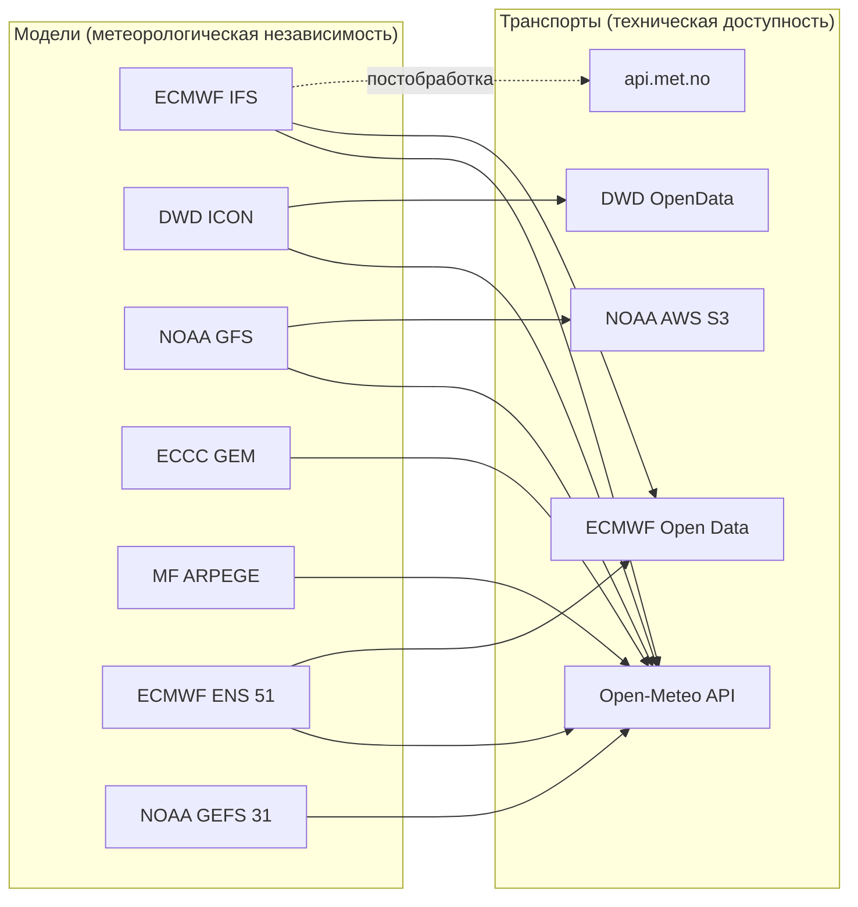

## 8.2. Выбранный состав моделей

### Ядро MVP — детерминированные модели

| # | Модель | Центр | Разрешение | Горизонт | Циклы (UTC) | Вес (старт) | Обоснование выбора |
|---|---|---|---|---|---|---|---|
| 1 | **ECMWF IFS** (HRES 0.25°) | ECMWF | ~9 км натив / 0.25° открытые данные | 15 сут | 00, 06, 12, 18 | 0.30 | Мировой эталон среднесрочного прогноза; лучшие оценки по осадкам на D+3..D+7 в горных регионах Европы |
| 2 | **DWD ICON** (Global 13 км + ICON-EU 7 км) | DWD | 7 км (EU) | 5 сут (EU) / 7.5 сут (Global) | 00, 06, 12, 18 | 0.28 | Лучшее доступное разрешение орографии для Кавказа; сильная конвективная параметризация; ICON-EU покрывает регион |
| 3 | **NOAA GFS** (0.25°) | NCEP | 25 км | 16 сут | 00, 06, 12, 18 | 0.20 | Независимая американская школа; максимальный горизонт; бесплатен и стабилен; источник GEFS |
| 4 | **ECCC GEM** (Global 15 км) | ECCC | 15 км | 10 сут | 00, 12 | 0.14 | Четвёртая полностью независимая система ассимиляции; заметно улучшает разброс консенсуса |
| 5 | **Météo-France ARPEGE** (Global/EU 11 км) | Météo-France | 11 км (EU) | 4 сут (EU) / 4 сут | 00, 06, 12, 18 | 0.08 | Пятая независимая система; сильна в средиземноморских конвективных ситуациях, релевантных Причерноморью |

> **Замечание.** `AROME` (1.3 км) и `ICON-D2` (2 км) — лучшие по разрешению, но **не покрывают Кавказ** (домены ограничены Францией и Центральной Европой). Их применение невозможно. Это существенное ограничение: наилучшее доступное разрешение для региона — **7 км (ICON-EU)**.

### Ансамбли — источник оценки неопределённости

| # | Ансамбль | Членов | Разрешение | Горизонт | Циклы | Назначение |
|---|---|---|---|---|---|---|
| E1 | **ECMWF IFS ENS** | 51 | 0.25° | 15 сут | 00, 12 | Основной источник вероятностной информации и spread |
| E2 | **NOAA GEFS** | 31 | 0.25° (→0.5° после D+10) | 10 (35) сут | 00, 06, 12, 18 | Независимый ансамбль; кросс-проверка spread |
| E3 | *(Phase 2)* **DWD ICON-EPS EU** | 40 | 13 км | 5 сут | 00, 06, 12, 18 | Высокоразрешающий ансамбль для ближнего диапазона |

> **Это решение выходит за рамки исходного ТЗ и является ключевым улучшением.** Межмодельный разброс (5 значений) — крайне грубая оценка неопределённости. Ансамбль из 51 члена даёт полноценное распределение вероятностей, позволяет считать CRPS, строить перцентили и вычислять вероятность превышения любого порога. Без ансамблей Reliability Score опирался бы на выборку из 5 точек, что статистически несостоятельно.

### Отвергнутые кандидаты

| Кандидат | Причина отказа |
|---|---|
| **Yr.no как «модель»** | Дублирует ECMWF IFS (§8.1.1). Используется в другой роли — см. §8.4 |
| **UKMO UM** | Доступен через Open-Meteo, но открытые данные ограничены по переменным осадков; кандидат на добавление в Phase 2 после оценки скилла |
| **JMA GSM** | Независим, но исторически слабее по Европе; низкий приоритет |
| **AccuWeather / Weatherbit / Tomorrow.io / Visual Crossing** | Проприетарные блендинги неизвестного состава — нарушают принцип независимости; платные лимиты |
| **Windy API** | Транспорт над IFS/GFS/ICON; квоты жёстче Open-Meteo; ничего нового не даёт |
| **OpenWeatherMap** | Собственный блендинг на базе GFS/ECMWF, непрозрачная методика |
| **Meteoblue** | Хороший multimodel, но платный API и непрозрачный состав mix |
| **ECMWF AIFS** (ML-модель) | Перспективна, слабо верифицирована по осадкам в горах. Кандидат Phase 3 как экспериментальная модель в shadow-режиме |

## 8.3. Транспорты

### T1. Open-Meteo API — основной транспорт (MVP)

* **Endpoint:** `https://api.open-meteo.com/v1/forecast`, `/v1/ensemble`, `/v1/previous-runs`, `/v1/archive`
* **Лимиты (free):** 600 запросов/мин, 5 000/ч, 10 000/сут, 300 000/мес.
* **Лицензия:** данные CC BY 4.0; free tier — **некоммерческое использование**. Обязательна атрибуция: и Open-Meteo, и первоисточников (DWD, NOAA, ECMWF, ECCC, Météo-France).
* **Почему основной:** единственный источник, отдающий 5 независимых моделей + ансамбли через один нормализованный JSON, поддерживающий **параметр `elevation`** (критично для гор), мультикоординатные запросы и **archive/previous-runs** (критично для холодного старта, см. §10.7.5).
* **Ключевые параметры запроса:** `latitude`, `longitude` (списками), `elevation`, `models`, `hourly`, `timezone=UTC`, `forecast_days`, `past_days`, `cell_selection=nearest`.

**Бюджет запросов (MVP):**

| Компонент | Расчёт | Запросов/цикл | Запросов/сутки |
|---|---|---|---|
| Детерминированные модели | 31 точка в 1 запросе × 5 моделей | 5 | 30 |
| Ансамбли | 31 точка × 2 ансамбля (батчами по 10 точек) | 8 | 48 |
| Ground truth (archive) | 1 батч/сутки | — | 5 |
| Retry-запас (×2) | | | ~166 |
| **Итого** | | **~13** | **≈ 170** |

**Использование квоты: ~1.7% от суточного лимита.** Запас позволяет расширяться до ~500 локаций без выхода за free tier.

### T2. api.met.no (MET Norway) — резервный транспорт и кросс-валидация

* **Endpoint:** `https://api.met.no/weatherapi/locationforecast/2.0/complete`
* **Требования ToS (обязательны, нарушение → бан):**
  * уникальный `User-Agent` с контактом: `4CASTER/1.0 (contact@example.org)`;
  * обязательное соблюдение `Expires` и `If-Modified-Since` (кэширование, отсутствие повторных запросов до истечения);
  * не более ~20 запросов/с; для нашей нагрузки — 31 запрос раз в 4 часа, что многократно ниже.
* **Роль в системе:** **не источник независимой модели**, а:
  1. независимый транспорт для проверки живости IFS-ветки при недоступности Open-Meteo;
  2. «экспертная постобработка ECMWF» — учитывается как **вариант IFS**, а не отдельная модель; используется для оценки вклада постобработки (Phase 2).
* **Лицензия:** NLOD / CC BY 4.0, требуется атрибуция.

### T3–T5. Прямые источники (Phase 2 — Resilience)

| Транспорт | Модель | Формат | Роль |
|---|---|---|---|
| **ECMWF Open Data** (`data.ecmwf.int`) | IFS HRES 0.25°, IFS ENS | GRIB2 | Полная независимость от Open-Meteo для эталонной модели |
| **DWD Open Data** (`opendata.dwd.de`) | ICON Global, ICON-EU | GRIB2 (bz2) | Прямой доступ, полный набор переменных |
| **NOAA / AWS Open Data** (`noaa-gfs-bdp-pds`) | GFS, GEFS | GRIB2 | Прямой доступ, S3, без лимитов |

**Обоснование Phase 2, а не MVP:** обработка GRIB2 (`cfgrib`/`eccodes`) требует загрузки файлов по 100–500 МБ и интерполяции в точку — это на порядок больше трафика, CPU и кода. В MVP это неоправданный риск для графика. Но интерфейс `ForecastProvider` проектируется так, чтобы добавление GRIB-провайдера не затрагивало доменный слой.

## 8.4. Источники ground truth (для Accuracy Engine)

Главная методологическая проблема проекта: **в горной части региона практически нет наземных наблюдений**. Решение — многоуровневый ground truth с явным весом доверия.

| Tier | Источник | Покрытие | Задержка | Точность по осадкам | Вес доверия |
|---|---|---|---|---|---|
| **T1** | METAR/SYNOP: Сочи (URSS), Сочи-город, Красная Поляна, Гагра, Сухум | 4–7 точек, только долины/побережье | 30–60 мин | Высокая (в точке) | **1.00** |
| **T2** | **GPM IMERG Late Run** (NASA, 0.1°, 30 мин) | Полное, сеточное | ~14 ч | Средняя; в горах занижает орографические осадки | **0.65** |
| **T2b** | **GPM IMERG Final Run** | Полное | ~3.5 мес | Выше, чем Late | **0.80** (ретроспективно) |
| **T3** | **ERA5-Land** (реанализ, 9 км) через Open-Meteo Archive | Полное | ~5 сут | Средняя, согласована во времени | **0.60** |
| **T4** | **Open-Meteo Historical Forecast API** (сшивка первых часов ранов = «best analysis») | Полное | ~1 сут | Модельная оценка, не наблюдение | **0.40** |
| **T5** | **Краудсорсинг из Telegram** (см. US-FB-1) | Точечное, редкое | 0–7 сут | Категориальная (был/не был дождь) | **0.50**, после фильтра правдоподобия |

**Правила комбинирования:**
1. Для каждой пары (локация, валидный час) формируется `TruthEstimate` — взвешенное объединение доступных источников с итоговым `truth_confidence ∈ [0,1]`.
2. Верификационные пары с `truth_confidence < 0.4` **не участвуют** в пересчёте весов моделей, но сохраняются.
3. Наблюдения T1 (станции) переносятся на горные точки **только внутри своего кластера и только для событий синоптического масштаба** (длительный фронтальный дождь), определяемых по согласию моделей; для конвективных случаев экстраполяция запрещена — она даст систематическую ошибку.
4. Крауд-наблюдение принимается, если оно не противоречит T2/T3 более чем на 2 категории HIL; иначе помечается `disputed` и исключается.

> **Это ключевое архитектурное решение проекта.** Наивная реализация Accuracy Engine («сравним прогноз с фактом») в этом регионе невозможна — факта нет. Многоуровневая система истины с весами доверия — единственный работоспособный путь, и её отсутствие потопило бы весь блок обучения весов.

## 8.5. Требования к слою источников

* **FR-SRC-1.** Каждый ответ внешнего API сохраняется в неизменном виде (raw payload) до нормализации; ссылка на объект хранится в БД.
* **FR-SRC-2.** Провайдеры реализуют единый порт `ForecastProvider` с методами `fetch(locations, model, run) -> RawPayload` и `capabilities() -> ProviderCapabilities`.
* **FR-SRC-3.** Для каждого провайдера — независимый rate limiter (token bucket), circuit breaker (порог 5 ошибок / окно 5 мин / half-open через 10 мин) и экспоненциальные ретраи с джиттером (3 попытки).
* **FR-SRC-4.** Система отслеживает `model_run` (дата+час инициализации) и **не обрабатывает повторно** уже полученный ран той же модели (идемпотентность по ключу `(model, run_at, location_set_hash)`).
* **FR-SRC-5.** Если ран модели задерживается, система использует предыдущий с пометкой `staleness_hours`, влияющей на вес модели в консенсусе.
* **FR-SRC-6.** Атрибуция источников обязательна: команда `/sources` бота и футер карточек содержат перечень первоисточников и лицензий.
* **FR-SRC-7.** Учёт квот: расход каждого транспорта считается в метриках; при достижении 70% суточной квоты — деградация (снижение частоты ансамблей), при 90% — только критичные запросы.

---

# 9. Доменная модель и Ubiquitous Language

## 9.1. Глоссарий

| Термин | Определение |
|---|---|
| **Location** | Точка (lat, lon, elevation_m) с метаданными и принадлежностью к кластеру |
| **LocationCluster** | Группа локаций со схожим метеорежимом; единица калибровки статистики |
| **ForecastModel** | Численная модель прогноза погоды (IFS, ICON, GFS, GEM, ARPEGE). Носитель независимости |
| **EnsembleSystem** | Ансамблевая система (IFS ENS, GEFS); частный случай ForecastModel с N членами |
| **TransportChannel** | Технический канал получения данных модели |
| **ModelRun** | Конкретный запуск модели, идентифицируется `(model_id, init_time)` |
| **RawPayload** | Неизменённый ответ внешнего API, сохранённый в объектном хранилище |
| **ForecastSnapshot** | Нормализованный прогноз одной модели для одной локации из одного рана, полученный в момент `fetched_at`. **Иммутабелен** |
| **ForecastSeries** | Временнóй ряд значений переменных внутри снапшота |
| **MemberSample** | Один член ансамбля или детерминированное значение — элемент взвешенного пула для консенсуса |
| **ConsensusForecast** | Результат агрегации всех доступных снапшотов на момент `computed_at` для локации. Иммутабелен, версионируется |
| **ReliabilityScore** | Калиброванная оценка надёжности 0–100 для (локация, горизонт, момент расчёта) |
| **HIL** (Hiking Impact Level) | Категория 0–5 операционного влияния осадков на поход |
| **ForecastDiff** | Структурированная разница между двумя последовательными ConsensusForecast |
| **ChangeEvent** | Значимое изменение, прошедшее фильтры значимости и анти-флаппинга; кандидат на уведомление |
| **Observation** | Наблюдение факта погоды из источника ground truth с весом доверия |
| **TruthEstimate** | Объединённая оценка факта для (локация, валидный час) с итоговым `truth_confidence` |
| **VerificationPair** | Пара (прогноз, TruthEstimate) для расчёта метрик |
| **WeightSet** | Версионированный набор весов моделей с областью применения и статусом (`candidate` / `active` / `retired`) |
| **Trip** | Планируемый поход: набор локаций + даты + владелец. Центральная продуктовая сущность |
| **Subscription** | Правило доставки уведомлений: (получатель, объект наблюдения, чувствительность) |
| **HazardModule** | Подключаемый модуль оценки конкретной опасности (в MVP — `RainHazard`; в Phase 4 — `SnowHazard`, `AvalancheHazard`) |

## 9.2. Bounded Contexts

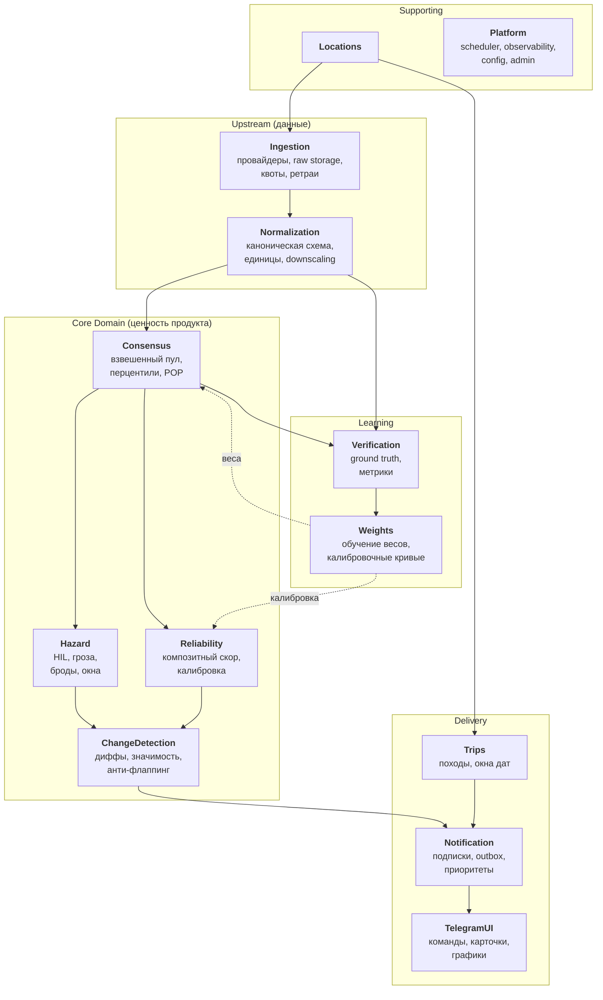

**Типы связей контекстов (Context Map):**

| Отношение | Тип | Комментарий |
|---|---|---|
| Ingestion → Normalization | Anticorruption Layer | ACL защищает домен от изменений схем внешних API |
| Normalization → Consensus | Shared Kernel | Каноническая схема переменных — общее ядро |
| Consensus → Reliability, Hazard | Customer/Supplier | Consensus — upstream, downstream зависит от его контракта |
| Weights → Consensus/Reliability | Published Language | Веса публикуются как версионированный иммутабельный артефакт |
| Notification → TelegramUI | Open Host Service | Notification не знает про Telegram, отдаёт абстрактное `NotificationMessage` |
| Verification → Weights | Conformist | Weights потребляет метрики как есть |

## 9.3. Ключевые доменные инварианты

| ID | Инвариант |
|---|---|
| INV-1 | `ForecastSnapshot` иммутабелен. Повторное получение того же `(model, run, location)` создаёт новую запись только при изменении содержимого (хэш payload) |
| INV-2 | `ConsensusForecast` всегда ссылается на конкретный список `snapshot_id` и `weight_set_version` — воспроизводим побитово |
| INV-3 | Сумма нормированных весов моделей в одном консенсусе = 1.0 ± 1e-9 |
| INV-4 | Одна `ForecastModel` учитывается в консенсусе не более одного раза, независимо от числа транспортов |
| INV-5 | `ChangeEvent` не может ссылаться на `ConsensusForecast`, построенный менее чем из 3 моделей — при меньшем числе моделей события не генерируются |
| INV-6 | `ReliabilityScore` всегда сопровождается `calibration_version`; при отсутствии калибровки помечается `is_calibrated = false` и отображается как диапазон, а не число |
| INV-7 | Уведомление отправляется ровно один раз (idempotency key = `hash(subscription_id, change_event_id)`) |
| INV-8 | `WeightSet` со статусом `active` в один момент времени ровно один на область применения (`scope`) |
| INV-9 | `VerificationPair` создаётся только для прогнозов, для которых существует `TruthEstimate` с `truth_confidence ≥ 0.4` |

---

# 10. Алгоритмическое ядро

## 10.1. Обзор конвейера

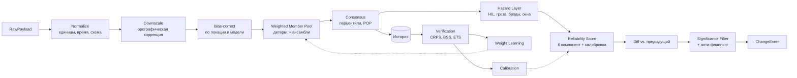

## 10.2. Нормализация

**Каноническая схема:**

* Время: **UTC**, ISO-8601, шаг сетки — 1 ч для D+0..D+3, 3 ч для D+4..D+7, 6 ч для D+8..D+14. Значения моделей с более грубым шагом дезагрегируются равномерно **только для интенсивности**; накопленные суммы не размазываются, а помечаются как интервальные.
* Единицы: осадки — мм за интервал; интенсивность — мм/ч; температура — °C; ветер — м/с; давление — гПа; CAPE — Дж/кг.
* Тип агрегации переменной задан явно: `instant` (температура, CAPE) / `accumulated` (осадки) / `mean` (облачность) / `max` (порывы). Ошибка агрегации накопленных величин — самый частый дефект в подобных системах, поэтому тип агрегации — часть схемы, а не соглашение.

**Требования:**

* **FR-NORM-1.** Каждая переменная канонической схемы имеет: `code`, `unit`, `aggregation_type`, `valid_range`, `precision`.
* **FR-NORM-2.** Значения вне `valid_range` (например, осадки > 200 мм/ч) отбрасываются с логированием и снижением `data_quality` снапшота.
* **FR-NORM-3.** Пропуски внутри ряда длиной ≤ 2 шагов интерполируются линейно (для `instant`) или нулём (для `accumulated`); более длинные пропуски делают снапшот частичным (`is_partial = true`).
* **FR-NORM-4.** Каждый снапшот получает `content_hash` (sha256 канонизированного JSON) для дедупликации.

## 10.3. Орографический downscaling

Глобальные модели с шагом 7–25 км «видят» вместо Фишта (2867 м) сглаженную возвышенность ~1800 м. Без коррекции все производные величины смещены.

**Коррекции (применяются после нормализации):**

1. **Температура.** `T_corr = T_model + Γ × (h_dem_model − h_true)`, где Γ — вертикальный градиент: 0.0065 °C/м по умолчанию, либо фактический градиент, вычисленный из уровней 850/700 гПа той же модели (предпочтительно — учитывает инверсии).
2. **Высота нулевой изотермы.** Пересчитывается из скорректированного профиля; критично для точек > 2500 м (Цахвоа, Фишт, Оштен), где летом возможен снег.
3. **Осадки — орографическое усиление.** Множитель `k_oro(location, model)` **не задаётся физической формулой, а обучается** Accuracy Engine как мультипликативная поправка смещения (§10.8.5). Обоснование: аналитические схемы усиления (Smith & Barstad) требуют полей ветра высокого разрешения, которых у нас нет; эмпирическая поправка на реальных данных надёжнее и самокорректируется.
4. **Фаза осадков.** `precip_type` определяется по скорректированной высоте нулевой изотермы с учётом слоя таяния (порог: снег при `h_true > h_freezing + 100 м`).

* **FR-DS-1.** Все коррекции хранятся отдельно от исходных значений (`raw_value`, `corrected_value`) — чтобы можно было переобучить и пересчитать.
* **FR-DS-2.** Запрос к Open-Meteo всегда содержит явный `elevation`; система дополнительно сохраняет `elevation`, возвращённую провайдером, для контроля.

## 10.4. Hazard Layer: Hiking Impact Level

Метеорологические миллиметры не являются языком принятия решений. Вводится операционная шкала.

### HIL — Hiking Impact Level

| HIL | Название | Критерий (за 6-часовое окно) | Смысл для похода |
|---|---|---|---|
| **0** | Сухо | < 0.2 мм | Планы не меняются |
| **1** | Морось / кратковременно | 0.2–2 мм, интенсивность < 1 мм/ч | Мембрана в рюкзаке, планы не меняются |
| **2** | Слабый дождь | 2–6 мм | Дискомфорт, скорость движения −10%, скользкие тропы |
| **3** | Умеренный / длительный | 6–15 мм или > 4 ч непрерывно | Пересмотр графика, риск мокрого лагеря, скорость −25% |
| **4** | Сильный дождь / гроза | 15–35 мм или `thunderstorm_risk > 0.5` | Отказ от гребней и перевалов, риск ЧП, скорость −40% |
| **5** | Экстремальный | > 35 мм за 6 ч или > 60 мм за 24 ч | Отмена/эвакуация; риск паводка, селей, непроходимости бродов |

> Пороги — **стартовые**, подлежат калибровке по обратной связи пользователей (US-FB-2) и по кластеру: 15 мм в засушливой долине и 15 мм на наветренном склоне Фишта имеют разный операционный смысл. Пороги хранятся в конфигурации, не в коде.

### Производные оценки опасности

**Грозовой риск** (`thunderstorm_risk ∈ [0,1]`):
```
tr = σ( a1·norm(CAPE) + a2·conv_fraction + a3·diurnal(t) + a4·norm(elevation) − b )
  conv_fraction = showers / max(precip_total, ε)
  diurnal(t)    = гауссиана с максимумом 15:00 локального времени, σ = 3 ч
  norm(CAPE)    = clip(CAPE / 1500, 0, 1)
```
Коэффициенты `a*`, `b` — начальные значения из экспертной оценки, далее — логистическая регрессия на верифицированных случаях (Phase 3).

**Риск бродов** (`ford_risk ∈ 0..3`): функция `precip_24h_accum` и `precip_48h_accum` с учётом кластера (для CL-KODOR и CL-EAST — более жёсткие пороги ввиду крупных водосборов Кодора и Мзымты). Рассчитывается по **консенсусной p75**, а не по медиане: для риска затопления релевантен пессимистичный сценарий.

**Сухие окна** (`dry_window`): максимальные непрерывные интервалы с `HIL ≤ 1` в консенсусе p60, длительностью ≥ 3 ч, с привязкой к локальному времени.

* **FR-HZ-1.** HazardModule — плагин с интерфейсом `evaluate(consensus, location, config) -> HazardAssessment`. В MVP регистрируется только `RainHazard`. Добавление `SnowHazard` не требует изменения ядра.
* **FR-HZ-2.** Все пороги HIL и коэффициенты рисков — во внешней конфигурации, версионируемой вместе с `weight_set`.

## 10.5. Consensus Forecast

### 10.5.1. Ключевая идея: единый взвешенный пул членов

Осадки — величина с сильно скошенным распределением, большим числом нулей и тяжёлым правым хвостом. **Арифметическое среднее по моделям для осадков методологически неверно**: одна «мокрая» модель из пяти сдвигает среднее так, что консенсус не соответствует ни одной модели, а вероятностная информация теряется полностью.

Решение: рассматривать всё доступное как **единый взвешенный ансамбль** (pooled weighted ensemble).

```
Пул членов M = { (value_k, weight_k) }:

  детерминированная модель i  → 1 член, вес w_i
  ансамбль j из N_j членов    → N_j членов, каждый с весом w_j / N_j

Σ w = 1 после нормировки.
```

Из пула вычисляются:

| Величина | Формула |
|---|---|
| Взвешенная эмпирическая CDF | `F(x) = Σ_k w_k · 1[value_k ≤ x]` |
| Перцентили | `p10, p25, p50 (медиана), p75, p90` — обратная к `F` |
| **POP** (вероятность осадков) | `P(precip > τ) = Σ_k w_k · 1[value_k > τ]`, τ = 0.2 мм для «был дождь», 1.0 / 5.0 / 15.0 мм для градаций |
| Ожидаемое количество | `E[x] = Σ_k w_k · value_k` (публикуется только вместе с p10–p90) |
| Спред | `IQR = p75 − p25` |
| Категориальный консенсус | HIL, набравший максимальный суммарный вес |

**Публикуется пользователю:** медиана (p50) как «основной сценарий», диапазон p10–p90 как «разброс», POP как вероятность, HIL как операционная категория. Среднее не публикуется.

> Такой подход даёт объединение 5 детерминированных прогнозов и 82 ансамблевых членов в статистически корректное распределение и является основой для расчёта CRPS в верификации.

### 10.5.2. Kernel dressing (Phase 3)

Каждый член пула «одевается» в ядро, отражающее его собственную ошибку:
`F(x) = Σ_k w_k · K((x − value_k)/h_k)`, где `h_k` — обученная ширина ядра для модели `k` на данном lead time. Это классический BMA-подход (Raftery et al.), устраняющий недодисперсию ансамбля. В MVP не реализуется (нет статистики), но структура пула к этому готова.

### 10.5.3. Формула весов

```
w_i_raw = W_skill(model_i, lead_bucket, cluster, month)
        × W_fresh(staleness_i)
        × W_terrain(model_i, cluster)
        × W_quality(snapshot_i)

w_i = w_i_raw / Σ w_raw
```

| Множитель | Определение | Диапазон |
|---|---|---|
| `W_skill` | Обучаемый компонент из Accuracy Engine (§10.8). До накопления статистики — стартовые значения §8.2 | [0.05, 0.40] |
| `W_fresh` | `exp(−staleness_hours / 12)` — штраф за устаревший ран модели | (0, 1] |
| `W_terrain` | `1 + β·log₂(25 / dx_km)` для кластеров с высокой сложностью рельефа (std высот в ячейке > 300 м), β = 0.10; иначе 1.0 | [1.0, 1.3] |
| `W_quality` | 1.0 для полного снапшота; 0.6 для `is_partial`; 0 для отброшенного | {0, 0.6, 1.0} |

**Ограничители (guardrails):**
* Ни одна модель не получает вес > 0.40 (защита от вырождения консенсуса в одну модель).
* Ни одна доступная модель не получает вес < 0.05 (сохранение разнообразия).
* Суммарный вес ансамблей ограничен 0.45 (ансамбли и их детерминированные «братья» коррелированы: IFS ENS и IFS HRES — одна система; их совместный вес ограничивается 0.50).

**Учёт корреляции моделей.** Модели не независимы (общие источники наблюдений, схожие параметризации). Явно задаётся матрица корреляции `C` между моделями (стартово — экспертная, далее — оцениваемая по истории ошибок). Эффективный размер ансамбля `N_eff = 1 / Σᵢⱼ wᵢwⱼCᵢⱼ` используется в расчёте Reliability вместо простого числа моделей. Без этого система систематически переоценивала бы надёжность.

### 10.5.4. Требования

* **FR-CON-1.** Консенсус рассчитывается для каждой локации после каждого цикла сбора, при наличии ≥2 моделей; при <3 моделях помечается `degraded = true` и не порождает ChangeEvent (INV-5).
* **FR-CON-2.** Консенсус хранит: список `snapshot_id`, `weight_set_version`, фактические веса, `n_models`, `n_members`, `n_eff`.
* **FR-CON-3.** Расчёт детерминирован: повторный запуск на тех же входах даёт побитово тот же результат.
* **FR-CON-4.** Консенсус вычисляется в трёх временны́х агрегациях: почасовой (D+0..D+3), 6-часовые окна (ночь 00–06, утро 06–12, день 12–18, вечер 18–24 локального времени) и суточной (D+0..D+14).
* **FR-CON-5.** Время окон — **локальное** (UTC+3 для всего региона), поскольку операционная релевантность («утро выхода») определяется локальным временем.

## 10.6. Reliability Score

### 10.6.1. Принципы

1. **Композитность.** Один индикатор (например, разброс между моделями) не описывает надёжность. Используются шесть независимых по природе компонент.
2. **Мультипликативность.** Компоненты объединяются взвешенным **геометрическим** средним. Обоснование: провал по любой компоненте должен обрушивать итог. Арифметическое среднее позволило бы прогнозу с нулевой временнóй стабильностью получить 70 баллов за счёт остальных компонент — это неприемлемо.
3. **Калиброванность.** Итоговое число проходит через изотоническую регрессию, обученную на исторической оправдываемости. `R = 80` обязано означать «оправдалось в ~80% случаев».
4. **Объяснимость.** Каждая компонента показывается пользователю с текстовой интерпретацией.

### 10.6.2. Формула

```
R_raw(loc, valid_window) = 100 · A^α₁ · E^α₂ · S^α₃ · H^α₄ · G^α₅ · D^α₆

  Σαᵢ = 1

Стартовые веса:
  α₁ (Agreement)      = 0.28
  α₂ (Ensemble)       = 0.22
  α₃ (Stability)      = 0.20
  α₄ (History)        = 0.15
  α₅ (reGime)         = 0.10
  α₆ (Data)           = 0.05
```

Все компоненты ∈ [0.05, 1.0] (нижняя отсечка предотвращает обнуление итога).

---

### Компонента A — Inter-Model Agreement (согласие моделей)

Насколько независимые модели говорят одно и то же.

```
A_cont = exp( − IQR_models / (k_A · (p50 + p₀)) )
    IQR_models — взвешенный межквартильный размах ТОЛЬКО по детерминированным моделям
    p₀ = 1.0 мм — регуляризатор, не даёт метрике взорваться при малых осадках
    k_A = 1.2

A_cat  = максимальная взвешенная доля моделей, согласных по категории HIL

A = √(A_cont · A_cat)
```

Двухкомпонентность существенна: модели могут расходиться в миллиметрах (12 мм vs 18 мм), оставаясь в одной операционной категории — это высокое согласие для целей похода; и наоборот, 0.1 мм vs 2.5 мм — малая абсолютная разница, но переход через границу «сухо/мокро».

---

### Компонента E — Ensemble Spread (внутримодельная неопределённость)

Разброс членов ансамбля относительно климатологического разброса на данном горизонте.

```
E = exp( − λ · σ_ens / σ_clim(lead, cluster, month) )
    σ_ens  — взвешенное стандартное отклонение (или нормированный IQR) членов ансамблей
    σ_clim — климатологический разброс, накопленный системой; до накопления — из ERA5-Land
    λ = 1.0
```

Смысл: если ансамблевый разброс сопоставим с климатическим (`σ_ens ≈ σ_clim`), прогноз не содержит информации сверх «обычной погоды для этого места и месяца» → `E ≈ 0.37`. Если разброс мал → `E → 1`.

Если ансамбли недоступны, `E` заменяется на `A` с понижающим коэффициентом 0.8, и это фиксируется в объяснении.

---

### Компонента S — Temporal Stability (устойчивость во времени)

**Наиболее недооценённая и, вероятно, наиболее ценная компонента.** Прогноз может демонстрировать отличное согласие моделей прямо сейчас и при этом скакать от рана к рану — такой прогноз ненадёжен, и ни одна из существующих метрик этого не поймает.

Используется **Flip-Flop Index** (Ruth et al.) — метрика, отделяющая осцилляции от направленного тренда:

```
Для последовательности n последних консенсус-значений x₁..xₙ
на один и тот же валидный интервал (n = 6, т.е. 24 часа):

  FFI = [ Σᵢ₌₂ⁿ |xᵢ − xᵢ₋₁| − (max(x) − min(x)) ] / (n − 2)

  S = exp( − FFI / k_S(lead) )
```

Свойства, ради которых выбрана именно эта метрика:
* монотонный тренд (прогноз последовательно становится мокрее) → `FFI = 0` → `S = 1`. **Это правильно:** направленное изменение — информативный сигнал, а не шум;
* колебания вверх-вниз → большой `FFI` → `S → 0`;
* нечувствительна к амплитуде тренда, чувствительна к его немонотонности.

`k_S(lead)` — масштабирующий коэффициент, растущий с горизонтом (на D+10 колебания нормальны, на D+1 — тревожный признак); калибруется по истории.

Дополнительно вычисляется `S_cat` — доля смен категории HIL за последние 6 ранов; итоговое `S = √(S_cont · (1 − S_cat_rate))`.

---

### Компонента H — Historical Skill (историческая оправдываемость)

Априорная надёжность прогнозов такого типа в этом месте на этом горизонте, из Accuracy Engine.

```
H = clip( (BSS_smoothed(cluster, lead_bucket, month, event) − BSS_floor)
          / (BSS_ceil − BSS_floor), 0.05, 1.0 )

  BSS — Brier Skill Score консенсуса относительно климатологии
  BSS_floor = 0.0, BSS_ceil = 0.60
  BSS_smoothed — EWMA по скользящему окну 180 дней с иерархическим сглаживанием:
      если данных по (cluster, lead, month) < 100 пар → падаем на (cluster, lead)
      если и там < 100 → на (region, lead)
      если и там < 100 → используем априорную кривую §10.6.5
```

Иерархическое сглаживание (partial pooling) обязательно: по одному кластеру за один месяц данных не наберётся, и без него компонента будет шумом.

---

### Компонента G — Regime Predictability (предсказуемость синоптической ситуации)

Некоторые погодные ситуации непредсказуемы принципиально, независимо от качества моделей. Летняя послеобеденная конвекция в горах при слабом синоптическом форсинге — ровно такой случай: она детерминирована процессами масштаба 1–5 км, которых нет ни в одной доступной модели.

```
G = G_synoptic^0.6 · (1 − f_conv)^0.4

  G_synoptic = exp( − spread(GH500) / k_G )
      spread(GH500) — разброс геопотенциальной высоты 500 гПа между моделями,
      прокси согласия по крупномасштабной циркуляции

  f_conv = clip( showers / max(precip_total, ε) · norm(CAPE), 0, 1 )
      доля конвективной составляющей
```

Практический эффект: при фронтальном прохождении (низкая `f_conv`, согласованный GH500) `G ≈ 0.9`; при «пятнистой» летней конвекции `G ≈ 0.3`, что честно снижает итоговый скор даже при формальном согласии моделей по суточной сумме.

---

### Компонента D — Data Completeness

```
D = (W_present / W_expected)^0.5 · freshness_penalty

  W_present  — сумма весов фактически полученных моделей
  W_expected — сумма весов ожидавшихся моделей
  freshness_penalty = 1 при staleness ≤ 6 ч, линейно до 0.7 при staleness = 18 ч
```

---

### 10.6.3. Агрегация по горизонтам 1 / 3 / 7 / 14 дней

Скор вычисляется на уровне 6-часовых окон, затем агрегируется:

```
R_day(d)      = взвешенное геометрическое среднее R по 4 окнам суток d
                (веса окон: ночь 0.15, утро 0.30, день 0.35, вечер 0.20 —
                 отражают операционную важность светового времени)

R_horizon(H)  = ( Πᵈ⁼¹..ᴴ R_day(d) )^(1/H)
```

Геометрическое среднее по дням означает, что горизонт 14 дней не может иметь высокий скор, если хотя бы несколько дальних суток непредсказуемы — что физически корректно.

**Ожидаемые типичные значения (летний сезон, Западный Кавказ):**

| Горизонт | Типичный R | Интерпретация |
|---|---|---|
| 1 день | 78–92 | Можно принимать решения |
| 3 дня | 60–78 | Основа для планирования, с готовностью к корректировке |
| 7 дней | 35–55 | Ориентировочно; для конвективных ситуаций — ниже |
| 14 дней | 12–28 | Только тренд и климатология |

Эти значения — **не цель, а ожидание**. Если система на 14 дней выдаёт 70, это дефект калибровки.

### 10.6.4. Калибровка

Сырой скор — эвристика. Пользователю показывается только **калиброванный** скор.

**Процедура (ежемесячный батч-джоб, отдельно для каждого горизонта):**
1. Собрать все `(R_raw, hit)` за скользящее окно 180 дней, где `hit = 1`, если прогноз оправдался в пределах допуска (совпадение категории HIL ±1 при `truth_confidence ≥ 0.5`).
2. Обучить **изотоническую регрессию** `R_raw → P(hit)` (монотонная, непараметрическая, устойчива к малым выборкам).
3. `R_calibrated = 100 · isotonic(R_raw)`.
4. Рассчитать **ECE** (Expected Calibration Error) по 10 бинам; если ECE > 0.12 — алерт оператору, калибровка не активируется.
5. Сохранить как версионированный артефакт `calibration_curve` с датой, размером выборки и ECE.

**До набора статистики** (первые ~60 дней, если не выполнен backfill §10.7.5) скор помечается `is_calibrated = false` и отображается как **качественная шкала** («высокая / средняя / низкая надёжность»), а не как число. Показывать некалиброванное число — значит нарушить принцип P2.

### 10.6.5. Априорная кривая (cold start)

До накопления собственной статистики `H` берётся из априорной кривой, отражающей типичную деградацию скилла прогноза осадков в среднеширотном горном регионе:

| Lead, сут | 1 | 2 | 3 | 5 | 7 | 10 | 14 |
|---|---|---|---|---|---|---|---|
| Априорный BSS | 0.52 | 0.44 | 0.36 | 0.24 | 0.15 | 0.07 | 0.02 |

`[ASSUMPTION]` Кривая подлежит замене на измеренную по результатам backfill (§10.7.5) до релиза MVP.

### 10.6.6. Требования

* **FR-REL-1.** Скор рассчитывается для каждого консенсуса, для окон, суток и четырёх горизонтов.
* **FR-REL-2.** Хранится разложение на компоненты (A, E, S, H, G, D) — обязательно, для объяснения и отладки.
* **FR-REL-3.** Пользователю выдаётся: число, цветовая индикация, словесная интерпретация, топ-2 компоненты, определившие итог.
* **FR-REL-4.** Некалиброванный скор не отображается как число (INV-6).
* **FR-REL-5.** Система умеет отвечать на вопрос «когда прогноз станет надёжным» — по исторической кривой `R(lead)` для кластера и месяца находится lead, при котором `R ≥ 65`, и вычисляется соответствующая календарная дата.

## 10.7. Change Detection

### 10.7.1. Принцип

> Значимо не то изменение, которое велико в миллиметрах, а то, которое **меняет решение пользователя**.

Изменение прогноза с 2 мм на 6 мм (переход HIL 1→3) значимее, чем с 40 мм на 55 мм (HIL 5→5): во втором случае поход отменён в обоих сценариях.

### 10.7.2. Расчёт диффа

Дифф вычисляется между текущим `ConsensusForecast` и предыдущим для той же локации, по каждому валидному окну, попадающему в горизонт наблюдения подписки/Trip.

Фиксируются: `Δp50`, `Δp90`, `ΔPOP`, `ΔHIL`, `ΔReliability`, `Δthunderstorm_risk`, `Δdry_window` (сдвиг границ), а также **атрибуция**: какие модели изменили своё мнение сильнее всего (вклад модели в сдвиг медианы).

### 10.7.3. Правила значимости

Событие считается значимым при выполнении **любого** из условий (при этом `n_models ≥ 3`):

| Код | Условие | Приоритет |
|---|---|---|
| `HIL_UP` | `ΔHIL ≥ +1` **и** новый `HIL ≥ 2` | HIGH |
| `HIL_DOWN` | `ΔHIL ≤ −1` **и** старый `HIL ≥ 2` | NORMAL |
| `POP_CROSS` | `POP` пересёк порог 0.4 или 0.7 **и** `|ΔPOP| ≥ 0.20` | HIGH |
| `AMOUNT_JUMP` | `\|Δp50\| > max(2 мм, 1.5 · NoiseFloor(lead, cluster))` | NORMAL |
| `EXTREME_APPEAR` | Появился `HIL ≥ 4` или `p90 > 35 мм/6ч` там, где было < 15 мм | **CRITICAL** |
| `STORM_APPEAR` | `thunderstorm_risk` вырос с < 0.3 до ≥ 0.5 | HIGH |
| `WINDOW_SHIFT` | Граница сухого окна сдвинулась ≥ 6 ч или окно исчезло/появилось | NORMAL |
| `RELIABILITY_DROP` | `ΔR ≤ −20` пунктов при `R_new < 50` | INFO |
| `FORD_RISK` | `ford_risk` вырос до ≥ 2 | HIGH |
| `TRIP_IMMINENT` | Любое из вышеперечисленного при старте Trip ≤ 48 ч | **повышение на уровень** |

**NoiseFloor(lead, cluster)** — динамический порог шума: медиана `|Δp50|` между последовательными ранами за последние 90 дней для данного горизонта и кластера. Это принципиально: на D+10 изменение в 5 мм — обычный шум, на D+1 — событие. Фиксированный порог в миллиметрах гарантированно даст либо спам на дальних горизонтах, либо пропуски на ближних.

### 10.7.4. Анти-флаппинг

Без этого механизма система станет источником спама и будет отключена пользователями.

| Механизм | Правило |
|---|---|
| **Подтверждение** | Событие приоритета ≤ HIGH требует подтверждения **вторым подряд циклом** ИЛИ `Reliability ≥ 65`. `CRITICAL` отправляется немедленно |
| **Гистерезис** | После срабатывания `HIL_UP` обратное `HIL_DOWN` требует превышения порога с запасом 1.5× |
| **Cooldown** | По одной паре (подписка, тип события, валидные сутки) — не чаще 1 раза в 6 ч |
| **Дедупликация** | События по соседним окнам одних суток схлопываются в одно уведомление |
| **Дневной лимит** | Максимум 4 уведомления в сутки на подписку (`normal`), 2 (`low`), 8 (`high`); превышение → дайджест |
| **Тихие часы** | Не-CRITICAL откладываются и агрегируются |
| **Затухание по горизонту** | События на D+8..D+14 генерируются только при приоритете ≥ HIGH: столь дальний прогноз не должен беспокоить пользователя мелочами |
| **Silence-is-signal** | Если по подписке не было уведомлений 72 ч, в утренний дайджест добавляется строка «прогноз стабилен» — чтобы молчание не читалось как поломка |

### 10.7.5. Backfill: решение проблемы холодного старта

**Проблема.** Reliability Score, NoiseFloor, климатологический spread, веса моделей и калибровочные кривые требуют исторической статистики. При старте «с нуля» первые 2–3 месяца система работала бы на неоткалиброванных эвристиках — то есть в режиме, прямо противоречащем принципу P2.

**Решение.** Ретроспективное наполнение из **Open-Meteo Previous Runs API** и **Historical Forecast API**, которые отдают архив прогнозов «как они были выпущены» с 2024 года, с фиксированными lead-time offsets (1–7 суток).

**Процедура (задача фазы 1, до релиза MVP):**
1. Для всех 31 локации выгрузить архив прогнозов за 2 летних сезона (май–октябрь 2024, 2025) по всем 5 моделям на offsets D+1..D+7.
2. Выгрузить ground truth за тот же период: ERA5-Land + IMERG Final + доступные станции.
3. Прогнать через тот же конвейер верификации (§10.8) → получить стартовые `W_skill`, `NoiseFloor`, `σ_clim`, априорную кривую `H(lead)`, калибровочные кривые.
4. Зафиксировать как `weight_set v1.0-backfill` и `calibration_curve v1.0-backfill`.

**Ценность:** система стартует с ~2 сезонами статистики вместо нуля. Это одно из самых важных решений проекта: без backfill MVP пришлось бы выпускать с честной пометкой «оценки надёжности пока не откалиброваны», что обесценивает ключевую фичу.

*Ограничение:* архив Previous Runs даёт offsets только до 7 суток, поэтому горизонты 10–14 суток стартуют менее откалиброванными; для них применяется экстраполяция кривой с явным флагом `low_confidence_calibration`.

### 10.7.6. Требования

* **FR-CHG-1.** Дифф рассчитывается после каждого консенсуса; хранится независимо от того, породил ли он событие.
* **FR-CHG-2.** ChangeEvent хранит ссылки на оба консенсуса, сработавшее правило, дельты и атрибуцию по моделям.
* **FR-CHG-3.** Уведомление содержит: что изменилось (было → стало), для каких дат, новый Reliability, атрибуцию, действие-подсказку.
* **FR-CHG-4.** Все пороги значимости — в конфигурации, изменяемой без деплоя, с версионированием.
* **FR-CHG-5.** Пользователь может отключить отдельные типы событий (кнопка «Отключить такие» в уведомлении).

## 10.8. Accuracy Engine

### 10.8.1. Архитектурный принцип

Верификация и обучение весов вынесены в **отдельный ограниченный контекст с асинхронным батч-циклом**. Обоснование выбора батча вместо онлайн-обучения:

| Критерий | Батч (выбрано) | Онлайн |
|---|---|---|
| Воспроизводимость | Полная: артефакт весов версионирован | Состояние размазано во времени |
| Отладка | Можно прогнать на истории | Практически невозможна |
| Риск деградации | Контролируемый: shadow → активация | Модель «уезжает» незаметно |
| Сложность | Низкая | Высокая |
| Актуальность | Задержка до суток | Мгновенная |

Задержка в сутки для системы, где ground truth приходит с задержкой 14 ч – 5 сут, не имеет значения. Онлайн-обучение здесь — преждевременная оптимизация с высоким риском.

### 10.8.2. Конвейер верификации

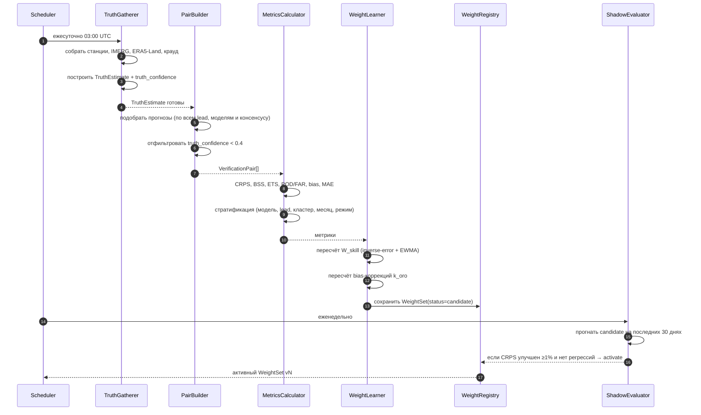

### 10.8.3. Метрики верификации

Используются метрики, стандартные для верификации осадков (WMO/WWRP):

| Метрика | Тип | Для чего |
|---|---|---|
| **CRPS** (Continuous Ranked Probability Score) | Вероятностная | **Основная метрика.** Оценивает всё распределение консенсуса, а не точечное значение. Обобщение MAE на вероятностные прогнозы |
| **CRPSS** | Skill score | CRPS относительно климатологии |
| **Brier Score / BSS** | Бинарная вероятностная | Для событий «осадки > τ» (τ = 0.2 / 1 / 5 / 15 мм) |
| **ETS** (Equitable Threat Score) | Категориальная | Стандарт для осадков; корректирует случайные попадания |
| **POD, FAR, CSI** | Категориальная | Обнаружение / ложные тревоги; напрямую интерпретируемы для алертов |
| **Reliability diagram + ECE** | Калибровка | Проверка честности вероятностей |
| **Multiplicative bias** | Систематическая | Обучение орографической поправки `k_oro` |
| **MAE / RMSE** | Непрерывная | Вспомогательные, для детерминированных членов |
| **Flip-flop realised** | Специальная | Действительно ли высокий FFI предсказывал большую итоговую ошибку (валидация компоненты S) |

**Стратификация метрик (обязательна):** `(model | consensus) × lead_bucket × location_cluster × month × regime`, где `regime ∈ {frontal, convective, mixed}` определяется по `f_conv` и согласию GH500. Нестратифицированные метрики бесполезны: модель, отличная во фронтальных ситуациях, может быть провальной в конвективных, и усреднённый вес скроет обе особенности.

### 10.8.4. Алгоритм обучения весов

**Стадия 1 (MVP) — Inverse-error weighting с EWMA:**

```
Для каждой ячейки стратификации (lead_bucket, cluster, month, regime):

  skill_i = CRPSS_i = 1 − CRPS_i / CRPS_climatology
  raw_i   = max(skill_i, 0.02) ^ γ          γ = 1.5 (обостряет различия)
  W_skill_i = raw_i / Σ raw

Сглаживание во времени:
  W_new = (1 − η) · W_old + η · W_computed     η = 0.25 (полураспад ≈ 2.4 обновления)

Иерархическое сглаживание по данным (partial pooling):
  W_final = (n / (n + n₀)) · W_cell + (n₀ / (n + n₀)) · W_parent
  n  — число верифицированных пар в ячейке
  n₀ = 150 — сила априора
  W_parent — вес на уровне выше (cluster → region → global)
```

**Стадия 2 (Phase 3) — EMOS / NGR (Nonhomogeneous Gaussian Regression) или BMA:** полноценная статистическая постобработка с обучением не только весов, но и параметров дисперсии и сдвига. Требует ≥2 сезонов данных, которые как раз будут накоплены к этому моменту.

**Guardrails (обязательны):**

| Правило | Значение |
|---|---|
| Минимум пар для обновления ячейки | 100 |
| Максимальное изменение веса за одно обновление | ±20% относительно |
| Диапазон весов | [0.05, 0.40] |
| Максимальный суммарный вес коррелированной группы (IFS HRES + IFS ENS) | 0.50 |
| Обязательный shadow-период перед активацией | 7 суток |
| Критерий активации кандидата | CRPS не хуже активного на всех lead_bucket, и лучше ≥1% суммарно |
| Автоматический откат | Если после активации CRPS ухудшился >3% за 14 суток → откат на предыдущую версию + алерт |

### 10.8.5. Обучение орографических поправок

Отдельно от весов обучается мультипликативная поправка на локацию и модель — она компенсирует систематическую недооценку осадков на наветренных склонах:

```
k_oro(loc, model) = median( obs_i / max(fcst_i, 0.1) ) по парам с obs > 1 мм
                    за скользящее окно 2 сезона

  применяется при n ≥ 100, clip к [0.5, 2.5]
  применяется ТОЛЬКО к количеству осадков, не к вероятности
```

Ожидаемый эффект: для точек кластера `CL-FISHT` и `CL-ABK-W` (наветренные склоны) `k_oro` окажется существенно > 1 для всех моделей — это ключевая систематическая ошибка глобальных моделей в регионе, и её коррекция даст наибольший прирост качества из всех обучаемых компонент.

### 10.8.6. Требования

* **FR-ACC-1.** Верификация выполняется ежесуточно для всех прогнозов, чей валидный период завершился и для которых доступен `TruthEstimate`.
* **FR-ACC-2.** Верифицируются **и консенсус, и каждая модель по отдельности** — иначе невозможно обучать веса.
* **FR-ACC-3.** Метрики хранятся с полной стратификацией и числом пар в каждой ячейке.
* **FR-ACC-4.** `WeightSet` иммутабелен и версионирован; активация фиксируется в аудит-логе с указанием оператора/автоматики.
* **FR-ACC-5.** Доступна публичная (через бота) агрегированная статистика точности — по требованию US-REL-3.
* **FR-ACC-6.** Реализован CLI `verify replay --from --to --weight-set` для офлайн-экспериментов на истории.
* **FR-ACC-7.** Ретроспективная переоценка при поступлении IMERG Final (через ~3.5 мес): метрики пересчитываются, `truth_confidence` повышается, веса уточняются.

---

# 11. Архитектура

## 11.1. Выбор архитектурного стиля

### Решение

> **Модульный монолит** (Modular Monolith) с **гексагональной архитектурой** внутри модулей, **событийной интеграцией** между модулями через transactional outbox, **асинхронными воркерами** для тяжёлых задач и **облегчённым CQRS** (отдельные read-модели для бота).

### Обоснование

| Рассмотренный стиль | Вердикт | Аргумент |
|---|---|---|
| **Микросервисы** | ❌ Отклонено | Команда 3–5 человек, бюджет ≤$10/мес, единый деплой. Сетевые границы дали бы распределённые транзакции, латентность и оверхед эксплуатации при нулевой выгоде: нагрузка не требует независимого масштабирования компонент |
| **Монолит без модульных границ** | ❌ Отклонено | Домен содержит 8+ различающихся по природе контекстов; без границ алгоритмическое ядро быстро смешается со слоем Telegram, и заменить провайдера/добавить зимний домен станет невозможно |
| **Модульный монолит** | ✅ **Выбрано** | Один деплой + жёсткие внутренние границы. Модуль можно вынести в сервис позже, если появится нагрузка (наиболее вероятный кандидат — Ingestion) |
| **Hexagonal / Ports & Adapters** | ✅ Применяется внутри модулей | Критично для Ingestion: провайдеры данных обязаны заменяться (Open-Meteo → GRIB) без изменения домена. И для Notification: Telegram — адаптер, не домен |
| **DDD (тактический + стратегический)** | ✅ Применяется | Домен содержательно сложен, терминология неочевидна. Ubiquitous Language и Bounded Contexts — не украшение, а необходимость для команды |
| **Event-Driven** | ✅ Применяется | Конвейер естественно событийный: `ForecastIngested → ConsensusComputed → ChangeDetected → NotificationRequested`. Даёт слабую связанность и возможность добавлять потребителей (зимний домен) без правки продюсеров |
| **Event Sourcing (полный)** | ⚠️ Частично | Полный ES отклонён как избыточный. Но `ForecastSnapshot` и `ConsensusForecast` **по природе иммутабельные факты** — хранятся append-only, что даёт главные преимущества ES (аудит, replay) без его сложности |
| **CQRS** | ✅ Облегчённый | Запись — нормализованная модель; чтение для бота — денормализованные read-модели (`forecast_card_cache`), обновляемые проекцией. Полное разделение хранилищ не нужно |
| **Background Workers + Scheduler** | ✅ Обязательно | Ядро системы — периодический конвейер |
| **Message Queue** | ✅ Обязательно | Redis Streams как брокер: развязка сбора и обработки, ретраи, backpressure |
| **Saga / Process Manager** | ✅ Точечно | Цикл сбора — долгоживущий процесс с частичными отказами; оформляется как `IngestionCycle` process manager с состоянием |

### Технологический стек

| Слой | Технология | Обоснование |
|---|---|---|
| Язык | **Python 3.12** | Единственная экосистема, где есть всё нужное: `numpy`/`scipy` (статистика), `properscoring`/`xskillscore` (CRPS/BSS), `scikit-learn` (изотоническая регрессия), `cfgrib`/`xarray` (GRIB для Phase 2), `matplotlib` (графики для бота), `aiogram` (Telegram). Альтернативы (Go, .NET) потребовали бы писать метрики верификации вручную |
| Web / API | **FastAPI** + Uvicorn | Асинхронность, автоматический OpenAPI, Pydantic-валидация как ACL для внешних API |
| Telegram | **aiogram 3.x** | Зрелый async-фреймворк, FSM для диалогов, встроенный роутинг |
| Очередь / воркеры | **Redis Streams** + **ARQ** (или Dramatiq) | Один Redis обслуживает брокер, кэш и rate limiter. Celery отклонён как избыточно тяжёлый |
| Планировщик | **APScheduler** с блокировкой через Redis | Cron-триггеры, устойчив к рестартам; распределённая блокировка предотвращает двойной запуск |
| СУБД | **PostgreSQL 16** (декларативное партиционирование) | Реляционная целостность, JSONB, богатая аналитика. **TimescaleDB опционален**, не обязателен: зависимость от расширения ограничила бы выбор хостинга |
| Объектное хранилище | **Cloudflare R2** (S3 API) | 10 ГБ бесплатно, **нулевая плата за исходящий трафик** — решающий фактор |
| Кэш | **Redis 7** | Карточки прогнозов, rate limiting, idempotency keys, распределённые блокировки |
| Аналитика по холодным данным | **DuckDB** над Parquet в R2 | Запросы к истории без нагрузки на Postgres и без отдельного DWH |
| Миграции | **Alembic** | Стандарт |
| Валидация/сериализация | **Pydantic v2** | ACL, конфигурация, контракты событий |
| Контейнеризация | **Docker** + docker compose | Единый артефакт, идентичность окружений |
| Наблюдаемость | **Prometheus** + **Grafana** + **Loki** + **OpenTelemetry** | Метрики, логи, трассировка |

## 11.2. Диаграмма контейнеров (C4 Level 2)

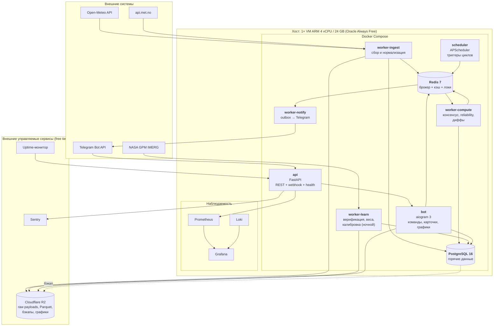

## 11.3. Внутренняя структура (C4 Level 3) и структура кода

```
src/fourcaster/
├── shared_kernel/            # Каноническая схема, VO, единицы, время, ошибки
│   ├── variables.py          # CanonicalVariable, AggregationType
│   ├── geo.py                # Coordinate, Elevation
│   └── events.py             # Базовый DomainEvent, контракты
│
├── modules/
│   ├── locations/
│   │   ├── domain/           # Location, LocationCluster
│   │   ├── application/
│   │   └── infrastructure/
│   │
│   ├── ingestion/
│   │   ├── domain/           # ModelRun, RawPayload, IngestionCycle (process manager)
│   │   ├── application/      # FetchForecastsUseCase, NormalizeUseCase
│   │   ├── ports/            # ForecastProvider, RawStore, RateLimiter   ← ГЛАВНЫЕ ПОРТЫ
│   │   └── infrastructure/
│   │       ├── openmeteo/    # адаптер + ACL (Pydantic-схемы внешнего API)
│   │       ├── metno/
│   │       └── grib/         # Phase 2
│   │
│   ├── forecasting/          # ForecastSnapshot, ForecastSeries, downscaling, bias
│   ├── consensus/            # MemberPool, WeightResolver, ConsensusCalculator
│   ├── reliability/          # компоненты A/E/S/H/G/D, калибратор
│   ├── hazard/
│   │   ├── ports.py          # HazardModule                              ← ТОЧКА РАСШИРЕНИЯ
│   │   ├── rain.py           # MVP
│   │   └── snow.py           # Phase 4 (заглушка)
│   ├── changedetection/      # DiffCalculator, SignificanceRules, AntiFlapping
│   ├── verification/         # TruthGatherer, PairBuilder, Metrics
│   ├── learning/             # WeightLearner, Calibrator, WeightRegistry
│   ├── trips/                # Trip, TripWindow
│   ├── notification/
│   │   ├── domain/           # NotificationRequest, Priority, Outbox
│   │   ├── ports.py          # NotificationChannel                       ← ТОЧКА РАСШИРЕНИЯ
│   │   └── infrastructure/telegram/
│   └── telegram_ui/          # handlers, keyboards, renderers, charts
│
├── platform/                 # scheduler, observability, config, di, admin, cli
└── main.py                   # композиционный корень, сборка DI
```

**Правила модульных границ (проверяются линтером `import-linter` в CI):**

| # | Правило |
|---|---|
| MB-1 | Модуль обращается к другому модулю **только** через его `public_api.py` или доменные события. Импорт `modules.X.domain.*` из модуля `Y` — ошибка сборки |
| MB-2 | `domain/` не импортирует ничего из `infrastructure/`, `application/` или сторонних библиотек кроме stdlib и numpy |
| MB-3 | Схемы внешних API живут только в `infrastructure/<provider>/schemas.py` (ACL) и никогда не проникают в домен |
| MB-4 | Направление зависимостей строго однонаправленное согласно Context Map (§9.2); циклы запрещены |
| MB-5 | `telegram_ui` не содержит доменной логики — только отображение |

## 11.4. Событийная модель

**Доменные события** (публикуются через transactional outbox → Redis Streams):

| Событие | Продюсер | Основные потребители | Payload |
|---|---|---|---|
| `IngestionCycleStarted` | Scheduler | Ingestion | cycle_id, planned_models |
| `RawPayloadStored` | Ingestion | Normalization | payload_ref, model, run, locations |
| `ForecastSnapshotCreated` | Forecasting | Consensus, Verification | snapshot_id, model, location, run |
| `IngestionCycleCompleted` | Ingestion | Consensus | cycle_id, n_models_ok, n_models_failed |
| `ConsensusComputed` | Consensus | Reliability, Hazard, Verification, ReadModel | consensus_id, location, computed_at |
| `ReliabilityComputed` | Reliability | ChangeDetection, ReadModel | scores by horizon |
| `HazardAssessed` | Hazard | ChangeDetection, ReadModel | HIL series, risks, windows |
| `ForecastDiffComputed` | ChangeDetection | — | diff_id |
| `ChangeEventDetected` | ChangeDetection | Notification | event_id, rule, priority, deltas |
| `NotificationRequested` | Notification | Telegram adapter | recipient, template, payload |
| `NotificationDelivered` / `Failed` | Telegram adapter | Analytics | delivery_id, status |
| `ObservationIngested` | Verification | — | observation_id |
| `VerificationCompleted` | Verification | Learning | period, metrics_ref |
| `WeightSetActivated` | Learning | Consensus, Audit | version, scope |
| `CalibrationUpdated` | Learning | Reliability | curve_version, ECE |

**Гарантии доставки:** at-least-once. Все потребители идемпотентны по `event_id`. Transactional outbox гарантирует, что событие не потеряется при коммите транзакции и не отправится при её откате.

**Dead Letter Queue:** после 5 неудачных обработок сообщение уходит в DLQ-поток с алертом оператору; DLQ обрабатывается вручную командой `platform dlq replay`.

## 11.5. Планирование циклов

Прогонов — **6 в сутки, каждые 4 часа**, выровнено по фактической доступности глобальных моделей.

| Цикл (UTC) | Что ожидается свежее | Комментарий |
|---|---|---|
| 02:00 | ICON 00Z, GFS 00Z, ARPEGE 00Z | IFS 00Z обычно ещё не готов |
| 06:00 | **IFS 00Z**, GEM 00Z, IFS ENS 00Z | Главный цикл суток |
| 10:00 | ICON 06Z, GFS 06Z, GEFS 06Z | |
| 14:00 | ARPEGE 12Z, ICON 12Z (частично) | |
| 18:00 | **IFS 12Z**, GFS 12Z, GEM 12Z, IFS ENS 12Z | Второй главный цикл |
| 22:00 | ICON 18Z, GFS 18Z, GEFS 18Z | |

* **FR-SCH-1.** Цикл считается успешным при получении ≥3 моделей; иначе — деградированный режим и алерт.
* **FR-SCH-2.** Внутри цикла модели опрашиваются параллельно с индивидуальными таймаутами (30 с на запрос, 4 мин на цикл).
* **FR-SCH-3.** Если ожидаемый ран модели ещё не выпущен, используется предыдущий с корректным `staleness_hours`; повторная попытка через 30 мин (до 2 раз).
* **FR-SCH-4.** Планировщик защищён распределённой блокировкой Redis (`SET NX PX`) — двойной запуск невозможен даже при нескольких репликах.
* **FR-SCH-5.** Ночной цикл обучения — 03:00 UTC, отдельный воркер с ограничением CPU, чтобы не влиять на отзывчивость бота.

## 11.6. Устойчивость и деградация

| Отказ | Поведение системы |
|---|---|
| Open-Meteo недоступен | Circuit breaker → переход на api.met.no (только IFS-ветка) → консенсус деградированный (`degraded=true`), ChangeEvent не генерируются, бот показывает предупреждение и последний валидный консенсус |
| Одна модель недоступна | Консенсус пересчитывается на оставшихся, веса перенормируются, компонента `D` снижает Reliability |
| Ансамбли недоступны | `E` замещается по правилу §10.6.2, флаг в объяснении скора |
| Redis недоступен | API/бот работают в read-only на Postgres; очереди останавливаются; алерт |
| Postgres недоступен | Полная деградация: бот отвечает из Redis-кэша карточек, уведомления копятся в outbox после восстановления |
| Telegram API 429 | Экспоненциальный backoff, соблюдение `retry_after`, очередь сохраняется |
| Ground truth недоступен | Верификация откладывается; веса не обновляются (лучше старые веса, чем обученные на мусоре) |
| Превышение квоты API | Деградация частоты: ансамбли раз в 8 ч, детерминированные модели — без изменений |

---

# 12. Потоки данных

## 12.1. Основной поток: цикл сбора и уведомления

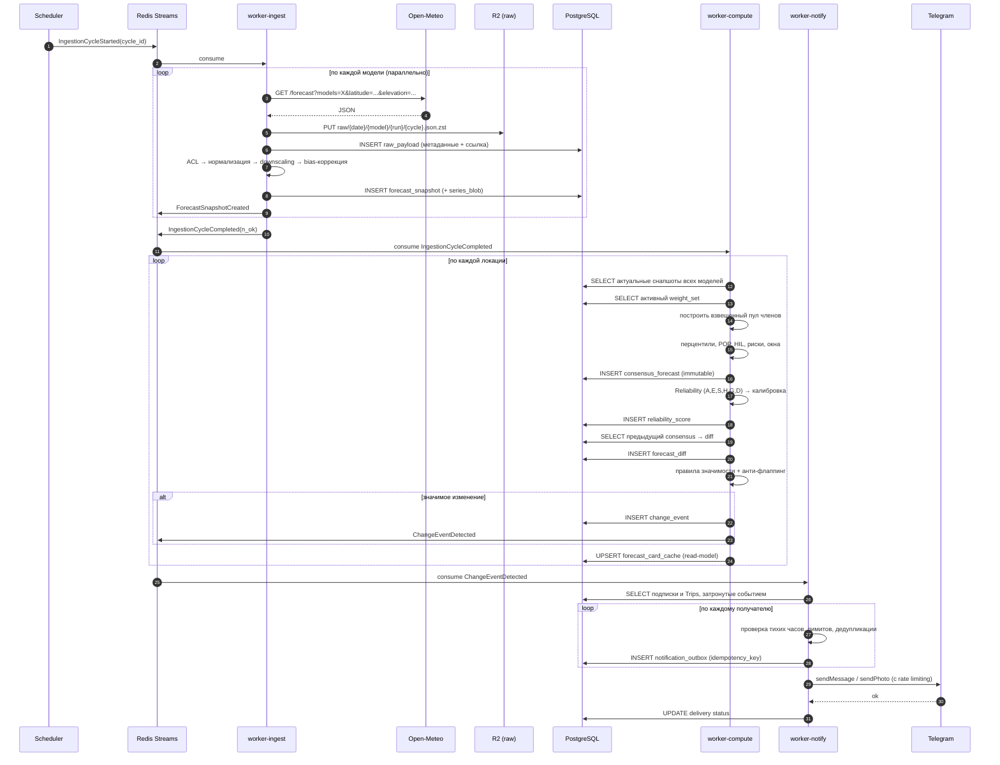

## 12.2. Поток обучения (ночной)

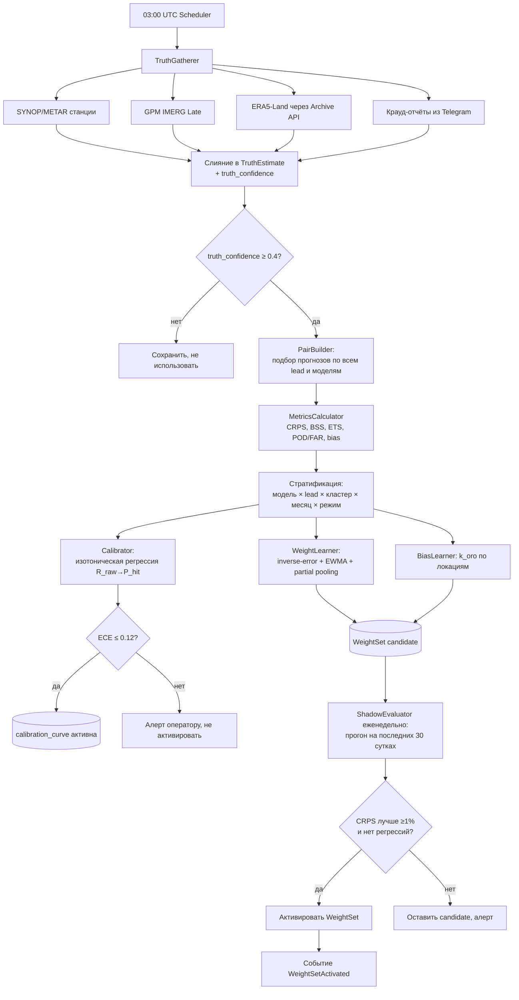

## 12.3. Поток пользовательского запроса

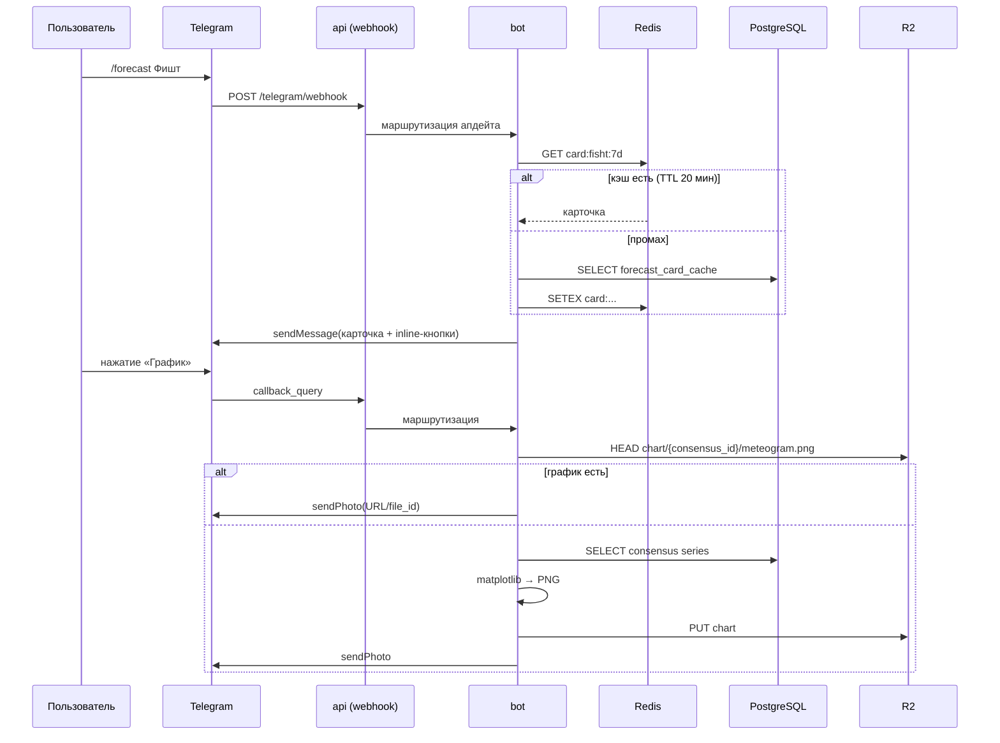

## 12.4. Гарантии и идемпотентность потоков

| Точка | Ключ идемпотентности | Поведение при повторе |
|---|---|---|
| Сбор | `(model_id, run_at, location_set_hash)` | Повторный сбор не создаёт новый снапшот, если `content_hash` совпал |
| Консенсус | `(location_id, cycle_id)` | Повторный расчёт даёт тот же результат; запись через `ON CONFLICT DO NOTHING` |
| ChangeEvent | `(location_id, consensus_from, consensus_to, rule_code, valid_date)` | Дубликат не создаётся |
| Уведомление | `sha256(subscription_id, change_event_id)` | Повторная доставка исключена (INV-7) |
| Верификация | `(forecast_ref, truth_ref)` | Пара уникальна |

---

# 13. Хранение данных и модель данных

## 13.1. Стратегия хранения: горячее / холодное

Наивное хранение всех прогнозных значений построчно даёт:

```
31 локация × 5 моделей × 6 циклов/сут = 930 снапшотов/сут
× ~168 временны́х шагов × 12 переменных ≈ 1.87 млн значений/сут
≈ 683 млн значений/год  → десятки ГБ  → неприемлемо для free-tier PostgreSQL
```

**Решение — трёхуровневое хранение:**

| Уровень | Что хранится | Где | Формат | Объём/год |
|---|---|---|---|---|
| **L0 — Raw** | Исходные ответы API без изменений (требование FR-SRC-1, аудит, replay) | Cloudflare R2 | JSON + zstd | ~2.5 ГБ |
| **L1 — Hot** | Метаданные снапшотов + **полный временнóй ряд в виде сжатого бинарного столбца** (одна строка на снапшот); консенсусы; агрегаты; события; подписки | PostgreSQL | таблицы + `bytea` (float32-массивы, zstd) | ~1.2 ГБ |
| **L2 — Cold** | Снапшоты и консенсусы старше 90 суток, ансамблевые члены целиком | Cloudflare R2 | Parquet, партиционирован по месяцам | ~4 ГБ |

**Ключевой приём — `series_blob`:** временнóй ряд снапшота (168 шагов × 12 переменных = 2016 float32 ≈ 8 КБ) сжимается zstd до ~1.5–2 КБ и хранится **одной строкой**. Это даёт 930 строк/сутки вместо 1.87 млн, то есть 340 тыс. строк и ~700 МБ в год — вместо десятков гигабайт.

Одновременно для SQL-запросов поддерживается **денормализованная суточная проекция** `forecast_daily` (930 × 14 = 13 тыс. строк/сут, 4.7 млн/год, ~600 МБ) — по ней работают все пользовательские запросы, аналитика и верификация. Полный ряд из блоба разворачивается только при построении графиков и replay.

Ансамблевые члены (82 члена × 168 шагов) **не хранятся в Postgres** — только производные статистики (перцентили, spread, POP). Сырые члены уходят в R2 Parquet, откуда доступны DuckDB для исследований.

**Аналитика по L2:** DuckDB читает Parquet напрямую из R2 (`httpfs`), без ETL и без нагрузки на операционную БД.

## 13.2. Политика хранения (retention)

| Данные | Postgres | R2 | Обоснование |
|---|---|---|---|
| `raw_payload` (объекты) | только метаданные | 400 суток, затем Glacier-подобный класс / удаление | Аудит и replay в пределах сезона+ |
| `forecast_snapshot` + blob | 120 суток | Parquet вечно (пока помещается) | Обучение требует ≥2 сезонов |
| `forecast_daily` | 400 суток | Parquet вечно | Основная рабочая проекция |
| `consensus_forecast` | 400 суток | Parquet вечно | История для US-HIST-1 |
| `reliability_score` | 400 суток | Parquet вечно | |
| `forecast_diff` | 180 суток | Parquet 2 года | |
| `change_event` | вечно | — | Малый объём, высокая ценность |
| `observation` / `truth_estimate` | вечно | — | Ground truth — самый ценный актив системы |
| `verification_pair` | 400 суток | Parquet вечно | |
| `verification_metric` | вечно | — | Агрегаты, малый объём |
| `weight_set`, `calibration_curve` | вечно | — | Аудит решений |
| `notification_delivery` | 180 суток | — | |
| Пользовательские данные | до удаления аккаунта | — | Минимизация |

Партиционирование: все крупные таблицы — декларативные партиции PostgreSQL **по месяцам** (`RANGE` по времени). Открепление старой партиции + выгрузка в Parquet + `DROP` — операция за секунды вместо многочасового `DELETE`.

## 13.3. Модель данных (ER-диаграмма)

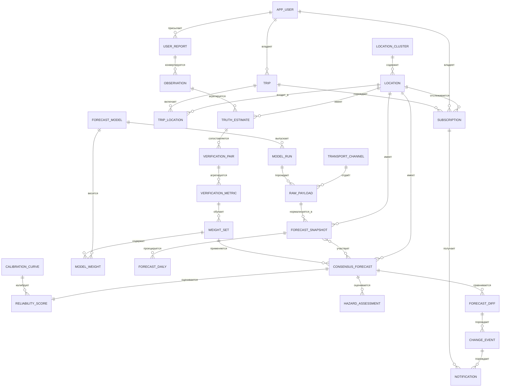

## 13.4. Ключевые таблицы (DDL-эскиз)

> Полный DDL — в `migrations/`. Ниже — сущностно значимые фрагменты, фиксирующие проектные решения.

### Справочники

```sql
CREATE TABLE location_cluster (
    id              TEXT PRIMARY KEY,            -- 'CL-FISHT'
    name            TEXT NOT NULL,
    regime_notes    TEXT,
    terrain_complexity NUMERIC(6,2)              -- std высот DEM, влияет на W_terrain
);

CREATE TABLE location (
    id              TEXT PRIMARY KEY,            -- 'fisht'
    name            TEXT NOT NULL,
    name_en         TEXT,
    cluster_id      TEXT NOT NULL REFERENCES location_cluster(id),
    lat             NUMERIC(8,5) NOT NULL,
    lon             NUMERIC(8,5) NOT NULL,
    elevation_m     INTEGER NOT NULL,            -- истинная высота точки
    dem_elevation_m INTEGER,                     -- высота ячейки провайдера
    coord_confidence CHAR(1) NOT NULL,           -- H/M/L
    is_draft        BOOLEAN NOT NULL DEFAULT true,
    timezone        TEXT NOT NULL DEFAULT 'Europe/Moscow',
    created_at      TIMESTAMPTZ NOT NULL DEFAULT now()
);

CREATE TABLE forecast_model (
    id              TEXT PRIMARY KEY,            -- 'ecmwf_ifs'
    name            TEXT NOT NULL,
    center          TEXT NOT NULL,               -- 'ECMWF'
    kind            TEXT NOT NULL,               -- 'deterministic' | 'ensemble'
    n_members       INTEGER NOT NULL DEFAULT 1,
    grid_km         NUMERIC(5,2) NOT NULL,
    max_lead_hours  INTEGER NOT NULL,
    run_hours_utc   INTEGER[] NOT NULL,          -- {0,6,12,18}
    is_active       BOOLEAN NOT NULL DEFAULT true
);

-- Матрица корреляции моделей (§10.5.3): защищает от переоценки надёжности
CREATE TABLE model_correlation (
    model_a         TEXT NOT NULL REFERENCES forecast_model(id),
    model_b         TEXT NOT NULL REFERENCES forecast_model(id),
    correlation     NUMERIC(4,3) NOT NULL,
    source          TEXT NOT NULL,               -- 'expert' | 'learned'
    updated_at      TIMESTAMPTZ NOT NULL,
    PRIMARY KEY (model_a, model_b)
);

CREATE TABLE transport_channel (
    id              TEXT PRIMARY KEY,            -- 'open_meteo'
    base_url        TEXT NOT NULL,
    daily_quota     INTEGER,
    priority        SMALLINT NOT NULL,           -- порядок фолбэка
    is_active       BOOLEAN NOT NULL DEFAULT true
);
```

### Сбор и прогнозы

```sql
CREATE TABLE model_run (
    id              BIGSERIAL PRIMARY KEY,
    model_id        TEXT NOT NULL REFERENCES forecast_model(id),
    init_time       TIMESTAMPTZ NOT NULL,
    discovered_at   TIMESTAMPTZ NOT NULL DEFAULT now(),
    UNIQUE (model_id, init_time)
);

CREATE TABLE raw_payload (
    id              BIGSERIAL,
    cycle_id        UUID NOT NULL,
    transport_id    TEXT NOT NULL REFERENCES transport_channel(id),
    model_run_id    BIGINT REFERENCES model_run(id),
    request_url     TEXT NOT NULL,
    request_params  JSONB NOT NULL,
    http_status     SMALLINT NOT NULL,
    object_key      TEXT NOT NULL,               -- ключ в R2
    size_bytes      INTEGER NOT NULL,
    content_hash    CHAR(64) NOT NULL,
    fetched_at      TIMESTAMPTZ NOT NULL,
    latency_ms      INTEGER,
    PRIMARY KEY (id, fetched_at)
) PARTITION BY RANGE (fetched_at);

CREATE TABLE forecast_snapshot (
    id              BIGSERIAL,
    location_id     TEXT NOT NULL REFERENCES location(id),
    model_id        TEXT NOT NULL REFERENCES forecast_model(id),
    model_run_id    BIGINT NOT NULL REFERENCES model_run(id),
    raw_payload_id  BIGINT NOT NULL,
    cycle_id        UUID NOT NULL,
    fetched_at      TIMESTAMPTZ NOT NULL,
    staleness_hours NUMERIC(5,2) NOT NULL,
    is_partial      BOOLEAN NOT NULL DEFAULT false,
    data_quality    NUMERIC(3,2) NOT NULL DEFAULT 1.0,
    content_hash    CHAR(64) NOT NULL,
    -- Компактное хранение ряда: схема + zstd(float32[])
    series_schema   JSONB NOT NULL,              -- {vars:[...], t0:..., steps:[...]}
    series_blob     BYTEA NOT NULL,
    PRIMARY KEY (id, fetched_at),
    UNIQUE (location_id, model_id, model_run_id, content_hash, fetched_at)
) PARTITION BY RANGE (fetched_at);

-- Денормализованная проекция для SQL-запросов и верификации
CREATE TABLE forecast_daily (
    snapshot_id     BIGINT NOT NULL,
    location_id     TEXT NOT NULL,
    model_id        TEXT NOT NULL,
    init_time       TIMESTAMPTZ NOT NULL,
    valid_date      DATE NOT NULL,
    lead_days       SMALLINT NOT NULL,
    precip_total    REAL,
    precip_max_rate REAL,
    precip_hours    REAL,
    pop             REAL,
    hil             SMALLINT,
    cape_max        REAL,
    t_min           REAL,
    t_max           REAL,
    freezing_level  REAL,
    fetched_at      TIMESTAMPTZ NOT NULL,
    PRIMARY KEY (snapshot_id, valid_date, fetched_at)
) PARTITION BY RANGE (fetched_at);

CREATE INDEX ON forecast_daily (location_id, valid_date, model_id, lead_days);
```

### Консенсус, надёжность, изменения

```sql
CREATE TABLE consensus_forecast (
    id              BIGSERIAL,
    location_id     TEXT NOT NULL REFERENCES location(id),
    cycle_id        UUID NOT NULL,
    computed_at     TIMESTAMPTZ NOT NULL,
    weight_set_id   BIGINT NOT NULL REFERENCES weight_set(id),
    config_version  TEXT NOT NULL,               -- версия порогов HIL и правил
    code_version    TEXT NOT NULL,               -- git sha — для воспроизводимости
    snapshot_ids    BIGINT[] NOT NULL,           -- полный состав входа
    applied_weights JSONB NOT NULL,              -- {model_id: weight}
    n_models        SMALLINT NOT NULL,
    n_members       SMALLINT NOT NULL,
    n_effective     NUMERIC(5,2) NOT NULL,       -- N_eff с учётом корреляции
    degraded        BOOLEAN NOT NULL DEFAULT false,
    series_schema   JSONB NOT NULL,
    series_blob     BYTEA NOT NULL,              -- p10,p25,p50,p75,p90,pop,hil по шагам
    PRIMARY KEY (id, computed_at)
) PARTITION BY RANGE (computed_at);

CREATE TABLE consensus_daily (
    consensus_id    BIGINT NOT NULL,
    location_id     TEXT NOT NULL,
    valid_date      DATE NOT NULL,
    lead_days       SMALLINT NOT NULL,
    p10 REAL, p25 REAL, p50 REAL, p75 REAL, p90 REAL,
    pop_02 REAL, pop_1 REAL, pop_5 REAL, pop_15 REAL,
    hil             SMALLINT NOT NULL,
    thunderstorm_risk REAL,
    ford_risk       SMALLINT,
    dry_windows     JSONB,
    computed_at     TIMESTAMPTZ NOT NULL,
    PRIMARY KEY (consensus_id, valid_date, computed_at)
) PARTITION BY RANGE (computed_at);

CREATE TABLE reliability_score (
    id              BIGSERIAL,
    consensus_id    BIGINT NOT NULL,
    location_id     TEXT NOT NULL,
    scope           TEXT NOT NULL,               -- 'window'|'day'|'horizon'
    valid_date      DATE,
    horizon_days    SMALLINT,                    -- 1|3|7|14 для scope='horizon'
    score_raw       NUMERIC(5,2) NOT NULL,
    score           NUMERIC(5,2) NOT NULL,       -- калиброванный
    is_calibrated   BOOLEAN NOT NULL,
    calibration_id  BIGINT REFERENCES calibration_curve(id),
    c_agreement     NUMERIC(4,3) NOT NULL,
    c_ensemble      NUMERIC(4,3) NOT NULL,
    c_stability     NUMERIC(4,3) NOT NULL,
    c_history       NUMERIC(4,3) NOT NULL,
    c_regime        NUMERIC(4,3) NOT NULL,
    c_data          NUMERIC(4,3) NOT NULL,
    explanation     JSONB NOT NULL,              -- топ-факторы для UI
    computed_at     TIMESTAMPTZ NOT NULL,
    PRIMARY KEY (id, computed_at)
) PARTITION BY RANGE (computed_at);

CREATE TABLE forecast_diff (
    id              BIGSERIAL,
    location_id     TEXT NOT NULL,
    consensus_from  BIGINT NOT NULL,
    consensus_to    BIGINT NOT NULL,
    valid_date      DATE NOT NULL,
    d_p50           REAL, d_p90 REAL, d_pop REAL,
    d_hil           SMALLINT,
    d_reliability   REAL,
    d_storm_risk    REAL,
    window_shift_h  REAL,
    model_attribution JSONB,                     -- вклад каждой модели в сдвиг
    computed_at     TIMESTAMPTZ NOT NULL,
    PRIMARY KEY (id, computed_at)
) PARTITION BY RANGE (computed_at);

CREATE TABLE change_event (
    id              BIGSERIAL PRIMARY KEY,
    location_id     TEXT NOT NULL,
    diff_id         BIGINT NOT NULL,
    rule_code       TEXT NOT NULL,               -- 'HIL_UP', 'EXTREME_APPEAR', ...
    priority        TEXT NOT NULL,               -- CRITICAL|HIGH|NORMAL|INFO
    valid_date      DATE NOT NULL,
    lead_days       SMALLINT NOT NULL,
    payload         JSONB NOT NULL,              -- было→стало, атрибуция
    confirmed       BOOLEAN NOT NULL DEFAULT false,
    suppressed_by   TEXT,                        -- причина подавления, если есть
    detected_at     TIMESTAMPTZ NOT NULL,
    UNIQUE (location_id, diff_id, rule_code, valid_date)
);
```

### Верификация и обучение

```sql
CREATE TABLE observation (
    id              BIGSERIAL PRIMARY KEY,
    source_tier     TEXT NOT NULL,               -- 'station'|'imerg'|'era5'|'analysis'|'crowd'
    source_id       TEXT NOT NULL,
    location_id     TEXT,                        -- NULL для сеточных источников
    lat NUMERIC(8,5), lon NUMERIC(8,5),
    valid_from      TIMESTAMPTZ NOT NULL,
    valid_to        TIMESTAMPTZ NOT NULL,
    precip_mm       REAL,
    hil_observed    SMALLINT,
    confidence      NUMERIC(3,2) NOT NULL,
    is_disputed     BOOLEAN NOT NULL DEFAULT false,
    raw             JSONB,
    ingested_at     TIMESTAMPTZ NOT NULL DEFAULT now()
);

CREATE TABLE truth_estimate (
    id              BIGSERIAL PRIMARY KEY,
    location_id     TEXT NOT NULL REFERENCES location(id),
    valid_from      TIMESTAMPTZ NOT NULL,
    valid_to        TIMESTAMPTZ NOT NULL,
    precip_mm       REAL NOT NULL,
    hil             SMALLINT NOT NULL,
    truth_confidence NUMERIC(3,2) NOT NULL,
    contributing    JSONB NOT NULL,              -- [{observation_id, weight}]
    finalized       BOOLEAN NOT NULL DEFAULT false,  -- true после IMERG Final
    computed_at     TIMESTAMPTZ NOT NULL,
    UNIQUE (location_id, valid_from, valid_to)
);

CREATE TABLE verification_pair (
    id              BIGSERIAL,
    truth_id        BIGINT NOT NULL,
    subject_kind    TEXT NOT NULL,               -- 'model' | 'consensus'
    model_id        TEXT,                        -- NULL для консенсуса
    consensus_id    BIGINT,
    snapshot_id     BIGINT,
    location_id     TEXT NOT NULL,
    valid_date      DATE NOT NULL,
    lead_days       SMALLINT NOT NULL,
    regime          TEXT NOT NULL,               -- frontal|convective|mixed
    fcst_p50 REAL, fcst_pop REAL, fcst_hil SMALLINT,
    fcst_cdf        BYTEA,                       -- для CRPS: сжатые перцентили
    obs_mm REAL NOT NULL, obs_hil SMALLINT NOT NULL,
    crps REAL, brier_02 REAL, brier_1 REAL, brier_5 REAL,
    abs_error REAL, hit BOOLEAN,
    created_at      TIMESTAMPTZ NOT NULL,
    PRIMARY KEY (id, created_at)
) PARTITION BY RANGE (created_at);

CREATE TABLE verification_metric (
    id              BIGSERIAL PRIMARY KEY,
    period_start    DATE NOT NULL,
    period_end      DATE NOT NULL,
    subject_kind    TEXT NOT NULL,
    model_id        TEXT,
    cluster_id      TEXT,
    lead_bucket     TEXT NOT NULL,               -- 'd1','d2-3','d4-5','d6-7','d8-10','d11-14'
    month           SMALLINT,
    regime          TEXT,
    n_pairs         INTEGER NOT NULL,
    crps REAL, crpss REAL,
    bs_1 REAL, bss_1 REAL,
    ets_1 REAL, pod_1 REAL, far_1 REAL, csi_1 REAL,
    mult_bias REAL, mae REAL, rmse REAL,
    ece REAL,
    computed_at     TIMESTAMPTZ NOT NULL
);

CREATE TABLE weight_set (
    id              BIGSERIAL PRIMARY KEY,
    version         TEXT NOT NULL UNIQUE,        -- 'v1.4.0'
    status          TEXT NOT NULL,               -- candidate|active|retired
    scope           TEXT NOT NULL DEFAULT 'global',
    trained_from    DATE, trained_to DATE,
    n_pairs         INTEGER,
    shadow_result   JSONB,
    activated_at    TIMESTAMPTZ,
    activated_by    TEXT,
    retired_at      TIMESTAMPTZ,
    notes           TEXT,
    created_at      TIMESTAMPTZ NOT NULL DEFAULT now()
);

CREATE TABLE model_weight (
    weight_set_id   BIGINT NOT NULL REFERENCES weight_set(id) ON DELETE CASCADE,
    model_id        TEXT NOT NULL REFERENCES forecast_model(id),
    cluster_id      TEXT,                        -- NULL = все
    lead_bucket     TEXT NOT NULL,
    month           SMALLINT,                    -- NULL = все
    regime          TEXT,                        -- NULL = все
    weight          NUMERIC(5,4) NOT NULL,
    n_pairs         INTEGER NOT NULL,
    PRIMARY KEY (weight_set_id, model_id, lead_bucket,
                 COALESCE(cluster_id,''), COALESCE(month,0), COALESCE(regime,''))
);

CREATE TABLE bias_correction (
    location_id     TEXT NOT NULL REFERENCES location(id),
    model_id        TEXT NOT NULL REFERENCES forecast_model(id),
    k_oro           NUMERIC(4,2) NOT NULL,
    n_pairs         INTEGER NOT NULL,
    valid_from      DATE NOT NULL,
    PRIMARY KEY (location_id, model_id, valid_from)
);

CREATE TABLE calibration_curve (
    id              BIGSERIAL PRIMARY KEY,
    version         TEXT NOT NULL UNIQUE,
    horizon_days    SMALLINT NOT NULL,
    knots           JSONB NOT NULL,              -- изотоническая: [[x,y],...]
    n_samples       INTEGER NOT NULL,
    ece             NUMERIC(5,4) NOT NULL,
    is_active       BOOLEAN NOT NULL DEFAULT false,
    trained_at      TIMESTAMPTZ NOT NULL
);
```

### Пользователи, походы, уведомления

```sql
CREATE TABLE app_user (
    id              BIGSERIAL PRIMARY KEY,
    telegram_id     BIGINT NOT NULL UNIQUE,
    chat_type       TEXT NOT NULL DEFAULT 'private',  -- private|group
    language        TEXT NOT NULL DEFAULT 'ru',
    timezone        TEXT NOT NULL DEFAULT 'Europe/Moscow',
    quiet_from      TIME NOT NULL DEFAULT '22:00',
    quiet_to        TIME NOT NULL DEFAULT '07:00',
    sensitivity     TEXT NOT NULL DEFAULT 'normal',   -- low|normal|high
    units           TEXT NOT NULL DEFAULT 'metric',
    is_blocked      BOOLEAN NOT NULL DEFAULT false,
    created_at      TIMESTAMPTZ NOT NULL DEFAULT now(),
    last_seen_at    TIMESTAMPTZ
);

CREATE TABLE trip (
    id              BIGSERIAL PRIMARY KEY,
    user_id         BIGINT NOT NULL REFERENCES app_user(id) ON DELETE CASCADE,
    title           TEXT NOT NULL,
    start_date      DATE NOT NULL,
    end_date        DATE NOT NULL,
    status          TEXT NOT NULL DEFAULT 'planned',  -- planned|active|archived|cancelled
    party_size      SMALLINT,
    notes           TEXT,
    created_at      TIMESTAMPTZ NOT NULL DEFAULT now(),
    CHECK (end_date >= start_date)
);

CREATE TABLE trip_location (
    trip_id         BIGINT NOT NULL REFERENCES trip(id) ON DELETE CASCADE,
    location_id     TEXT NOT NULL REFERENCES location(id),
    day_offset      SMALLINT,                    -- на какой день похода
    ord             SMALLINT NOT NULL,
    PRIMARY KEY (trip_id, location_id, ord)
);

CREATE TABLE subscription (
    id              BIGSERIAL PRIMARY KEY,
    user_id         BIGINT NOT NULL REFERENCES app_user(id) ON DELETE CASCADE,
    location_id     TEXT NOT NULL REFERENCES location(id),
    trip_id         BIGINT REFERENCES trip(id) ON DELETE CASCADE,
    date_from       DATE,                        -- NULL = скользящее окно
    date_to         DATE,
    horizon_days    SMALLINT NOT NULL DEFAULT 7,
    min_priority    TEXT NOT NULL DEFAULT 'NORMAL',
    muted_rules     TEXT[] NOT NULL DEFAULT '{}',
    status          TEXT NOT NULL DEFAULT 'active',
    created_at      TIMESTAMPTZ NOT NULL DEFAULT now(),
    UNIQUE (user_id, location_id, COALESCE(trip_id, 0))
);

CREATE TABLE notification_outbox (
    id              BIGSERIAL PRIMARY KEY,
    idempotency_key CHAR(64) NOT NULL UNIQUE,    -- sha256(subscription, event)
    subscription_id BIGINT NOT NULL,
    change_event_id BIGINT,
    kind            TEXT NOT NULL,               -- alert|digest|trip_report|system
    priority        TEXT NOT NULL,
    payload         JSONB NOT NULL,
    scheduled_for   TIMESTAMPTZ NOT NULL,        -- с учётом тихих часов
    status          TEXT NOT NULL DEFAULT 'pending',
    attempts        SMALLINT NOT NULL DEFAULT 0,
    last_error      TEXT,
    created_at      TIMESTAMPTZ NOT NULL DEFAULT now()
);
CREATE INDEX ON notification_outbox (status, scheduled_for)
    WHERE status IN ('pending','retrying');

CREATE TABLE notification_delivery (
    id              BIGSERIAL PRIMARY KEY,
    outbox_id       BIGINT NOT NULL REFERENCES notification_outbox(id),
    telegram_message_id BIGINT,
    delivered_at    TIMESTAMPTZ,
    feedback        SMALLINT,                    -- +1 / -1 / NULL (US-FB-2)
    feedback_at     TIMESTAMPTZ
);

CREATE TABLE user_report (
    id              BIGSERIAL PRIMARY KEY,
    user_id         BIGINT NOT NULL REFERENCES app_user(id),
    location_id     TEXT NOT NULL REFERENCES location(id),
    observed_date   DATE NOT NULL,
    time_of_day     TEXT,                        -- night|morning|day|evening
    hil_reported    SMALLINT NOT NULL,
    comment         TEXT,
    trust_score     NUMERIC(3,2) NOT NULL DEFAULT 0.5,
    validation_state TEXT NOT NULL DEFAULT 'pending', -- pending|accepted|disputed
    created_at      TIMESTAMPTZ NOT NULL DEFAULT now()
);
```

### Read-model для бота (CQRS-проекция)

```sql
CREATE TABLE forecast_card_cache (
    location_id     TEXT PRIMARY KEY REFERENCES location(id),
    consensus_id    BIGINT NOT NULL,
    rendered        JSONB NOT NULL,   -- готовая структура карточки на 14 суток
    reliability     JSONB NOT NULL,   -- скоры по 4 горизонтам + объяснение
    updated_at      TIMESTAMPTZ NOT NULL
);
```

## 13.5. Кэширование

| Ключ | Содержимое | TTL | Инвалидация |
|---|---|---|---|
| `card:{location}:{days}` | Готовая карточка | 25 мин | При `ConsensusComputed` |
| `rel:{location}` | Reliability по горизонтам | 25 мин | При `ReliabilityComputed` |
| `models:{location}` | Сравнение моделей | 25 мин | При `ConsensusComputed` |
| `chart:{consensus_id}:{type}` | Telegram `file_id` готового PNG | 24 ч | По TTL |
| `quota:{transport}:{date}` | Счётчик запросов | до конца суток | — |
| `lock:cycle:{cycle_id}` | Распределённая блокировка | 10 мин | — |
| `idem:{key}` | Ключи идемпотентности | 48 ч | — |
| `rl:tg:{chat_id}` | Rate limiting Telegram | 60 с | — |

**Правило:** кэш никогда не является источником истины; при недоступности Redis система работает медленнее, но корректно.

## 13.6. Резервное копирование и восстановление

| Что | Метод | Частота | Хранение | RPO | RTO |
|---|---|---|---|---|---|
| PostgreSQL (полный) | `pg_dump -Fc` + zstd → R2 | Ежесуточно 04:00 UTC | 30 суточных + 12 недельных + 12 месячных | 24 ч | 1 ч |
| PostgreSQL (WAL) | `pgBackRest`/`wal-g` архивация в R2 | Непрерывно | 7 суток | **5 мин** | 1.5 ч |
| Критичные таблицы | Отдельный логический дамп (`weight_set`, `calibration_curve`, `observation`, `truth_estimate`, пользователи) | Ежесуточно | 90 суток, **второй провайдер** (Backblaze B2) | 24 ч | 20 мин |
| R2 (raw payloads) | Версионирование объектов + Object Lock | — | 400 суток | 0 | — |
| Конфигурация/секреты | Git + шифрованный `sops`-файл; секреты в GitHub Secrets | При изменении | — | 0 | 10 мин |
| Инфраструктура | IaC (docker-compose + Ansible playbook) в Git | При изменении | — | 0 | 30 мин |

**Требования:**
* **FR-BAK-1.** Восстановление проверяется **автоматически ежемесячно**: восстановление дампа в одноразовый контейнер + smoke-тесты схемы и выборочных запросов. Непроверенный бэкап считается отсутствующим.
* **FR-BAK-2.** Ground truth (`observation`, `truth_estimate`) и обученные артефакты (`weight_set`, `calibration_curve`) реплицируются **к другому провайдеру** — их потеря невосполнима (переобучение потребует нового сезона наблюдений).
* **FR-BAK-3.** Документированный runbook восстановления с проверенным временем выполнения хранится в `docs/runbooks/restore.md`.

---

# 14. API

## 14.1. Принципы

* Внутренний REST API (FastAPI), OpenAPI 3.1 генерируется автоматически.
* Версионирование в пути: `/api/v1/...`.
* Аутентификация: `X-API-Key` для служебных вызовов, HMAC-подпись для Telegram webhook (`X-Telegram-Bot-Api-Secret-Token`).
* Формат ошибок — RFC 9457 (Problem Details).
* Пагинация — курсорная. Все временны́е метки — UTC ISO-8601.
* Идемпотентность мутаций — заголовок `Idempotency-Key`.

## 14.2. Публичные (read-only) эндпоинты

| Метод | Путь | Назначение |
|---|---|---|
| `GET` | `/api/v1/locations` | Список локаций; фильтры `cluster`, `include_draft` |
| `GET` | `/api/v1/locations/{id}` | Детали локации |
| `GET` | `/api/v1/locations/{id}/forecast` | Консенсус-прогноз. Параметры: `days` (1–14), `granularity` (`hourly`\|`window`\|`daily`) |
| `GET` | `/api/v1/locations/{id}/reliability` | Скоры по горизонтам + разложение на компоненты |
| `GET` | `/api/v1/locations/{id}/models` | Прогнозы отдельных моделей + применённые веса |
| `GET` | `/api/v1/locations/{id}/changes` | События изменений; `since`, `min_priority` |
| `GET` | `/api/v1/locations/{id}/history` | Эволюция прогноза на дату: `valid_date`, `from_run`, `to_run` |
| `GET` | `/api/v1/locations/{id}/windows` | Сухие окна; `from`, `to`, `min_hours` |
| `GET` | `/api/v1/compare` | Сравнение локаций: `ids=a,b,c`, `days` |
| `GET` | `/api/v1/accuracy` | Публичная статистика точности: `period`, `cluster`, `lead_bucket` |
| `GET` | `/api/v1/sources` | Источники, лицензии, атрибуция |

**Пример ответа `GET /api/v1/locations/fisht/forecast?days=3&granularity=daily`:**

```json
{
  "location": { "id": "fisht", "name": "Фишт", "lat": 43.953, "lon": 39.908, "elevation_m": 2867 },
  "consensus": {
    "id": 184213,
    "computed_at": "2026-07-24T06:14:22Z",
    "n_models": 5, "n_members": 87, "n_effective": 3.4,
    "weight_set_version": "v1.4.0",
    "degraded": false,
    "applied_weights": { "ecmwf_ifs": 0.30, "dwd_icon": 0.28, "ncep_gfs": 0.19,
                          "eccc_gem": 0.15, "mf_arpege": 0.08 }
  },
  "days": [
    {
      "valid_date": "2026-07-25", "lead_days": 1,
      "precip_mm": { "p10": 0.0, "p25": 0.4, "p50": 2.1, "p75": 6.8, "p90": 14.2 },
      "pop": { "gt_0_2mm": 0.71, "gt_1mm": 0.55, "gt_5mm": 0.31, "gt_15mm": 0.09 },
      "hil": 2, "hil_label": "Слабый дождь",
      "thunderstorm_risk": 0.42, "ford_risk": 0,
      "temperature": { "min": 6.2, "max": 14.8 },
      "freezing_level_m": 3620,
      "dry_windows": [ { "from": "2026-07-25T03:00Z", "to": "2026-07-25T10:00Z", "hours": 7 } ],
      "reliability": { "score": 81, "is_calibrated": true }
    }
  ],
  "attribution": ["ECMWF", "DWD", "NOAA NCEP", "ECCC", "Météo-France", "Open-Meteo (CC BY 4.0)"]
}
```

**Пример ответа `GET /api/v1/locations/fisht/reliability`:**

```json
{
  "location_id": "fisht",
  "computed_at": "2026-07-24T06:14:31Z",
  "calibration_version": "cal-2026-07-01",
  "horizons": [
    {
      "days": 1, "score": 84, "score_raw": 81.4, "is_calibrated": true, "band": "high",
      "label": "Высокая надёжность — можно принимать решения",
      "components": { "agreement": 0.89, "ensemble": 0.81, "stability": 0.93,
                      "history": 0.62, "regime": 0.71, "data": 1.00 },
      "top_factors": [
        { "component": "stability", "effect": "positive",
          "text": "Прогноз не менялся в последних 6 обновлениях" },
        { "component": "regime", "effect": "negative",
          "text": "Возможна послеобеденная конвекция — локальные ливни плохо предсказуемы" }
      ]
    },
    { "days": 3, "score": 67, "band": "medium", "...": "..." },
    { "days": 7, "score": 41, "band": "low",
      "label": "Ориентировочно — проверьте через 2 дня",
      "expected_confident_from": "2026-07-28" },
    { "days": 14, "score": 19, "band": "very_low",
      "label": "Только общий тренд, не основа для решений" }
  ]
}
```

## 14.3. Служебные эндпоинты (API-key)

| Метод | Путь | Назначение |
|---|---|---|
| `POST` | `/api/v1/admin/cycles/trigger` | Внеочередной запуск цикла сбора |
| `POST` | `/api/v1/admin/recompute` | Пересчёт консенсуса/скоров за период |
| `GET` | `/api/v1/admin/weights` | Список наборов весов и их статусы |
| `POST` | `/api/v1/admin/weights/{version}/activate` | Активация набора |
| `POST` | `/api/v1/admin/weights/rollback` | Откат на предыдущий активный |
| `GET` | `/api/v1/admin/quota` | Расход квот транспортов |
| `POST` | `/api/v1/admin/broadcast` | Рассылка системного сообщения |
| `POST` | `/api/v1/observations` | Приём внешних наблюдений (интеграции) |
| `GET` | `/api/v1/admin/dlq` / `POST .../replay` | Работа с dead letter queue |

## 14.4. Служебные и технические

| Метод | Путь | Назначение |
|---|---|---|
| `GET` | `/health/live` | Liveness (процесс жив) |
| `GET` | `/health/ready` | Readiness (Postgres + Redis доступны) |
| `GET` | `/health/deep` | Глубокая проверка: возраст последнего консенсуса, глубина очередей, квоты |
| `GET` | `/metrics` | Prometheus |
| `POST` | `/telegram/webhook` | Приём апдейтов Telegram (secret token) |

## 14.5. Контракты и совместимость

* **FR-API-1.** OpenAPI-схема публикуется как артефакт CI; ломающие изменения требуют новой версии пути.
* **FR-API-2.** Все ответы, содержащие прогноз, обязаны включать `reliability` и `attribution` — запрещено отдавать прогноз без указания надёжности и источников (принципы P1, а также лицензионные требования CC BY).
* **FR-API-3.** Rate limiting публичных эндпоинтов: 60 запросов/мин на IP.
* **FR-API-4.** Контрактные тесты (schemathesis) в CI.

---

# 15. Telegram-бот

## 15.1. Принципы UX

1. **Кнопки, а не команды.** Команды существуют для опытных пользователей, но основной путь — inline-клавиатуры. Требовать от туриста запоминания синтаксиса — проектная ошибка.
2. **Ответ за один экран.** Карточка прогноза помещается без прокрутки на телефоне: ≤ 12 строк.
3. **Прогрессивное раскрытие.** Сначала вывод, потом — по кнопке — детали, потом — по кнопке — сырые данные моделей.
4. **Числа сопровождаются словами.** «Reliability 41» бесполезно; «41 — ориентировочно, проверьте через 2 дня» полезно.
5. **Каждое уведомление действенно.** Содержит вывод, а не только факты.

## 15.2. Команды

### Основные

| Команда | Описание |
|---|---|
| `/start` | Онбординг: выбор языка, часового пояса, первой локации; краткое объяснение сути продукта |
| `/help` | Справка со сценариями, а не списком команд |
| `/forecast [локация] [дней]` | Консенсус-прогноз. Без аргументов — меню избранного |
| `/now [локация]` | Компактный ответ «сегодня/завтра» для спонтанных выходов |
| `/reliability [локация]` | Надёжность по горизонтам 1/3/7/14 с разложением |
| `/models [локация]` | Что говорит каждая модель + веса + spaghetti-график |
| `/changes [локация]` | Значимые изменения за 7 дней |
| `/history [локация] [дата]` | Эволюция прогноза на дату (heat-map) |
| `/window [локация] [период]` | Лучшие сухие окна |
| `/compare [лок1] [лок2] ...` | Сравнение до 5 локаций |
| `/locations` | Каталог локаций по кластерам |

### Подписки и походы

| Команда | Описание |
|---|---|
| `/subscribe [локация]` | Подписка на локацию |
| `/unsubscribe [локация]` | Отписка |
| `/my` | Мои подписки и походы |
| `/trip` | Мастер создания похода (FSM: название → локации → даты → размер группы) |
| `/trips` | Список походов; для каждого — статус, дни до старта, текущий прогноз, Reliability |
| `/digest` | Утренний дайджест по всем подпискам немедленно |
| `/settings` | Часовой пояс, тихие часы, чувствительность, язык, единицы, типы уведомлений |
| `/pause [дней]` | Приостановить все уведомления |

### Обратная связь и прозрачность

| Команда | Описание |
|---|---|
| `/report [локация] [дата]` | Сообщить фактическую погоду (краудсорс ground truth) |
| `/accuracy` | Публичная статистика оправдываемости системы; диаграмма надёжности |
| `/sources` | Источники данных, модели, лицензии, атрибуция |
| `/about` | О проекте + **дисклеймер об ответственности** |
| `/feedback` | Свободный текст разработчикам |

### Дополнительные (предложены сверх ТЗ)

| Команда | Ценность |
|---|---|
| `/why [локация] [дата]` | **«Почему такой прогноз»** — объяснение: какие модели что говорят, что определяет надёжность, какая синоптическая ситуация. Закрывает главное возражение «откуда вы это взяли» |
| `/whenconfident [локация] [дата]` | «Когда прогноз на эту дату станет надёжным» — прямая реализация US-REL-2 |
| `/risk [локация]` | Сводка операционных рисков: гроза, броды, накопленные осадки, фаза осадков на высоте |
| `/alt [локация]` | «Куда поехать вместо» — локации с лучшим прогнозом в радиусе 100 км на те же даты |
| `/track` | Пошаговая привязка прогноза к дням маршрута («день 3 — переход Фишт→Оштен») |
| `/nearest` | Прогноз для ближайшей локации по присланной геопозиции |
| `/quiet` | Быстрое включение тихого режима на 12 ч |

### Административные (whitelist)

`/admin stats` · `/admin health` · `/admin weights` · `/admin quota` · `/admin broadcast` · `/admin dlq` · `/admin location <id> promote`

## 15.3. Форматы сообщений

### Карточка прогноза

```
🏔 Фишт · 2867 м · Consensus 5/5 моделей
🕐 обновлено 09:14 МСК

Пт 25.07  🌧 Слабый дождь        2 (0–14) мм  ▓▓░░░  71%
Сб 26.07  ⛈ Гроза днём         12 (4–31) мм  ▓▓▓▓░  88%
Вс 27.07  ☁️ Сухо                 0 (0–1) мм  ░░░░░  18%
Пн 28.07  🌦 Морось               1 (0–5) мм  ▓░░░░  44%
...

📊 Надёжность:  1д 84 🟢 · 3д 67 🟡 · 7д 41 🟠 · 14д 19 🔴
⚠️ Сб: гроза 13–18, избегать гребней

[ Часы 48ч ] [ Модели ] [ Надёжность ]
[ История ] [ Окна выхода ] [ Подписаться ]
```

Формат `p50 (p10–p90)` показывает основной сценарий и разброс одной строкой — компактно и честно.

### Уведомление об изменении

```
⚠️ ИЗМЕНЕНИЕ ПРОГНОЗА · Фишт

Суббота 26 июля стала заметно хуже:
  было:  🌦 2 мм, вероятность 35%
  стало: ⛈ 12 мм, вероятность 88%, гроза днём

Причина: ECMWF и ICON сдвинули фронт на сутки раньше
        (GFS по-прежнему сухо — расхождение моделей)

Надёжность: 71 🟡 (было 64)
До старта похода «Фишт–Оштен»: 2 дня

💡 Прогноз подтверждён двумя обновлениями подряд.
   Рекомендуем пересмотреть график субботы.

[ Подробнее ] [ Модели ] [ 👍 полезно ] [ 👎 ] [ 🔕 такие не слать ]
```

### Утренний дайджест (07:00 локального времени, если есть подписки)

```
☀️ Доброе утро! Сводка на 24 июля

🥾 Поход «Фишт–Оштен» · старт через 2 дня
   Пт ☁️ сухо · Сб ⛈ гроза · Вс 🌦 морось
   Надёжность 3д: 67 🟡

📍 Ачишхо — без изменений 3 дня подряд ✅
📍 Кардывач — прогноз улучшился: Сб теперь сухо

[ Открыть походы ] [ Все подписки ]
```

## 15.4. Графика

Генерируется matplotlib, кэшируется в R2, повторно отправляется по Telegram `file_id`.

| Тип | Содержание | Команда |
|---|---|---|
| **Метеограмма** | Осадки (столбцы p50 + лента p10–p90), POP (линия), температура, высота нулевой изотермы; заливка сухих окон | `/forecast` → «Часы 48ч» |
| **Spaghetti plot** | Линия каждой модели + облако ансамблевых членов + жирная линия консенсуса | `/models` |
| **Heat-map эволюции** | Ось X — момент выпуска прогноза, ось Y — валидная дата, цвет — осадки; вертикальные метки отправленных алертов. **Это визуальное ядро продукта** — показывает то, чего нет нигде | `/history` |
| **Кривая надёжности** | R(lead) для локации с историческим коридором для сравнения | `/reliability` |
| **Reliability diagram** | Прогнозируемая вероятность vs. наблюдённая частота; доказательство калиброванности | `/accuracy` |

## 15.5. Требования к боту

* **FR-TG-1.** Webhook, а не polling (экономия ресурсов, мгновенная доставка). Secret token обязателен.
* **FR-TG-2.** Соблюдение лимитов Telegram: ≤30 сообщений/с глобально, ≤1 сообщение/с в один чат, ≤20 сообщений/мин в группу. Реализуется отдельным rate limiter поверх outbox; при `429` — соблюдение `retry_after`.
* **FR-TG-3.** Массовые рассылки распределяются во времени (jitter до 10 мин) и не блокируют интерактивные ответы — отдельная очередь с меньшим приоритетом.
* **FR-TG-4.** При блокировке бота пользователем (`403 Forbidden`) подписки помечаются `paused`, повторные попытки прекращаются.
* **FR-TG-5.** FSM-диалоги (создание Trip, `/report`) имеют таймаут 15 мин и кнопку отмены на каждом шаге.
* **FR-TG-6.** Локализация RU/EN; строки вынесены в каталоги переводов, не хардкодятся.
* **FR-TG-7.** Все ответы бота на пользовательские команды — ≤2 с (p95), из read-модели/кэша.
* **FR-TG-8.** `/about` содержит явный дисклеймер: система информационная, не является официальным источником прогноза, решения о безопасности пользователь принимает самостоятельно.
* **FR-TG-9.** Атрибуция источников присутствует в `/sources` и в футере графиков (лицензионное требование CC BY 4.0).

---

# 16. Облачная инфраструктура и эксплуатация

> **♻️ Пересмотрено ([ADR-0013](docs/adr/ADR-0013-hosting-serverless-no-card.md)).** Oracle Cloud
> Always Free оказался недоступен без верификации картой. Фактический стек — бесплатный serverless без
> карты: **GitHub Actions** (конвейер вместо APScheduler на VM), **Supabase Postgres** (вместо
> self-hosted PG + Redis + R2), **Vercel** (webhook бота + Mini App). Разделы §16.1–§16.x про
> VM/Docker/Redis/R2/оркестрацию остаются как исходный замысел и целевой вариант при росте нагрузки;
> при расхождении с реальностью приоритет у ADR-0013. Статус — §0.1.

## 16.1. Выбор хостинга

### Основной вариант — Oracle Cloud Always Free

| Параметр | Значение |
|---|---|
| Ресурсы | 4 vCPU Ampere ARM, 24 ГБ RAM, 200 ГБ block storage |
| Стоимость | **$0 бессрочно** |
| Ограничение | Инстансы «idle» могут быть освобождены; регион не всегда имеет свободную ёмкость |
| Митигация | Поддерживать ненулевую загрузку (наши воркеры это обеспечивают); настроить алерт на недоступность; держать проверенный бэкап и IaC для восстановления за 30 мин |

24 ГБ RAM и 4 ARM-ядра многократно перекрывают потребности системы — там свободно размещаются приложение, Postgres, Redis и весь стек наблюдаемости.

### Резервный вариант — Hetzner CX22 / CAX11

| Параметр | Значение |
|---|---|
| Ресурсы | 2 vCPU, 4 ГБ RAM, 40 ГБ SSD |
| Стоимость | ≈ €3.79/мес |
| Плюс | Полностью предсказуемо, без риска отзыва ресурсов |

**Рекомендация:** старт на Oracle Always Free; при первых признаках нестабильности — миграция на Hetzner. Стек полностью контейнеризован, миграция — восстановление из бэкапа + `docker compose up`, ≈30 минут. Архитектура не зависит от специфики провайдера (**никаких managed-специфичных сервисов**) — это осознанное решение ради переносимости.

### Внешние управляемые сервисы

| Сервис | Роль | Тариф |
|---|---|---|
| **Cloudflare R2** | Объектное хранилище | 10 ГБ + 1 млн записей/мес бесплатно; **нулевой egress** |
| **Backblaze B2** | Вторичная копия критичных данных | 10 ГБ бесплатно |
| **GitHub** + Actions | Репозиторий, CI/CD, реестр образов (GHCR) | Бесплатно для публичных / 2000 мин для приватных |
| **Sentry** | Ошибки | 5k событий/мес бесплатно |
| **Grafana Cloud** *(опция)* | Метрики/логи, если не self-hosted | 10k серий, 50 ГБ логов бесплатно |
| **UptimeRobot / Better Stack** | Внешний аптайм-мониторинг | Бесплатно |
| **Cloudflare** | DNS, TLS, WAF, прокси webhook | Бесплатно |

**Итоговая стоимость MVP: $0–4/мес.**

## 16.2. Контейнеризация

```yaml
# docker-compose.yml (структура; полная версия — в репозитории)
services:
  api:        { image: ghcr.io/../4caster:${TAG}, command: uvicorn ..., replicas: 1 }
  bot:        { image: ghcr.io/../4caster:${TAG}, command: python -m ...bot }
  scheduler:  { image: ghcr.io/../4caster:${TAG}, command: python -m ...scheduler }
  worker-ingest:  { image: ..., command: arq ...IngestWorker,  cpus: 1.0 }
  worker-compute: { image: ..., command: arq ...ComputeWorker, cpus: 1.5 }
  worker-notify:  { image: ..., command: arq ...NotifyWorker,  cpus: 0.5 }
  worker-learn:   { image: ..., command: arq ...LearnWorker,   cpus: 1.0, mem_limit: 4g }
  postgres:   { image: postgres:16-alpine, volumes: [pgdata:/var/lib/postgresql/data] }
  redis:      { image: redis:7-alpine, command: redis-server --appendonly yes }
  prometheus: { image: prom/prometheus }
  grafana:    { image: grafana/grafana }
  loki:       { image: grafana/loki }
  caddy:      { image: caddy:2 }   # TLS, reverse proxy
```

**Требования:**
* **FR-DOC-1.** Один образ приложения для всех ролей; роль определяется командой запуска. Упрощает CI и гарантирует идентичность версий.
* **FR-DOC-2.** Multi-stage build; финальный образ на `python:3.12-slim`, non-root пользователь, размер ≤ 400 МБ.
* **FR-DOC-3.** Мультиархитектурная сборка (`linux/amd64`, `linux/arm64`) — обязательна для Oracle Ampere.
* **FR-DOC-4.** Healthcheck в каждом сервисе; политика `restart: unless-stopped`.
* **FR-DOC-5.** Все конфигурации — через переменные окружения (12-factor); секреты — через Docker secrets / `.env`, не в образе.
* **FR-DOC-6.** Ресурсные лимиты обязательны — воркер обучения не должен вытеснить бота из памяти.

## 16.3. CI/CD

```mermaid
flowchart LR
  A[Push / PR] --> B[Lint: ruff, mypy strict]
  B --> C[import-linter:<br/>проверка модульных границ]
  C --> D[Unit-тесты + покрытие ≥80%]
  D --> E[Интеграционные тесты<br/>testcontainers: PG + Redis]
  E --> F[Контрактные тесты API<br/>schemathesis]
  F --> G[Тесты алгоритмов<br/>на золотых наборах]
  G --> H[Сборка multi-arch образа]
  H --> I[Trivy: скан уязвимостей]
  I --> J[Push в GHCR]
  J --> K{ветка main?}
  K -- да --> L[Deploy staging]
  L --> M[Smoke-тесты]
  M --> N{ручное подтверждение}
  N -- да --> O[Deploy production<br/>SSH + compose pull + up -d]
  O --> P[Health check + автооткат при провале]
```

| Требование | Описание |
|---|---|
| **FR-CI-1** | Каждый PR проходит полный пайплайн; merge при красном CI запрещён |
| **FR-CI-2** | Миграции применяются отдельным шагом до запуска новой версии; обязательны обратно совместимые миграции (expand/contract) |
| **FR-CI-3** | Деплой production — только с ручным подтверждением; автоматический откат при провале health-check в течение 5 мин |
| **FR-CI-4** | Версионирование по semver + git sha; `code_version` записывается в каждый `consensus_forecast` |
| **FR-CI-5** | Staging-окружение с уменьшенным набором локаций (5 шт.) и той же схемой |
| **FR-CI-6** | Секреты — только в GitHub Secrets; сканирование на утечки (`gitleaks`) в пайплайне |
| **FR-CI-7** | Ночной прогон полного набора алгоритмических тестов на исторических данных (regression suite) с публикацией метрик CRPS/BSS — контроль отсутствия деградации качества от изменений кода |

## 16.4. Мониторинг и логирование

### Метрики (Prometheus)

| Группа | Метрики |
|---|---|
| **Бизнес** | `consensus_computed_total`, `change_events_total{rule,priority}`, `notifications_sent_total{priority}`, `notification_feedback_total{value}`, `active_subscriptions`, `active_trips` |
| **Качество** | `reliability_score_bucket`, `consensus_crps`, `consensus_bss`, `calibration_ece`, `models_participating` |
| **Конвейер** | `ingestion_cycle_duration_seconds`, `ingestion_model_success_total{model}`, `snapshot_staleness_hours{model}`, `queue_depth{stream}`, `dlq_size` |
| **Внешние API** | `provider_request_duration_seconds{provider}`, `provider_errors_total{provider,code}`, `provider_quota_used_ratio{provider}`, `circuit_breaker_state{provider}` |
| **Инфраструктура** | Стандартные exporters: node, postgres, redis, cadvisor |
| **Telegram** | `telegram_api_calls_total{method,status}`, `telegram_rate_limited_total`, `bot_command_duration_seconds{command}` |

### Дашборды Grafana

1. **Обзор системы** — здоровье конвейера, последний успешный цикл по каждой модели, глубина очередей.
2. **Качество прогнозов** — CRPS/BSS по моделям и горизонтам, ECE калибровки, распределение Reliability.
3. **Пользователи и уведомления** — активные подписки, алерты по типам, feedback ratio, alert fatigue index.
4. **Внешние зависимости** — латентность, ошибки, расход квот, состояние circuit breakers.
5. **Инфраструктура** — CPU/RAM/диск, размер БД по таблицам, рост партиций.

### Алерты оператору (в админ-чат Telegram + Sentry)

| Условие | Severity |
|---|---|
| Цикл сбора не завершился успешно 2 раза подряд | **P1** |
| Получено < 3 моделей в цикле | **P1** |
| Последний консенсус старше 6 ч | **P1** |
| Postgres/Redis недоступны | **P1** |
| Очередь уведомлений > 500 или DLQ > 0 | **P2** |
| Квота внешнего API > 70% | **P2** |
| ECE калибровки > 0.12 | **P2** |
| CRPS активного набора весов ухудшился > 3% за 14 суток | **P2** |
| Свободное место на диске < 20% | **P2** |
| Бэкап не создан за 26 ч / ежемесячный тест восстановления провален | **P1** |
| Рост ошибок Telegram API > 5% | **P3** |

### Логирование

* **FR-LOG-1.** Структурированные JSON-логи; обязательные поля: `timestamp`, `level`, `service`, `trace_id`, `cycle_id`, `location_id`, `event`.
* **FR-LOG-2.** Сквозная трассировка OpenTelemetry: `trace_id` проходит от Scheduler через все воркеры до доставки уведомления. Без этого отладка асинхронного конвейера невозможна.
* **FR-LOG-3.** Уровни: `DEBUG` в staging, `INFO` в production; `ERROR` дублируется в Sentry.
* **FR-LOG-4.** Хранение логов: 14 суток в Loki; критичные аудит-события (активация весов, админ-действия) — в БД бессрочно.
* **FR-LOG-5.** В логах запрещены персональные данные сверх `telegram_id`; тексты пользовательских сообщений не логируются.

## 16.5. Масштабирование

Текущая нагрузка ничтожна (≈170 внешних запросов и ≈900 расчётов в сутки). План масштабирования — на случай роста числа локаций и пользователей.

| Триггер роста | Действие | Порядок |
|---|---|---|
| Локаций > 150 | Батчирование запросов, увеличение `worker-ingest` до 2 реплик | Горизонтально, без изменения архитектуры |
| Пользователей > 5 000 | Отдельные реплики `worker-notify`, шардирование очереди уведомлений по `chat_id` | Горизонтально |
| Локаций > 500 | Выход за free tier Open-Meteo → переход на прямую загрузку GRIB (Phase 2 уже реализована) либо платный тариф | Смена транспорта |
| БД > 20 ГБ | Ужесточение retention, ускорение выгрузки в Parquet, при необходимости — TimescaleDB compression | Настройка |
| CPU расчётов > 70% | Векторизация numpy → вынос `worker-compute` на отдельную VM | Вертикально/горизонтально |
| Регионов > 1 | Партиционирование по региону, отдельные наборы весов и калибровок на регион (уже предусмотрено полем `scope`) | Архитектурно готово |

**Что специально сделано для масштабируемости заранее:** stateless-воркеры, очередь как точка развязки, отсутствие привязки к managed-сервисам провайдера, `scope` в наборах весов, партиционирование таблиц с первого дня.

---

# 17. Функциональные требования

Сводная таблица. Детали — в соответствующих разделах.

| ID | Требование | Раздел | Приоритет |
|---|---|---|---|
| FR-LOC-1..5 | Каталог локаций, высоты, кластеры, черновики | §7.4 | P0 |
| FR-SRC-1..7 | Провайдеры, raw storage, идемпотентность ранов, квоты, атрибуция | §8.5 | P0 |
| FR-NORM-1..4 | Каноническая схема, валидация, пропуски, хэши | §10.2 | P0 |
| FR-DS-1..2 | Орографический downscaling, разделение raw/corrected | §10.3 | P0 |
| FR-HZ-1..2 | HazardModule как плагин, конфигурируемые пороги | §10.4 | P0 |
| FR-CON-1..5 | Консенсус: пул членов, воспроизводимость, три агрегации, локальное время | §10.5.4 | P0 |
| FR-REL-1..5 | Reliability: компоненты, калибровка, объяснение, «когда станет надёжно» | §10.6.6 | P0 |
| FR-CHG-1..5 | Диффы, события, анти-флаппинг, конфигурируемость, отключение типов | §10.7.6 | P0 |
| FR-ACC-1..7 | Верификация, метрики, обучение весов, guardrails, replay, переоценка | §10.8.6 | P0/P1 |
| FR-SCH-1..5 | Планирование, деградация, блокировки | §11.5 | P0 |
| FR-API-1..4 | Контракты, обязательность reliability+attribution, rate limiting | §14.5 | P0 |
| FR-TG-1..9 | Webhook, лимиты, FSM, локализация, дисклеймер | §15.5 | P0 |
| FR-DOC-1..6 | Docker, multi-arch, 12-factor, лимиты | §16.2 | P0 |
| FR-CI-1..7 | CI/CD, миграции, откат, regression suite | §16.3 | P0 |
| FR-LOG-1..5 | Логи, трассировка, приватность | §16.4 | P0 |
| FR-BAK-1..3 | Бэкапы, проверка восстановления, второй провайдер | §13.6 | P0 |

---

# 18. Нефункциональные требования

## 18.1. Производительность

| ID | Требование | Значение |
|---|---|---|
| NFR-P1 | Ответ бота на команду (p95) | ≤ 2 с |
| NFR-P2 | Ответ read-API (p95) | ≤ 500 мс |
| NFR-P3 | Полный цикл сбора (31 локация × 5 моделей + 2 ансамбля) | ≤ 4 мин |
| NFR-P4 | Расчёт консенсуса + reliability + диффы для всех локаций | ≤ 90 с |
| NFR-P5 | Задержка «данные получены → уведомление доставлено» (p95) | ≤ 15 мин |
| NFR-P6 | Генерация графика | ≤ 3 с |
| NFR-P7 | Ночной цикл обучения | ≤ 60 мин |

## 18.2. Надёжность и доступность

| ID | Требование | Значение |
|---|---|---|
| NFR-R1 | Доступность бота (месяц) | ≥ 99.0% |
| NFR-R2 | Успешность циклов сбора | ≥ 99.0% |
| NFR-R3 | Потеря уведомлений | 0 (outbox + at-least-once) |
| NFR-R4 | RPO / RTO | 5 мин (WAL) / 1.5 ч |
| NFR-R5 | Работоспособность при отказе 1 внешнего провайдера | Полная, с деградацией качества |
| NFR-R6 | Работоспособность при отказе Redis | Read-only режим |
| NFR-R7 | Максимальный простой при плановом деплое | 0 (rolling для api/bot) |

## 18.3. Корректность и качество данных

| ID | Требование |
|---|---|
| NFR-Q1 | Все расчёты детерминированы и воспроизводимы: одинаковый вход + версия кода + версия весов ⇒ побитово одинаковый выход |
| NFR-Q2 | Ни один прогноз не выдаётся пользователю без сопутствующей оценки надёжности (принцип P1) |
| NFR-Q3 | Некалиброванный Reliability не отображается числом (INV-6) |
| NFR-Q4 | Data Completeness ≥ 97% (доля успешных пар локация×модель×цикл) |
| NFR-Q5 | Verification Coverage ≥ 90% в течение 7 суток после валидного периода |
| NFR-Q6 | ECE калибровки ≤ 0.08 (цель), ≤ 0.12 (порог алерта) |
| NFR-Q7 | Любое отправленное уведомление воспроизводимо из сырых данных в течение срока их хранения |

## 18.4. Безопасность

| ID | Требование |
|---|---|
| NFR-S1 | Секреты не хранятся в репозитории; сканирование `gitleaks` в CI |
| NFR-S2 | Telegram webhook защищён secret token + проверкой IP-диапазонов Telegram |
| NFR-S3 | Служебные эндпоинты — только по API-ключу; админ-команды — по whitelist `telegram_id` |
| NFR-S4 | TLS 1.3 для всех внешних соединений; HSTS |
| NFR-S5 | Все SQL-запросы параметризованы (SQLAlchemy); прямая конкатенация запрещена линтером |
| NFR-S6 | Rate limiting на всех публичных входах |
| NFR-S7 | Образы сканируются Trivy; сборка падает при CRITICAL-уязвимостях |
| NFR-S8 | Принцип наименьших привилегий: контейнеры non-root, отдельный пользователь БД для приложения без DDL-прав в production |
| NFR-S9 | Зависимости обновляются автоматически (Dependabot/Renovate), обновления безопасности — в течение 7 суток |

## 18.5. Приватность и соответствие

| ID | Требование |
|---|---|
| NFR-PR1 | Хранятся только `telegram_id`, настройки, подписки, походы. Имена, телефоны, геолокация постоянно не хранятся |
| NFR-PR2 | Команда `/forget` полностью удаляет пользователя и его данные в течение 24 ч |
| NFR-PR3 | Тексты сообщений пользователей не логируются |
| NFR-PR4 | Крауд-отчёты обезличиваются при попадании в `observation` |
| NFR-PR5 | Соблюдение лицензий источников: обязательная атрибуция CC BY 4.0 / NLOD, соблюдение ToS api.met.no (User-Agent с контактом, кэширование) |
| NFR-PR6 | Free tier Open-Meteo — некоммерческое использование; при монетизации требуется переход на коммерческую лицензию (см. риск R-06) |

## 18.6. Сопровождаемость

| ID | Требование |
|---|---|
| NFR-M1 | Покрытие тестами ≥ 80%; доменный слой (`consensus`, `reliability`, `changedetection`, `verification`) — ≥ 95% |
| NFR-M2 | `mypy --strict` без ошибок |
| NFR-M3 | Модульные границы проверяются автоматически (`import-linter`), нарушение = падение CI |
| NFR-M4 | Все архитектурные решения фиксируются как ADR |
| NFR-M5 | Алгоритмы имеют «золотые» тестовые наборы: зафиксированные входы и ожидаемые выходы, защищающие от незаметной регрессии качества |
| NFR-M6 | Добавление новой модели прогноза не требует изменений вне `infrastructure/` и справочников |
| NFR-M7 | Добавление зимнего HazardModule не требует изменений в `consensus`, `reliability`, `changedetection` |
| NFR-M8 | Runbook на каждый P1-алерт |

## 18.7. Стоимость

| ID | Требование |
|---|---|
| NFR-C1 | Инфраструктура ≤ $10/мес при 1000 активных пользователей |
| NFR-C2 | Расход квот внешних API ≤ 40% от бесплатных лимитов при штатной работе |
| NFR-C3 | Рост БД ≤ 2 ГБ/год при 31 локации |
| NFR-C4 | Отсутствие зависимости от платных managed-сервисов, привязывающих к провайдеру |

## 18.8. Расширяемость

| ID | Требование |
|---|---|
| NFR-E1 | Новая локация добавляется данными (seed/админ-команда), без деплоя |
| NFR-E2 | Новый регион — конфигурацией + собственными наборами весов (`scope`), без изменения ядра |
| NFR-E3 | Новый канал доставки (Email, WhatsApp) — реализацией порта `NotificationChannel` |
| NFR-E4 | Новая метеопеременная — расширением канонической схемы, без миграции существующих данных (`series_schema` версионирован) |
| NFR-E5 | Зимний сезон — новыми `HazardModule` + новыми переменными; ядро не меняется |

---

# 19. План разработки

## 19.1. Состав команды и оценка

| Роль | FTE | Зона ответственности |
|---|---|---|
| Tech Lead / Architect | 1.0 | Архитектура, алгоритмическое ядро, ревью |
| Backend Engineer 1 | 1.0 | Ingestion, нормализация, хранение, инфраструктура |
| Backend Engineer 2 | 1.0 | Consensus, Reliability, ChangeDetection |
| Backend/Data Engineer | 0.5–1.0 | Verification, Accuracy Engine, backfill, аналитика |
| Product/QA | 0.5 | Telegram UX, тексты, приёмка, пользовательские исследования |

**Итого: 4–4.5 FTE. Длительность до релиза MVP: 14 недель (7 спринтов по 2 недели).**

## 19.2. Фазы и спринты

> **Статусы фаз** (актуально на 26 июля 2026, сводка — §0.3). Легенда:
> ✅ готово · 🔄 частично · ⬜ запланировано · ♻️ пересмотрено (ADR-0013).
> Исходные сроки в скобках — плановые из первой редакции; фактический ход отражён бейджами.

### Фаза 0 — Основание — 🔄 частично (Спринт 1, недели 1–2)

| Задача | DoD |
|---|---|
| 0.1 Репозиторий, структура модулей, DI, конфигурация | `import-linter` проходит; каркас 12 модулей |
| 0.2 CI/CD: линт, тесты, сборка multi-arch, деплой на staging | Зелёный пайплайн, образ в GHCR, staging поднят |
| 0.3 **Верификация координат и высот 31 локации** | Все `Conf=L` подняты до `M`/`H`; DEM-высоты сверены; seed-миграция |
| 0.4 Схема БД v1, партиционирование, Alembic | Миграции применяются и откатываются |
| 0.5 Docker Compose, Postgres, Redis, R2-бакеты | `docker compose up` поднимает всё локально |
| 0.6 Наблюдаемость: Prometheus, Grafana, Loki, OTel | Дашборд «Обзор системы» показывает данные |
| 0.7 ADR-0001..0005 (стиль, стек, хранение, транспорт, модели) | Приняты и в репозитории |

**Риск-контроль спринта:** 0.3 — единственная задача с внешней зависимостью (картографические данные); стартует первой.

### Фаза 1 — Сбор данных и backfill — 🔄 частично (Спринт 2, недели 3–4)

| Задача | DoD |
|---|---|
| 1.1 Порт `ForecastProvider` + адаптер Open-Meteo + ACL | Контрактные тесты на записанных фикстурах |
| 1.2 Rate limiter, circuit breaker, ретраи, учёт квот | Тесты отказов; метрики в Grafana |
| 1.3 Raw storage в R2 + метаданные + дедупликация по хэшу | Повторный сбор не создаёт дубль |
| 1.4 Нормализация: каноническая схема, единицы, агрегации, валидация | Property-based тесты (Hypothesis) на агрегации |
| 1.5 Downscaling: температура, нулевая изотерма, фаза осадков | Юнит-тесты на синтетических профилях |
| 1.6 `IngestionCycle` process manager + планировщик 6 циклов | Цикл проходит на staging, метрики зелёные |
| 1.7 **Backfill: выгрузка архива 2024–2025 по всем локациям** | ≥2 сезона в БД; отчёт о полноте |
| 1.8 Адаптер api.met.no (резервный транспорт) | Фолбэк срабатывает при отключении Open-Meteo |

**Milestone M1** 🔄 — сбор идёт (5 моделей, 6 циклов/сутки, read-модель + история в Postgres); backfill и резервный транспорт ещё не сделаны.

### Фаза 2 — Ядро: консенсус и надёжность — 🔄 частично (Спринты 3–4, недели 5–8)

| Задача | DoD |
|---|---|
| 2.1 `MemberPool`, взвешенные перцентили, POP | Золотые наборы; сверка с эталонным расчётом в numpy |
| 2.2 `WeightResolver`: скилл, свежесть, рельеф, качество, guardrails | Сумма весов = 1; лимиты соблюдаются; тесты |
| 2.3 Матрица корреляции моделей, расчёт `N_eff` | Тесты на вырожденных случаях |
| 2.4 `RainHazard`: HIL, гроза, броды, сухие окна | Тесты на реальных исторических кейсах |
| 2.5 Reliability: компоненты A, E, S (Flip-Flop Index), D | Каждая компонента — отдельный набор тестов |
| 2.6 Reliability: компоненты H, G; агрегация по горизонтам | Значения в ожидаемых диапазонах §10.6.3 |
| 2.7 Хранение консенсуса: `series_blob`, `consensus_daily` | Round-trip тест сериализации; объём в бюджете |
| 2.8 Read-модель `forecast_card_cache` + проекция | Обновляется по событию `ConsensusComputed` |

**Milestone M2** 🔄 — консенсус (перцентили + POP) считается каждый цикл для активных локаций; калиброванная надёжность и обучаемые веса ещё не готовы.

### Фаза 3 — Верификация и обучение — ⬜ запланирована (Спринт 5, недели 9–10)

| Задача | DoD |
|---|---|
| 3.1 `TruthGatherer`: станции, IMERG, ERA5-Land, слияние в `TruthEstimate` | Покрытие ≥90% локацио-суток за тестовый месяц |
| 3.2 `PairBuilder` + метрики CRPS, BSS, ETS, POD/FAR, bias | Сверка с `xskillscore` на эталонных данных |
| 3.3 Стратификация метрик; определение режима (frontal/convective) | Метрики по всем ячейкам, число пар записано |
| 3.4 `WeightLearner`: inverse-error, EWMA, partial pooling, guardrails | Прогон на backfill даёт осмысленные веса |
| 3.5 `Calibrator`: изотоническая регрессия, ECE, версионирование | ECE ≤ 0.12 на данных backfill |
| 3.6 `WeightRegistry` + shadow-режим + автооткат | Активация/откат работают, аудит-лог пишется |
| 3.7 Обучение `k_oro` по локациям | Ожидаемое `k_oro > 1` для CL-FISHT подтверждено |
| 3.8 CLI `verify replay` | Воспроизведение исторического расчёта |

**Milestone M3** ⬜ — не достигнут (Accuracy Engine не начат).

> **Ключевая зависимость:** задача 1.7 (backfill) обязана быть завершена до 3.4 — иначе обучать не на чем.

### Фаза 4 — Детекция изменений и уведомления — 🔄 частично (Спринт 6, недели 11–12)

| Задача | DoD |
|---|---|
| 4.1 `DiffCalculator` + атрибуция по моделям | Тесты на синтетических парах консенсусов |
| 4.2 Правила значимости, динамический `NoiseFloor` | `NoiseFloor` посчитан из backfill; тесты правил |
| 4.3 Анти-флаппинг: подтверждение, гистерезис, cooldown, лимиты | Симуляция на 30 сутках истории: ≤2 алерта/сутки/подписка |
| 4.4 `Notification` + transactional outbox + идемпотентность | Событие не теряется и не дублируется (тесты отказов) |
| 4.5 Тихие часы, дайджест, приоритеты, чувствительность | Тесты на часовых поясах |
| 4.6 Telegram-адаптер: rate limiting, обработка 429/403 | Нагрузочный тест на 1000 фиктивных чатов |

**Milestone M4** 🔄 — уведомления доставляются подписчикам по значимым изменениям; строгий анти-флаппинг (`NoiseFloor`, outbox, дайджест, тихие часы) ещё не реализован.

### Фаза 5 — Telegram-интерфейс — 🔄 частично (Спринт 7, недели 13–14)

| Задача | DoD |
|---|---|
| 5.1 Онбординг, `/start`, `/help`, настройки, локализация | Прохождение онбординга ≤60 с |
| 5.2 Карточки: `/forecast`, `/now`, `/reliability`, `/models` | Соответствие макетам §15.3 |
| 5.3 Trips: FSM создания, `/trips`, авто-подписки, архивация, отчёт | Полный жизненный цикл похода |
| 5.4 История и изменения: `/history`, `/changes`, `/why` | Heat-map эволюции корректен на исторических данных |
| 5.5 Графика: метеограмма, spaghetti, heat-map, кривая надёжности | Генерация ≤3 с; кэш по `file_id` |
| 5.6 `/window`, `/compare`, `/alt`, `/risk`, `/whenconfident` | Работают на всех локациях |
| 5.7 `/report` (краудсорс) + валидация правдоподобия | Отчёты попадают в `observation` |
| 5.8 `/accuracy`, `/sources`, `/about` с дисклеймером | Атрибуция и дисклеймер на месте |
| 5.9 Админ-команды + runbooks | Все P1-алерты имеют runbook |

**Milestone M5 — Релиз MVP** 🔄 — в проде работает срез (бот + Mini App); полный MVP §4.2 (31 локация, Trips, калибровка, полный набор команд) ещё не закрыт.

### Фаза 6 — Стабилизация и закрытый бета-тест — ⬜ запланирована (недели 15–18)

| Задача | DoD |
|---|---|
| 6.1 Закрытая бета: 20–30 пользователей, 2 турклуба | Собран качественный фидбэк |
| 6.2 Калибровка порогов HIL и чувствительности по фидбэку | Actionable Alert Rate ≥ 60% |
| 6.3 Нагрузочное и хаос-тестирование (отключение провайдеров, Redis, БД) | Поведение соответствует §11.6 |
| 6.4 Проверка восстановления из бэкапа | RTO подтверждён замером |
| 6.5 Наполнение runbooks, документация эксплуатации | Онбординг нового инженера ≤1 день |

**Milestone M6 — Публичный запуск** ⬜ — не достигнут.

## 19.3. Критический путь и зависимости

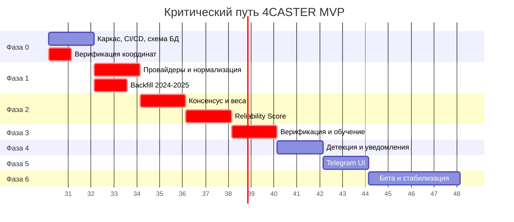

**Главные зависимости:**
1. `Backfill (1.7)` → `Обучение весов (3.4)` → `Калибровка (3.5)` → **корректный Reliability на релизе**. Срыв backfill означает релиз с некалиброванным скором.
2. `Верификация координат (0.3)` → всё остальное. Неверные координаты обесценят все накопленные данные.
3. `NoiseFloor из истории (4.2)` зависит от backfill.
4. Telegram UI (Фаза 5) может частично идти параллельно с Фазой 4 — макеты и статические экраны не зависят от детекции изменений.

## 19.4. Definition of Done (общий)

Задача считается выполненной, если: код прошёл ревью; покрытие соответствует NFR-M1; `mypy --strict` и `import-linter` зелёные; добавлены/обновлены тесты, включая золотые наборы для алгоритмов; обновлена документация и, при необходимости, ADR; метрики и логи добавлены; фича задеплоена на staging и проверена; для P1-функциональности написан runbook.

---

# 20. Roadmap

```mermaid
timeline
    title Roadmap 4CASTER
    section 2026 Q3 — MVP (◀ мы здесь: срез в проде)
        Фазы 0–5 : Сбор 5 моделей + 2 ансамбля
                 : Consensus, Reliability, Change Detection
                 : Accuracy Engine с backfill
                 : Telegram-бот, Trips
    section 2026 Q4 — Устойчивость и глубина
        Phase 2  : Прямая загрузка GRIB (ECMWF/DWD/NOAA)
                 : ICON-EPS, оценка UKMO
                 : Пользовательские точки, импорт GPX
                 : Публичное read-only API, веб-виджет
    section 2027 Q1 — Зимний домен
        Phase 4  : SnowHazard: снегонакопление, фаза, ветровой перенос
                 : Интеграция лавинных бюллетеней
                 : Зимние правила значимости и HIL
    section 2027 Q2 — Качество и интеллект
        Phase 3  : EMOS/BMA постобработка, kernel dressing
                 : ML-модели (AIFS, GraphCast) в shadow-режиме
                 : Спутниковый нокастинг 0–6 ч
                 : Логистическая регрессия грозового риска
    section 2027 H2 — Масштаб
        Expansion: Новые регионы (Центральный Кавказ, Крым, Алтай)
                 : Веб-интерфейс
                 : Монетизация: pro-тариф, коммерческая лицензия данных
                 : API для турклубов и МЧС
```

## Детализация по фазам

Статусы: ✅ готово · 🔄 в работе (срез) · ⬜ запланировано. Детализация текущей фазы — §0.

| Фаза | Статус | Срок | Содержание | Ключевая метрика успеха |
|---|---|---|---|---|
| **MVP** | 🔄 срез в проде | Q3 2026 | §4.2 | Actionable Alert Rate ≥ 60%, ECE ≤ 0.12 |
| **Phase 2: Resilience & Reach** | ⬜ | Q4 2026 | GRIB-провайдеры (снятие зависимости от Open-Meteo), ICON-EPS, пользовательские точки, GPX, публичное API | Ingestion Success ≥ 99.5% при отключённом Open-Meteo |
| **Phase 4: Winter** | ⬜ | Q1 2027 | `SnowHazard`, снегонакопление, высота снеговой линии, ветровой перенос, интеграция бюллетеней. **Требует расширения ground truth: снегомерные данные** | Запуск зимнего домена без изменений в ядре (проверка NFR-M7) |
| **Phase 3: Intelligence** | ⬜ | Q2 2027 | EMOS/BMA, kernel dressing, ML-модели в shadow, нокастинг по спутнику, обученный грозовой риск | Consensus Skill Gain ≥ 12% над лучшей моделью |
| **Expansion** | 🔄 частично вытянута | H2 2027 | Новые регионы, веб, монетизация. **Telegram Mini App уже реализован досрочно** (§0.1) | 5 000 активных пользователей |

**Порядок фаз обоснован так:** сначала снимается инфраструктурный риск (зависимость от единственного транспорта), затем расширяется сезонный охват (максимальный прирост аудитории), и только потом углубляется научная часть — она даёт меньший прирост пользовательской ценности на единицу трудозатрат, чем зимний домен.

---

# 21. Риски

## 21.1. Реестр рисков

Оценка: Вероятность (В) и Влияние (Вл) по шкале 1–5; Рейтинг = В × Вл.

| ID | Риск | В | Вл | Рейтинг | Митигация |
|---|---|---|---|---|---|
| **R-01** | **Отсутствие ground truth в горах** делает Accuracy Engine некорректным: веса обучаются на спутниковых данных, систематически занижающих орографические осадки | 5 | 5 | **25** | Многоуровневая система истины с весами доверия (§8.4); отсечка `truth_confidence < 0.4`; отдельное обучение `k_oro`; краудсорсинг; ретроспективный пересчёт по IMERG Final; **явная публикация ограничений в `/accuracy`** |
| **R-02** | **Open-Meteo — единая точка отказа**: отключение, смена лимитов или условий лицензии останавливает систему | 3 | 5 | **15** | Резервный транспорт api.met.no с первого дня; **Phase 2 (GRIB) приоритезирована в Q4 2026**; порт `ForecastProvider` изолирует домен; хранение raw payload позволяет пережить простой без потери истории |
| **R-03** | **Alert fatigue**: пользователи отключают уведомления из-за шума | 4 | 4 | **16** | Анти-флаппинг (§10.7.4); симуляция на 30 сутках истории до релиза; три уровня чувствительности; кнопки 👍/👎 и «не слать такие»; метрика Alert Fatigue Index как anti-metric |
| **R-04** | **Ложная точность Reliability Score**: красивое число без реальной калибровки подрывает доверие к продукту навсегда | 4 | 5 | **20** | Обязательный backfill до релиза; изотоническая калибровка; INV-6 (некалиброванный скор — не число); публичная `/accuracy`; ECE как алертируемая метрика |
| **R-05** | **Недостаточное разрешение моделей** (лучшее — 7 км) не разрешает долины Кавказа; консенсус систематически ошибается в конкретных точках | 5 | 3 | **15** | Обучаемая поправка `k_oro` по локациям; честная коммуникация ограничения в `/about`; кластеризация локаций; в Phase 3 — статистический downscaling по накопленным данным |
| **R-06** | **Лицензионный конфликт при монетизации**: free tier Open-Meteo — некоммерческий | 2 | 4 | **8** | Явно зафиксировано (NFR-PR6); при монетизации — коммерческая лицензия либо self-hosted Open-Meteo (AGPLv3) на своей инфраструктуре, либо прямой GRIB (данные ECMWF/DWD/NOAA открыты) |
| **R-07** | **Отзыв ресурсов Oracle Always Free** | 3 | 3 | **9** | Проверенные ежедневные бэкапы, IaC, отсутствие provider-lock-in; готовый план миграции на Hetzner за 30 мин; внешний аптайм-мониторинг |
| **R-08** | **Холодный старт: недостаток статистики** для весов, `NoiseFloor`, `σ_clim` | 4 | 4 | **16** | Backfill 2 сезонов из Previous Runs API (§10.7.5); априорные кривые; partial pooling; явный флаг `low_confidence_calibration` для горизонтов 10–14 сут |
| **R-09** | **Юридическая ответственность** за решения пользователей в горах | 2 | 5 | **10** | Дисклеймер в `/about`, `/start` и футере каждого критического алерта; формулировки уведомлений — рекомендательные («рекомендуем пересмотреть»), не директивные; NG-6 |
| **R-10** | **Переусложнение алгоритмов** относительно объёма данных: 6 компонент Reliability невозможно откалибровать при малой выборке | 3 | 4 | **12** | Компоненты вводятся поэтапно с проверкой вклада каждой; A/B на истории; при недостатке данных компонента фиксируется на нейтральном значении; регулярный аудит вклада компонент |
| **R-11** | **Изменение Telegram Bot API / блокировки** | 2 | 4 | **8** | Порт `NotificationChannel`; Email-канал как запасной (Phase 2); мониторинг ошибок API |
| **R-12** | **Спорные/недостоверные координаты** локаций (особенно `Conf=L` в Абхазии) | 4 | 3 | **12** | Задача 0.3 в первом спринте; `is_draft` скрывает неверифицированные точки; сверка с DEM; возможность уточнения через `/feedback` |
| **R-13** | **Дрейф качества после автообновления весов**: система «уезжает» незаметно | 3 | 4 | **12** | Shadow-режим 7 суток; guardrails на изменение весов; автооткат при ухудшении CRPS >3%; версионирование и аудит; ночной regression suite в CI |
| **R-14** | **Рост объёма БД** сверх free-tier | 2 | 3 | **6** | Трёхуровневое хранение, `series_blob`, партиционирование, автовыгрузка в Parquet, алерт на диск |
| **R-15** | **Уход ключевого разработчика** (малая команда, сложный домен) | 3 | 4 | **12** | ADR на каждое решение, этот PRD как источник истины, ≥95% покрытие домена тестами, runbooks, парное ревью алгоритмов |
| **R-16** | **Конвективные ситуации принципиально непредсказуемы**, и никакая методика не даст полезного прогноза на 3+ суток летом | 5 | 2 | **10** | Компонента `G` честно снижает скор; продуктовая коммуникация «в такие дни планируйте гибко»; в Phase 3 — нокастинг по спутнику для ближнего диапазона, где это решаемо |
| **R-17** | **Ограничение доступа к внешним API из региона** (сетевые ограничения, геоблокировки) | 2 | 4 | **8** | Сервер вне региона; несколько транспортов; мониторинг доступности с внешней точки |

## 21.2. Топ-5 рисков и владельцы

| Ранг | Риск | Владелец | Триггер эскалации |
|---|---|---|---|
| 1 | R-01 Ground truth | Data Engineer | Verification Coverage < 70% за месяц |
| 2 | R-04 Ложная точность | Tech Lead | ECE > 0.15 или невозможность калибровки к концу Фазы 3 |
| 3 | R-03 Alert fatigue | Product | Actionable Alert Rate < 50% в бете |
| 4 | R-08 Холодный старт | Data Engineer | Backfill даёт < 1 полного сезона данных |
| 5 | R-02 SPOF Open-Meteo | Backend 1 | Любой инцидент недоступности > 4 ч |

## 21.3. Возможные проблемы реализации (технический уровень)

| Проблема | Проявление | Решение |
|---|---|---|
| Неверная агрегация накопленных величин | Осадки завышены/занижены в разы при переходе между шагами сетки | `aggregation_type` — обязательное поле схемы; property-based тесты (§19.2, задача 1.4) |
| Путаница UTC и локального времени | Прогноз «на субботу» смещён на сутки | Всё хранение — UTC; конверсия только на границе UI; тесты на переходах суток |
| Смещение при сравнении прогноза с фактом (lead-time matching) | Метрики верификации систематически искажены | `PairBuilder` с явным `lead_days`; тесты на граничных случаях |
| Дрейф `elevation` между провайдерами | Разные модели «видят» разную высоту точки | Хранение `dem_elevation_m` отдельно; явная передача `elevation`; контроль расхождений |
| Дубликаты уведомлений при рестарте воркера | Пользователь получает алерт дважды | Transactional outbox + idempotency_key (INV-7); тесты на падение между коммитом и отправкой |
| Утечка памяти при разворачивании `series_blob` | OOM воркера обучения | Ресурсные лимиты, потоковая обработка, батчирование |
| Взрывной рост партиций | Деградация планировщика запросов | Автоматическое создание/открепление партиций (`pg_partman` или собственный джоб), мониторинг |
| Незаметная регрессия качества алгоритма | Метрики ухудшились, но тесты зелёные | Ночной regression suite на истории с публикацией CRPS/BSS (FR-CI-7) |
| Изотоническая регрессия переобучается на малой выборке | Калибровка хуже, чем её отсутствие | Минимум 500 наблюдений на горизонт; кросс-валидация; порог ECE перед активацией |
| Ансамблевые члены раздувают Postgres | Выход за бюджет БД | Члены — только в R2 Parquet; в Postgres — производные статистики (§13.1) |

---

# 22. Открытые вопросы

| # | Вопрос | Влияние | Кто решает | Срок |
|---|---|---|---|---|
| Q1 | Доступен ли реальный доступ к данным метеостанций Роскомгидромета/Абхазии (не METAR)? Это радикально улучшило бы ground truth | Высокое (R-01) | Product | До Фазы 3 |
| Q2 | Требуется ли регистрация NASA Earthdata для IMERG и укладывается ли частота выгрузки в лимиты? | Среднее | Data Engineer | Фаза 1 |
| Q3 | Подтвердить координаты 11 локаций с `Conf = L` | Высокое (R-12) | Product + Tech Lead | Спринт 1 |
| Q4 | Границы летнего сезона: 1 мая — 31 октября или по фактическому снеготаянию? | Низкое | Product | До релиза |
| Q5 | Планируется ли монетизация? От ответа зависит выбор лицензии данных (R-06) | Среднее | Стейкхолдеры | До Phase 2 |
| Q6 | Нужна ли поддержка групповых чатов в MVP или достаточно личных? | Среднее (объём Фазы 5) | Product | Спринт 5 |
| Q7 | Приемлемо ли для пользователей отображение качественной шкалы вместо числа, если калибровка не готова? | Среднее | Product + UX | Бета |
| Q8 | Какой порог `truth_confidence` использовать по факту? 0.4 — экспертная оценка, требует проверки на backfill | Среднее | Data Engineer | Фаза 3 |
| Q9 | Требуется ли английская локализация в MVP или достаточно русской? | Низкое | Product | Спринт 5 |

---

# 23. Предложения по улучшению сверх ТЗ

Решения, не запрошенные напрямую, но существенно повышающие ценность или снижающие риск. Каждое уже встроено в соответствующие разделы.

| # | Предложение | Раздел | Ценность |
|---|---|---|---|
| **1** | **Разделение `ForecastModel` и `TransportChannel`** | §8.1.2 | Предотвращает главную методологическую ошибку — двойной учёт одной модели (например, Yr.no + ECMWF). Без этого консенсус занижал бы неопределённость |
| **2** | **Использование ансамблей (51 + 31 член), а не только межмодельного разброса** | §8.2 | Превращает оценку неопределённости из выборки в 5 точек в полноценное распределение; делает возможными CRPS, перцентили и корректный Reliability |
| **3** | **Единый взвешенный пул членов вместо усреднения по моделям** | §10.5.1 | Методологически корректная агрегация скошенной величины; среднее по осадкам — известная ошибка |
| **4** | **Компонента Temporal Stability на базе Flip-Flop Index** | §10.6.2 | Ловит ненадёжность, невидимую для межмодельного согласия; отличает информативный тренд от шума. Вероятно — самая ценная компонента скора |
| **5** | **Калибровка Reliability изотонической регрессией + публичная `/accuracy`** | §10.6.4 | Делает число проверяемым. Некалиброванный скор — это маркетинг, а не инженерия |
| **6** | **Backfill 2 сезонов из Previous Runs API** | §10.7.5 | Устраняет холодный старт; система выходит откалиброванной, а не «через 3 месяца» |
| **7** | **Trip как центральная сущность вместо подписки на точку** | §6.1, §13.4 | Совпадает с реальной задачей пользователя; даёт контекст (дни до старта) для приоритизации алертов и пост-отчёт |
| **8** | **Hiking Impact Level вместо миллиметров** | §10.4 | Переводит метеорологию в язык решений; делает пороги значимости осмысленными |
| **9** | **Многоуровневый ground truth с весами доверия** | §8.4 | Единственный работоспособный способ верификации в регионе без наблюдений. Без него Accuracy Engine нереализуем |
| **10** | **Динамический `NoiseFloor` вместо фиксированных порогов в мм** | §10.7.3 | Убирает и спам на дальних горизонтах, и пропуски на ближних |
| **11** | **Матрица корреляции моделей и `N_eff`** | §10.5.3 | Без неё система систематически переоценивает надёжность: 5 коррелированных моделей ≠ 5 независимых мнений |
| **12** | **Shadow-режим + автооткат для обновления весов** | §10.8.4 | Защита от незаметной деградации — главного риска самообучающихся систем |
| **13** | **Трёхуровневое хранение с `series_blob`** | §13.1 | Сокращает объём БД в ~30 раз, позволяя уложиться в free tier без потери полноты данных |
| **14** | **Компонента Regime Predictability** | §10.6.2 | Честно признаёт, что летняя конвекция непредсказуема, вместо того чтобы выдавать уверенный прогноз |
| **15** | **Команда `/why` — объяснение прогноза** | §15.2 | Закрывает главное возражение к любой агрегирующей системе: «откуда цифра» |
| **16** | **`/whenconfident` — когда прогноз станет надёжным** | §15.2 | Прямо отвечает на реальную задачу планировщика; уникальная функция |
| **17** | **`/alt` — альтернативные районы** | §15.2 | Превращает плохую новость в действие; высокий потенциал удержания |
| **18** | **Heat-map эволюции прогноза** | §15.4 | Визуальное ядро продукта: показывает динамику прогноза, чего нет ни в одном массовом сервисе |
| **19** | **Краудсорсинг ground truth через бота** | §6.5, §8.4 | Единственный источник наземной истины в высокогорье; одновременно — механизм вовлечения |
| **20** | **Риск бродов и накопленные осадки** | §10.4 | Практическая опасность, о которой не говорит ни один погодный сервис; высокая прикладная ценность |
| **21** | **«Silence is signal» в дайджесте** | §10.7.4 | Отсутствие алертов не должно читаться как поломка; повышает доверие |
| **22** | **Полная воспроизводимость: `code_version` + `weight_set_version` + raw payload** | §13.4, INV-2 | Позволяет ответить на любую претензию «почему вы прислали этот алерт»; необходимое условие для научной части |
| **23** | **Автоматическая ежемесячная проверка восстановления бэкапа** | §13.6 | Непроверенный бэкап — отсутствующий бэкап |
| **24** | **`import-linter` для модульных границ в CI** | §11.3 | Единственный способ не дать модульному монолиту деградировать в «большой ком грязи» |
| **25** | **Ночной regression suite по качеству алгоритмов** | §16.3 | Обычные тесты не ловят ухудшение CRPS; эта проверка ловит |

---

# 24. Приложения

## A. Матрица трассируемости целей

| Цель | User Stories | Функциональные требования | Метрики |
|---|---|---|---|
| G1 Агрегация | US-FC-1, US-FC-3 | FR-SRC-*, FR-NORM-*, FR-CON-* | Data Completeness, Consensus Skill Gain |
| G2 Надёжность | US-REL-1..3 | FR-REL-1..5 | ECE, Calibration Error |
| G3 Детекция | US-HIST-2..3, US-SUB-1 | FR-CHG-1..5 | Notification Latency, Actionable Alert Rate |
| G4 Обучаемость | US-FB-1, US-OPS-2 | FR-ACC-1..7 | CRPS improvement, Verification Coverage |
| G5 Доставка | US-SUB-*, US-FC-*, US-HIST-* | FR-TG-1..9 | WAU, D30 Retention |
| G6 Аудируемость | US-OPS-3 | INV-2, FR-SRC-1, FR-BAK-* | Replay success rate |
| G7 Экономика | — | NFR-C1..C4 | Стоимость/мес, расход квот |

## B. Каноническая схема переменных (фрагмент)

| code | unit | aggregation | valid_range | precision | источники |
|---|---|---|---|---|---|
| `precip_total` | mm | accumulated | [0, 500] | 0.1 | все |
| `precip_rate` | mm/h | instant | [0, 200] | 0.1 | вычисляется |
| `precip_probability` | ratio | instant | [0, 1] | 0.01 | ансамбли, GFS |
| `showers` | mm | accumulated | [0, 300] | 0.1 | IFS, ICON, GFS |
| `precip_type` | enum | instant | rain/sleet/snow | — | вычисляется |
| `cape` | J/kg | instant | [0, 8000] | 1 | IFS, ICON, GFS, GEM |
| `cloud_cover_total` | % | mean | [0, 100] | 1 | все |
| `temperature_2m` | °C | instant | [-60, 55] | 0.1 | все |
| `freezing_level_height` | m | instant | [0, 6000] | 10 | IFS, ICON, GFS |
| `wind_speed_10m` | m/s | instant | [0, 80] | 0.1 | все |
| `wind_gusts_10m` | m/s | max | [0, 120] | 0.1 | IFS, ICON, GFS |
| `geopotential_height_500` | m | instant | [4500, 6200] | 1 | все (для компоненты G) |

## C. Lead-time buckets

| bucket | lead_days | шаг сетки консенсуса | генерация алертов |
|---|---|---|---|
| `d1` | 0–1 | 1 ч | все приоритеты |
| `d2-3` | 2–3 | 1 ч | все приоритеты |
| `d4-5` | 4–5 | 3 ч | все приоритеты |
| `d6-7` | 6–7 | 3 ч | ≥ NORMAL |
| `d8-10` | 8–10 | 6 ч | ≥ HIGH |
| `d11-14` | 11–14 | 6 ч | ≥ HIGH |

## D. Список ADR к созданию в Фазе 0

| ADR | Тема |
|---|---|
| ADR-0001 | Модульный монолит вместо микросервисов |
| ADR-0002 | Python как основной язык |
| ADR-0003 | Разделение ForecastModel и TransportChannel |
| ADR-0004 | Трёхуровневое хранение и `series_blob` |
| ADR-0005 | Взвешенный пул членов как метод агрегации |
| ADR-0006 | Композитный мультипликативный Reliability Score |
| ADR-0007 | Батч-обучение весов вместо онлайн |
| ADR-0008 | Многоуровневый ground truth с весами доверия |
| ADR-0009 | PostgreSQL без обязательного TimescaleDB |
| ADR-0010 | Cloudflare R2 как объектное хранилище |
| ADR-0011 | Backfill из Previous Runs API для холодного старта |
| ADR-0012 | Telegram webhook вместо polling |

## E. Атрибуция источников (обязательный текст для `/sources`)

```
Данные прогнозов предоставлены:
• ECMWF (IFS, IFS ENS) — Европейский центр среднесрочных прогнозов погоды
• Deutscher Wetterdienst (ICON) — Германия
• NOAA / NCEP (GFS, GEFS) — США
• Environment and Climate Change Canada (GEM) — Канада
• Météo-France (ARPEGE) — Франция
Доставка данных: Open-Meteo (CC BY 4.0), MET Norway (NLOD / CC BY 4.0)
Данные наблюдений: NASA GPM IMERG, ERA5 (Copernicus Climate Change Service)

4CASTER — информационная система. Не является официальным источником
прогноза погоды. Решения о безопасности в горах пользователь принимает
самостоятельно и под свою ответственность.
```

## F. Ссылки

* Open-Meteo API — https://open-meteo.com/en/docs
* Open-Meteo Previous Runs API — https://open-meteo.com/en/docs/previous-runs-api
* Open-Meteo Historical Forecast API — https://open-meteo.com/en/docs/historical-forecast-api
* Open-Meteo Ensemble API — https://open-meteo.com/en/docs/ensemble-api
* Open-Meteo Pricing / лимиты — https://open-meteo.com/en/pricing
* MET Norway Locationforecast — https://docs.api.met.no/doc/locationforecast/datamodel.html
* MET Norway Terms of Service — https://api.met.no/doc/TermsOfService
* Yr — как делаются прогнозы (подтверждение использования ECMWF вне Скандинавии) — https://hjelp.yr.no/hc/en-us/articles/360004008874

---

**Конец документа.**

> Документ подготовлен как единственный источник требований для реализации 4CASTER MVP.
> Все изменения — через PR с обновлением версии и, при необходимости, ADR.
